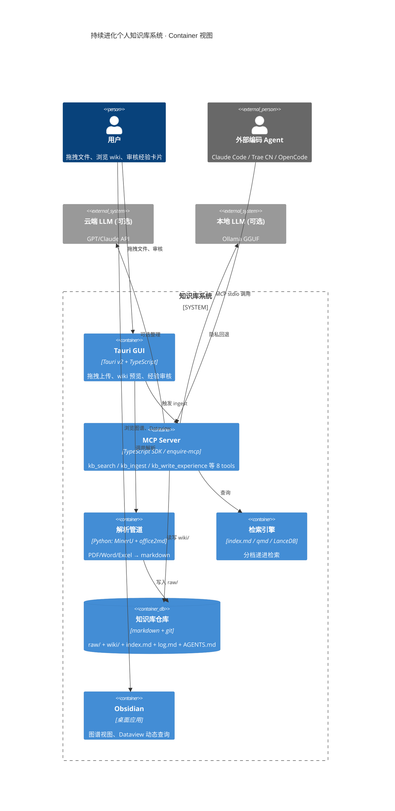
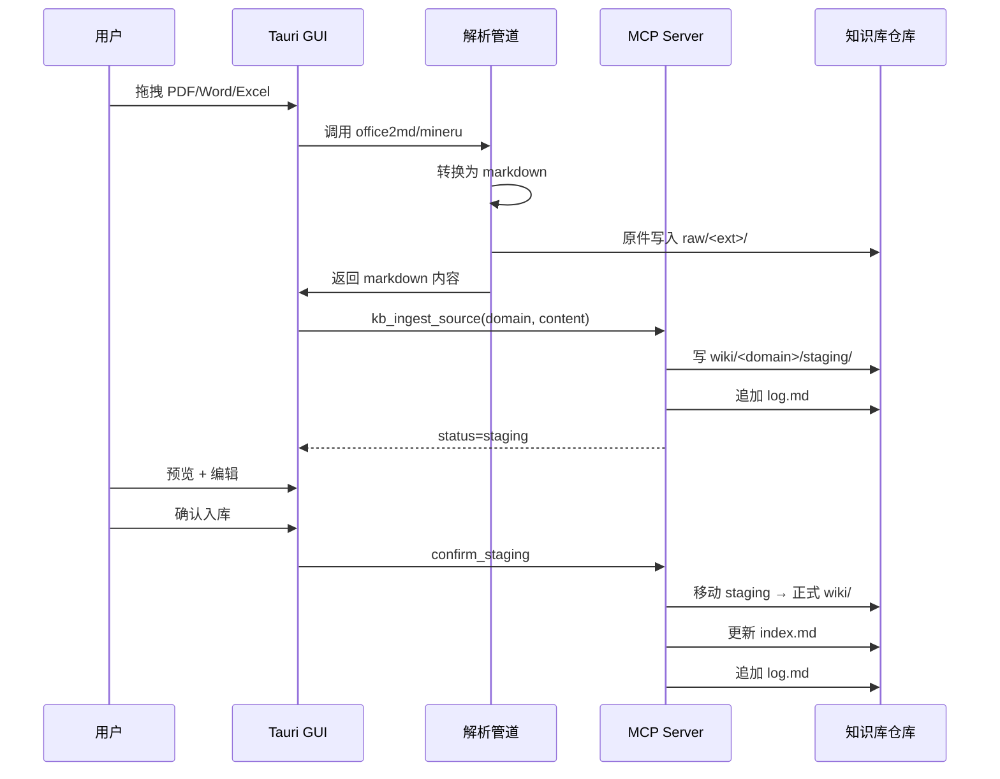
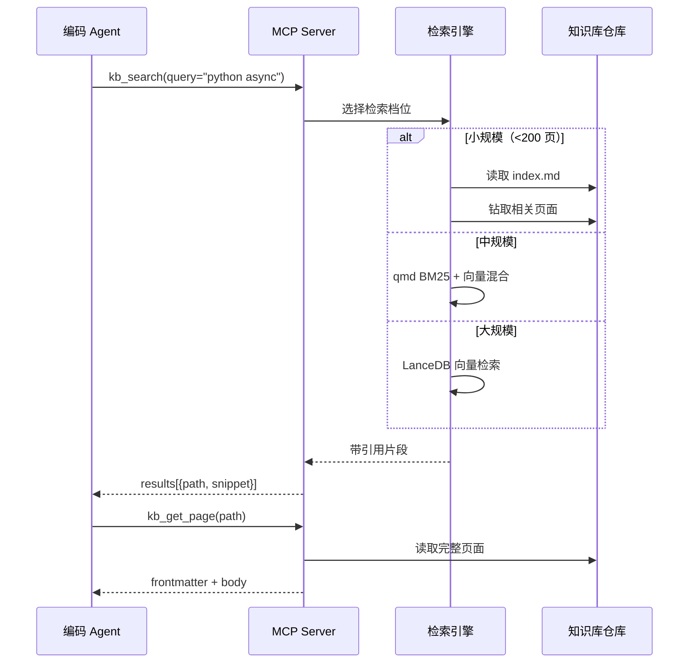
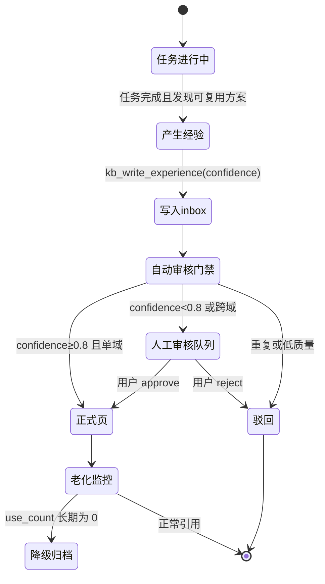

# 持续进化个人知识库系统 · 架构设计（ARCH）

> 基于 [ARCH 模板](templates/arch-template.md) 创建。技术选型见 [ADR-001](decisions/ADR-001-knowledge-base-tech-stack.md)，需求见 [PRD](PRD.md)，选型依据见 [选型报告](reports/2026-07-22-knowledge-base-tech-selection.md)。

## 1. 架构概览

**架构风格**：混合分层（Hybrid Layered）。Andrej Karpathy 的 LLM Wiki 模式（raw / wiki / schema 三层 + Ingest/Query/Lint 三操作 + index.md/log.md 双索引）是本架构的 100% 子集；四点改进作为外层叠加，不破坏内核。

### 1.1 C4 Container 图



### 1.2 五层架构

| 层 | 名称 | 选型 | 职责 |
| --- | --- | --- | --- |
| L1 | 存储层 | markdown + git + Obsidian | 不可变 raw、人类可读 wiki、git 版本控制 |
| L2 | 索引层 | index.md + log.md + frontmatter + Dataview | 内容导航、时间日志、元数据查询 |
| L3 | 访问层 | MCP server（enquire-mcp + TS 扩展） | Agent 标准化调用，stdio 本地零网络 |
| L4 | GUI 层 | Tauri v2 + TypeScript | 多格式上传、wiki 预览、经验审核 |
| L5 | 进化层 | AGENTS.md schema + Dream Loop | 持续沉淀、两 tier 审核、老化淘汰 |

**降级路径**：若 Tauri GUI 不做，L4 退化为 Obsidian + CLI，L1-L3 + L5 仍是完整 Karpathy 系统；若 MCP server 不做，L3 退化为 CLI（git + grep），L1-L2 仍是完整 Karpathy 系统。每层独立可替换。

## 2. 组件设计

| 组件 | 职责 | 技术栈 | 关键依赖 |
| --- | --- | --- | --- |
| `repo` 知识库仓库 | 唯一事实来源，markdown + git | git ≥2.40、Obsidian ≥1.5 | 无（vendor-neutral） |
| `mcp_server` | 暴露 8 个 MCP tools，stdio 传输 | TypeScript 5.x、@modelcontextprotocol/sdk | enquire-mcp（复用）/ Zod（校验） |
| `parser` 解析管道 | PDF/Word/Excel → markdown | Python 3.11、MinerU 3.4+、office2md 0.5+ | mineru[pipeline]、mammoth、pandas |
| `search_engine` | 分档检索 | 规模自适应：index.md / qmd / LanceDB | qmd（含 GGUF 模型 ~2GB）/ lancedb |
| `tauri_gui` | 桌面 GUI | Tauri v2、React 18、TypeScript | @tauri-apps/api、isomorphic-git |
| `evolution_loop` | 经验沉淀与审核 | AGENTS.md 规则 + MCP ingest tool + /dream 脚本 | cron / 手动触发 |
| `lint_engine` | 健康检查 | TypeScript（自建）或 qmd lint | 复用 mcp_server 的 kb_lint |

## 3. 接口契约

### 3.1 MCP Tools（L3 访问层对外契约）

所有 tools 经 stdio 传输，输入输出均为 JSON，参数用 Zod schema 校验。

| Tool | 对应 Karpathy 操作 | 输入 | 输出 | 副作用 |
| --- | --- | --- | --- | --- |
| `kb_search` | Query | `{ query: string, domain?: string, limit?: number }` | `{ results: [{ path, title, snippet, score }] }` | 无（只读） |
| `kb_get_page` | Query | `{ path: string, section?: string }` | `{ frontmatter, body, links }` | 无 |
| `kb_ingest_source` | Ingest | `{ source_path: string, domain: string, type?: "source" }` | `{ wiki_path, status: "staging" }` | 写 raw/、写 wiki/staging/、追加 log |
| `kb_write_experience` | 持续进化 | `{ title, domain, content, confidence: 0-1, source_task: string }` | `{ path, status: "pending" }` | 写 wiki/`<domain>`/experiences/inbox/ |
| `kb_list_categories` | 导航 | `{ include_stats?: boolean }` | `{ categories: [{ name, page_count, last_update }] }` | 无 |
| `kb_list_recent` | Query | `{ limit?: number, type?: "ingest"/"query"/"lint"/"experience"/"init" }` | `{ entries: [{ date, type, title, path }] }` | 无 |
| `kb_lint` | Lint | `{ checks?: ["frontmatter","contradictions","orphans","stale","missing_xref"] }` | `{ issues: [{ type, severity: "high"/"mid", page, detail, suggestion }], summary: { total, by_type, pages_scanned, checks_run } }` | 无 |
| `kb_health` | 运维 | `{}` | `{ total_pages, index_status, last_ingest, last_lint }` | 无 |

### 3.2 Tauri GUI 命令（L4 内部 IPC）

| 命令 | 输入 | 输出 | 说明 |
| --- | --- | --- | --- |
| `upload_file` | `{ file_path, domain }` | `{ staging_path }` | 触发解析管道，结果入 staging |
| `confirm_staging` | `{ staging_path }` | `{ wiki_path }` | 用户确认后写入正式 wiki/ |
| `preview_wiki` | `{ path }` | `{ html }` | Obsidian 兼容 markdown → HTML 预览 |
| `list_staging` | `{}` | `{ items: [{ path, title, domain }] }` | 列出待审核 staging |
| `review_experience` | `{ inbox_path, action: "promote"/"reject" }` | `{ result_path }` | 审核经验卡片 |

## 4. 数据模型与存储

### 4.1 目录结构

```text
Continuous-learning/
├── raw/                          # L1 不可变原始资料
│   ├── assets/                   # 图片、附件
│   ├── pdf/                      # PDF 原件
│   ├── docx/                     # Word 原件
│   └── xlsx/                     # Excel 原件
├── wiki/                         # L1 + L2 知识库主体
│   ├── coding/                   # 领域：编程
│   │   ├── experiences/
│   │   │   ├── inbox/            # 待审核经验卡片
│   │   │   └── *.md              # 已正式经验页
│   │   ├── *.md                  # 概念页、实体页
│   │   └── _index.md             # 领域子索引
│   ├── emotions/                 # 领域：情感
│   ├── reading/                  # 领域：读书
│   └── ...                       # 其他领域
├── index.md                      # L2 内容索引（按领域分组）
├── log.md                        # L2 时间日志（append-only）
├── AGENTS.md                     # L5 知识库 schema 与进化工作流规约
├── CLAUDE.md                     # 项目治理规则（最高准则）
└── docs/                         # 项目治理文档（与知识库内容分离）
    ├── decisions/                # ADR
    ├── templates/                # 文档模板
    └── reports/                  # 运行时报告
```

### 4.2 frontmatter Schema

每个 wiki 页强制 frontmatter：

```yaml
---
title: "页面标题"               # 必填
domain: [coding]                # 必填，数组，可多归属
type: concept                   # 必填：concept | entity | source | experience
status: active                  # 必填：active | staging | pending | archived
confidence: 0.9                 # experience 必填：0-1
date: 2026-07-22                # 必填：创建/最后更新日期
source_task: "task-xxx"         # experience 必填：来源任务标识
source_file: raw/pdf/xxx.pdf    # source 必填：原始资料路径
tags: [python, async]           # 可选：横切标签
use_count: 0                    # 可选：被引用次数（老化用）
---
```

### 4.3 index.md 结构

```markdown
# 知识库索引

> 最后更新：2026-07-22 · 总页数：N

## coding
- [[wiki/coding/async-patterns]] · Python 异步模式总结 · 2026-07-22
- ...

## emotions
- [[wiki/emotions/...]] · ... · ...

## experiences（最近）
- [[wiki/coding/experiences/...]] · 经验标题 · confidence=0.9 · 2026-07-22
```

### 4.4 log.md 结构

```markdown
## [2026-07-22] ingest | PDF 标题
- source: raw/pdf/xxx.pdf
- wiki: wiki/coding/xxx.md
- pages_touched: 5

## [2026-07-22] experience | 编码经验标题
- inbox: wiki/coding/experiences/inbox/xxx.md
- confidence: 0.85
- source_task: task-xxx

## [2026-07-22] lint | 健康检查
- issues: 3
- fixed: 2
```

**解析约定**：日志条目以 `## [YYYY-MM-DD] <type> | <title>` 起始，可被 `grep "^## \[" log.md | tail -5` 解析（与 Karpathy 原方案一致）。

## 5. 关键工作流

### 5.1 Ingest（多格式上传 → 入库）



### 5.2 Query（外部 Agent 调用）



### 5.3 持续进化（任务结束 → 经验沉淀）



**两 tier 审核门禁**（Anthropic Dream Loop 思路）：

- **Tier 1（自动，约 90%）**：confidence ≥ 0.8 且单域且非重复 → 自动提升为正式页。
- **Tier 2（人工，约 10%）**：confidence < 0.8 或跨域或疑似重复 → 进入人工审核队列，Tauri GUI 或 Obsidian 中提示用户。
- **防污染**：所有经验经 git 可回滚；`use_count` 长期为 0 的条目经 `/dream` 老化降级到 `archive/`。

### 5.4 Lint（健康检查）

定时或手动触发 `kb_lint`，检查：

1. **矛盾**：同一实体在不同页面有冲突声明。
2. **孤儿页**：无入链的页面（除非 type=experience 且 confidence 高）。
3. **过时声明**：source 页面被更新后，引用它的 wiki 页未同步。
4. **缺失交叉引用**：页面间应建链但未建。
5. **数据缺口**：重要概念被提及但无独立页面。

输出结构化报告至 `docs/reports/YYYY-MM-DD-kb-lint-lint.md`。

## 6. 部署架构

### 6.1 本地优先（默认）

```text
[单机]
  ├── git 仓库（markdown）
  ├── MCP server（stdio，子进程）
  │     └── 被 Claude Code / Trae / OpenCode 作为子进程拉起
  ├── Tauri GUI（桌面应用）
  └── Obsidian（桌面应用，可选）
```

零网络面，所有数据不出本机。云 LLM 仅在用户显式选择"用云端整理"时调用，隐私敏感时回退本地 Ollama。

### 6.2 降级路径

| 降级场景 | 退化形态 | 仍可用能力 |
| --- | --- | --- |
| Tauri 不做 | Obsidian + CLI | raw→wiki 手动 ingest、index.md 检索、git 版本 |
| MCP 不做 | CLI（git + grep + qmd） | 命令行检索、手动写经验卡片 |
| qmd 模型未下载 | 纯 index.md | LLM 先读索引再钻取（<200 页够用） |
| 云 LLM 不可用 | 本地 Ollama | 整理质量略降，全链路离线 |

### 6.3 可选远程升级

若未来需远程访问（手机、团队），存储层不变，仅 MCP server 切 Streamable HTTP 传输，前端加 Next.js Web。此为 P5+ 演进方向，本期不实现。

## 7. 前端 / GUI 设计

### 7.1 设计原则

| 原则 | 说明 |
| --- | --- |
| **本地优先** | 所有交互在本地完成，无网络等待；上传→解析→预览→确认全链路即时反馈 |
| **极简工具型** | 知识库 GUI 是常驻后台工具，不追求视觉炫技，优先信息密度与操作效率 |
| **Obsidian 兼容** | markdown 预览与 Obsidian 渲染一致，支持 [[wikilinks]]、frontmatter、Dataview |
| **暗色为主** | 长时间浏览 wiki 的护眼需求，提供浅色切换 |
| **可键盘操作** | 上传、确认、审核全流程支持快捷键，减少鼠标依赖 |
| **素材克制品味** | 素材库资源用于提升质感（字体、图标、配色、过渡动画），不为堆砌而堆砌 |

### 7.2 前端设计素材库

> **使用时机**：P4 GUI 阶段。在构建 Tauri GUI 前访问下列站点下载所需素材，再进行界面设计。
>
> **使用纪律**：
>
> - 每个素材记录来源 URL 与 License（避免商业闭源项目误用 CC-BY-NC 等限制商用素材）。
> - 下载素材统一存放 `frontend/assets/` 下，按类别子目录组织。
> - 仅选用与"极简工具型"原则相符的素材，避免过度装饰。

#### 7.2.1 动画库

| 站点 | URL | 用途 | License 关注点 |
|---|---|---|---|
| GSAP | <https://github.com/greensock/GSAP> | 列表过渡、拖拽反馈、确认动画 | GitHub 仓库，注意其商用授权条款（标准版免费） |

#### 7.2.2 图像资源

| 站点 | URL | 用途 |
| --- | --- | --- |
| Pixabay | <https://pixabay.com/zh/> | 通用图像、矢量、插画（空状态插画、占位图） |
| Texturelabs | <https://texturelabs.org> | 图像纹理（背景质感、纸张纹理） |
| Pexels | <https://pexels.com> | 摄影向图像（首屏背景、情绪图） |
| Unsplash | <https://unsplash.com> | 摄影感电影感素材、矢量插画（高质量封面图） |

#### 7.2.3 视频与动态素材

| 站点 | URL | 用途 |
| --- | --- | --- |
| Mixkit | <https://mixkit.co/free-stock-video/> | 转场、背景视频（首屏动效） |
| Giphy | <https://giphy.com> | 贴纸、GIF（空状态、加载态） |
| LottieFiles | <https://lottiefiles.com> | UI 动画（上传进度、成功反馈、loading） |
| Spriters-Resource | <https://spriters-resource.com> | 老式像素游戏风格素材（可选趣味彩蛋） |

#### 7.2.4 图标资源

| 站点 | URL | 用途 |
| --- | --- | --- |
| Flaticon | <https://flaticon.com> | 通用图标、logo 素材 |
| Iconfont | <https://iconfont.cn/collections> | 中国图标 logo 查询（中文场景亲和） |
| Google Material Icons | <https://fonts.google.com/icons> | Google 图标（标准化基础图标集） |

#### 7.2.5 字体资源

| 站点 | URL | 用途 |
| --- | --- | --- |
| Google Fonts | <https://fonts.google.com> | 西文字体 + 中文字体（Noto Sans SC 等） |
| DaFont | <https://dafont.com> | 英语装饰字体（标题、特殊场景） |
| FontZone | <https://fontzone.net> | 英语字体补充 |
| Zimon | <https://zimon.cc/tool> | 中文字体查询与转换 |

#### 7.2.6 配色资源

| 站点 | URL | 用途 |
| --- | --- | --- |
| ColorHunt | <https://colorhunt.co> | 配色方案灵感 |
| Color-Hex | <https://color-hex.com> | 颜色字典、十六进制查询 |
| UI Gradients | <https://uigradients.com> | 渐变色方案 |
| Grabient | <https://grabient.com> | 渐变色生成器 |
| Picular | <https://picular.co> | 关键词联想颜色（品牌色探索） |

#### 7.2.7 3D 模型素材（备用，本期 GUI 多半不需要）

| 站点 | URL | 用途 |
| --- | --- | --- |
| Sketchfab | <https://sketchfab.com> | 3D 模型预览与下载 |
| Cubebrush | <https://cubebrush.co> | basemesh 基础模型 |
| Gumroad | <https://gumroad.com> | 3D 模型工具包与插件 |
| OpenGameArt | <https://opengameart.org> | 免费游戏美术资源 |
| BlenderKit | <https://blenderkit.com> | Blender 模型、材质、贴图、HDR |
| Quixel Megascans | <https://quixel.com/megascans> | 写实场景扫描级模型贴图 |
| Poly Haven | <https://polyhaven.com> | 免费 HDRI 资源 |
| CG Bookcase | <https://cgbookcase.com> | PBR 贴图资源 |

#### 7.2.8 音效与音乐

| 站点 | URL | 用途 |
| --- | --- | --- |
| Pixabay Sound Effects | <https://pixabay.com/zh/sound-effects> | VFX 音效（上传成功、确认反馈） |
| Mixkit Sound Effects | <https://mixkit.co/free-sound-effects/> | 免费背景音乐、UI 音效 |
| Free Music Archive | <https://freemusicarchive.org> | 免费背景音乐（若需沉浸式浏览模式） |

### 7.3 GUI 组件清单

| 组件 | 职责 | 素材建议 |
| --- | --- | --- |
| `DropZone` | 拖拽上传区 | LottieFiles 上传动画 + Pixabay 空状态插画 |
| `FileList` | staging 文件列表 | Google Material Icons 文件类型图标 |
| `MarkdownPreview` | wiki 页预览 | Google Fonts Noto Sans SC + 等宽字体（代码块） |
| `ExperienceInbox` | 经验卡片审核队列 | LottieFiles loading + Flaticon 状态图标 |
| `CategoryTree` | 领域分类树 | ColorHunt 配色区分领域 |
| `SearchBar` | 知识库检索 | Grabient 渐变搜索框（克制品味） |
| `LogTimeline` | log.md 时间线 | GSAP 列表过渡 |
| `SettingsPanel` | 配置（LLM 选择、隐私开关） | 简洁表单，无装饰 |

### 7.4 配色与字体基线

- **主色**：从 ColorHunt 选取一组深色为主、单一强调色的方案（建议深蓝/墨绿系，呼应"知识沉淀"语义）。
- **字体**：中文 Noto Sans SC（Google Fonts），西文 Inter（Google Fonts），代码 JetBrains Mono（Google Fonts）。
- **暗色模式**：背景 `#1a1a1a`，正文 `#e0e0e0`，强调色按主色定义。

## 8. 技术选型（引用 ADR）

| 决策点 | 选型 | ADR |
| --- | --- | --- |
| A. 部署形态 | ④ 混合分层架构 | [ADR-001](decisions/ADR-001-knowledge-base-tech-stack.md) |
| B. GUI 技术栈 | Tauri v2（降级 Next.js + Node） | ADR-001 |
| C. 文件解析 | MinerU（PDF）+ office2md（Word/Excel） | ADR-001 |
| D. MCP server | enquire-mcp（复用）+ TypeScript SDK（扩展） | ADR-001 |
| E. 检索 | index.md → qmd → LanceDB 分档递进 | ADR-001 |
| F. 持续进化 | AGENTS.md + MCP ingest + /dream + Lint 四件套 | ADR-001 |
| G. 分类 | 目录树（领域）+ frontmatter tags（横切）+ Dataview（动态视图） | ADR-001 |

## 9. 风险与缓解

| 风险 | 等级 | 缓解措施 |
| --- | --- | --- |
| Tauri Rust 门槛 | 中 | 后端极薄封装 FS/git/调 Python；复杂逻辑放 TS；降级 Next.js |
| MCP 生态演化（2026-07-28 候选规范） | 中 | 锁定 SDK 稳定版，薄封装 6 个月迁移窗口 |
| 持续进化污染 | 中高 | 两 tier 审核门禁 + use_count 老化 + git 回滚 + inbox 物理隔离 |
| 素材 License 误用 | 中 | 每个素材记录来源 URL 与 License，避免商用限制素材 |
| LLM 整理质量 | 中 | staging 审核环节 + 保留 raw 不可变 + 定期 Lint |
| 大规模检索性能 | 低（本期不做） | 分档递进，>5000 页才上 LanceDB |

## 10. 演进路线

| 阶段 | 范围 | 对应 PRD 里程碑 |
| --- | --- | --- |
| P0 | 治理脚手架（已完成）+ 知识库目录骨架 | P0 |
| P1 | MCP server 8 tools + index.md/log.md + Ingest/Query 闭环 | P1 |
| P2 | 三 Agent（Claude Code/Trae/OpenCode）接入验证 + L-2 性能优化（已完成） | P2 |
| P3 | 持续进化四件套 + 两 tier 审核门禁 | P3 |
| P4 | Tauri GUI + 多格式上传 + **访问素材库下载资源** | P4 |
| P5 | 集成验收（US-001～US-006 全过） | P5 |
| P6+ | 可选：qmd 中规模检索、远程 HTTP MCP、移动端 | 演进 |
