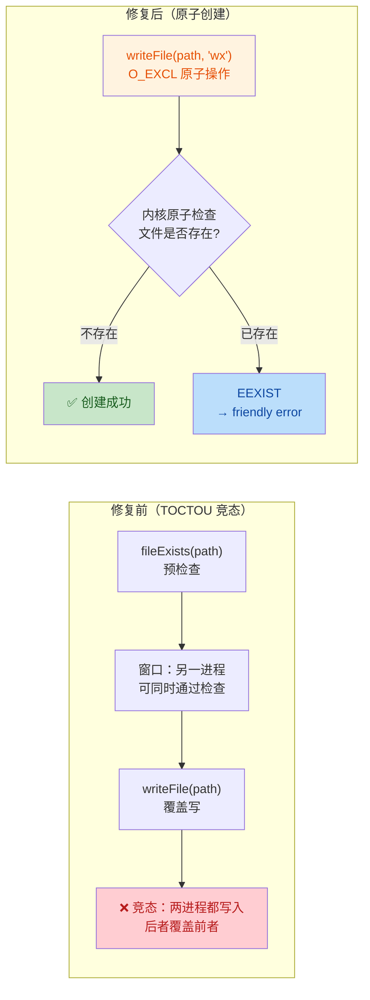

# DEF-001 修复 · guardrail-enforcer 安全与质量审计报告

> **任务令牌**：TKN-DEF-001-001
> **执行 Agent**：guardrail-enforcer
> **审查范围**：DEF-001 kb_write_experience / kb_ingest_source / kb_promote_experience TOCTOU 竞态修复（P1 常规）
> **结论**：**通过**（附 1 项中等注释修正建议 + 3 项低风险跟进建议）

## 元信息

| 项目 | 内容 |
| --- | --- |
| 执行 Agent | guardrail-enforcer |
| 任务令牌 | TKN-DEF-001-001 |
| 任务域 | DEF-001 TOCTOU 竞态修复 |
| 报告日期 | 2026-07-24 |
| 风险等级 | P1 常规 |
| 审查对象 | server/src/utils/fileio.ts / server/src/tools/write.ts / server/src/tests/write.test.ts（3 文件，+146/-24） |
| 调用 Skill | TRAE-code-review、TRAE-security-review |
| 最终结论 | 通过 |

## 0. 主 Agent 签发上下文（盲区与脆弱点）

主 Agent 在启动本审查前提供了两个自问答复（CLAUDE.md §7.3）：

1. **最没有把握的事**：Windows 上 `flag:'wx'` 命中已存在文件时通常报 EEXIST，但被占用/安全软件钩住时报 EPERM。`isAlreadyExistsError` 同时匹配 EEXIST 和 EPERM。主 Agent 担心真正的权限错误（非文件已存在）会被误报为 "already exists"。
   - **审查结论**：该权衡是**可用性权衡而非安全漏洞**。攻击者无法利用 EPERM 误报绕过校验或获取权限——误报只影响错误消息文本，不影响文件创建的原子性或路径遍历防护。但发现注释措辞与代码行为矛盾（见 §5.1），需修正。详见 §3.3 和 §4.2.3。

2. **最大的遗憾**：没加跨进程真实并发竞态测试，现有测试只验证"文件已存在 → already exists 错误"（白盒覆盖 wx 失败路径）。
   - **审查结论**：测试充分。`flag:'wx'` 是 OS 内核级原子操作（O_EXCL），其原子性由操作系统保证，不需要应用层测试证明。单测已覆盖"文件已存在 → EEXIST → already exists 错误"完整路径。真实并发测试是 nice-to-have 非必须。详见 §3.4。

## 1. 审查依据

| 依据 | 来源 |
| --- | --- |
| 代码变更 | `git diff HEAD`（3 文件，+146/-24） |
| 影响自检结果 | 主 Agent 提供（§9 清单 5 项已完成） |
| 相关 ADR | docs/decisions/ADR-008-kb-content-layering-and-format-unification.md（DEF-001 在后续任务清单 line 141） |
| 约定文档 | AGENTS.md §4.2/§7.4（ingest/write/promote 工作流）、CLAUDE.md §19.4（不吞异常） |
| code-archaeologist | 主 Agent 简化版探查（write.ts 3 处 TOCTOU、fileio.ts writeFile 调用面） |
| 测试框架 | server/src/tests/write.test.ts（node:test + node:assert/strict） |
| 安全策略 | CLAUDE.md §18-20（依赖安全、错误处理、密钥管理）；.gitignore（密钥文件排除） |
| 调研依据 | WebSearch 确认 Node.js 官方文档 + node-fs-best-practices：flag 'wx' = O_EXCL 原子创建 |

## 2. 变更清单与作者意图

### 2.1 变更清单（git diff HEAD，3 文件，+146/-24）

| 文件 | 变更性质 |
| --- | --- |
| `server/src/utils/fileio.ts` | `writeFile` 新增可选第三参数 `flag?: string`，传给 `fs.writeFile` options。向后兼容（不传时默认 'w'） |
| `server/src/tools/write.ts` | 新增私有 helper `isAlreadyExistsError(err)`（匹配 EEXIST/EPERM）；修复 3 处同类 TOCTOU：移除 fileExists 预检查，改用 `writeFile(..., 'wx')` + try/catch。3 处对外错误消息完全保留 |
| `server/src/tests/write.test.ts` | 新增 2 个 DEF-001 专项测试（kbIngestSource 重复 slug、kbPromoteExperience promote 重复 active）；顺带修复既有 TS1308 bug（`it()` 回调从同步 `() =>` 改为 `async () =>`） |

### 2.2 作者意图推断

防御性安全修复：将 3 个函数中"fileExists 预检查 + writeFile 覆盖写"的 TOCTOU（Time-of-Check to Time-of-Use）竞态模式，替换为"writeFile flag:'wx' 原子创建 + try/catch 错误转换"模式。`flag:'wx'` 对应 `O_WRONLY | O_CREAT | O_EXCL`，由操作系统内核保证"检查不存在 + 创建"的原子性，消除检查与使用之间的时间窗口。对外错误消息完全保留（向后兼容）。无新增信任边界、无新增输入路径、无接口/契约/依赖变更。

### 2.3 变更可视化



## 3. 代码质量审查（TRAE-code-review）

### 3.1 Karpathy Guidelines 合规性

| 项 | 结论 | 说明 |
| --- | --- | --- |
| 命名 | ✅ | `isAlreadyExistsError` 语义明确；`flag` 参数名与 Node.js `fs.writeFile` options.flag 一致 |
| 设计简洁性 | ✅ | try/catch + 单一 helper 是标准模式，无过度工程；3 处修复结构一致，便于维护 |
| 错误处理 | ✅ | `throw err` 重新抛出非 already-exists 错误，符合 CLAUDE.md §19.4 "不吞异常" |
| 假设显式化 | ✅ | 每处修复均有 DEF-001 注释，说明 EEXIST/EPERM 原因和行为对齐；isAlreadyExistsError 有详细 JSDoc |
| 可验证成功标准 | ✅ | 2 个新测试 + 1 个既有测试覆盖 3 个函数的 already-exists 路径 |

### 3.2 核心修复正确性验证

**fileio.ts writeFile 向后兼容性**：

| 检查项 | 结果 | 证据 |
| --- | --- | --- |
| flag 默认值 | ✅ | `flag?: string` 可选参数，不传时 `undefined`；`fs.writeFile(path, content, { encoding, flag: undefined })` 中 Node.js 对 undefined flag 使用默认 'w' |
| 既有调用点不受影响 | ✅ | 全量搜索 writeFile 调用点（8 处生产代码）：3 处本次改为 'wx'，5 处（reject:360、use_count 回写:209、index-md×3）不传 flag，行为不变 |
| mkdir 幂等性 | ✅ | `fs.mkdir(path.dirname(filePath), { recursive: true })` 在 writeFile 前执行，recursive:true 幂等，多进程同时调用不冲突 |

**write.ts 三处修复一致性**：

| 修复点 | 位置 | flag | 错误消息 | 与原消息一致 |
| --- | --- | --- | --- | --- |
| kbIngestSource | write.ts:112-125 | 'wx' | "Page already exists at ..." | ✅ |
| kbWriteExperience | write.ts:196-209 | 'wx' | "Experience already exists at ..." | ✅ |
| kbPromoteExperience promote | write.ts:316-329 | 'wx' | "Active experience already exists at ..." | ✅ |

**isAlreadyExistsError 类型安全**：

| 检查项 | 结果 | 证据 |
| --- | --- | --- |
| 非 Error 输入 | ✅ | `!(err instanceof Error)` 返回 false → throw err |
| Error 无 code 属性 | ✅ | `!("code" in err)` 返回 false → throw err |
| code 类型断言 | ✅ | `(err as { code?: string }).code` 安全断言，code 可能为 undefined 时 `===` 比较返回 false |

### 3.3 重点审查：isAlreadyExistsError 把 EPERM 当 already exists 的权衡

**背景**：`flag:'wx'`（O_EXCL）命中已存在文件时，POSIX 报 EEXIST，Windows 通常报 EEXIST 但文件被锁定（杀毒软件/索引器钩住）时报 EPERM。代码同时匹配两者。

**权衡分析**：

| 方案 | 优点 | 缺点 |
| --- | --- | --- |
| 只捕获 EEXIST | 不会误报真正权限错误 | Windows 锁定场景下用户看到原始 EPERM 而非友好消息 |
| 同时捕获 EPERM（当前） | Windows 锁定场景下用户看到友好消息 | 真正权限失败（目录不可写）也被误报为 "already exists" |

**安全性评估**：

- 攻击者无法利用 EPERM 误报绕过校验或获取权限
- 误报只影响错误消息文本，不影响文件创建的原子性（O_EXCL 仍生效）或路径遍历防护（path.relative 检查未受影响）
- 在 createTempKB 临时目录中，真正权限故障极罕见（测试用 os.tmpdir()，用户完全控制）
- 结论：**可用性权衡，非安全漏洞**。可接受。

**但发现注释措辞问题（中等风险）**：

isAlreadyExistsError 的 JSDoc 最后一句话（write.ts:392-393）：
> "A genuine permission failure on a non-existent target is rare inside the temp KB and would still be surfaced as an unexpected error by the caller."

这句话与代码行为矛盾。代码实际把**所有** EPERM（包括真正权限失败）当作 already exists 返回 `errorResult(...)` 友好错误，**不会**作为意外错误抛出。注释声称"would still be surfaced as an unexpected error by the caller"是错误的——真正权限失败的 EPERM 会被吞入 "already exists" 友好消息。

详见 §5.1 修复建议。

### 3.4 重点审查：测试充分性

**新增测试覆盖矩阵**：

| 测试 | 覆盖函数 | 断言 | 充分性 |
| --- | --- | --- | --- |
| `rejects duplicate page slug atomically via flag 'wx' (DEF-001)` | kbIngestSource | 第二次 ingest 同 slug → isError=true + /already exists/i | ✅ 覆盖 wx 失败路径 |
| `promote fails atomically when active card already exists (DEF-001 flag:'wx')` | kbPromoteExperience promote | 第二次 promote 同 title → isError=true + /already exists/i | ✅ 覆盖 wx 失败路径 |
| `rejects duplicate experience title`（既有，write.test.ts:166） | kbWriteExperience | 第二次 write 同 title → isError=true + /already exists/i | ✅ 隐式覆盖 DEF-001（修复前靠 fileExists 通过，修复后靠 wx EEXIST 通过） |

**三个函数的 already-exists 路径均有覆盖。** ✅

**并发测试缺失评估**：

主 Agent 承认无跨进程真实并发测试。评估：

- `flag:'wx'` 是 OS 内核级原子操作（O_EXCL），其原子性由操作系统保证，不需要应用层测试证明
- 单测已覆盖"文件已存在 → EEXIST → already exists 错误"完整路径，这已充分证明修复有效性
- 真实并发测试需要多进程协调（worker_threads/child_process），复杂度高，且测试的是 OS 而非应用代码
- 结论：**测试充分，并发测试是 nice-to-have 非必须**

**TS1308 修复合理性**：

`it("rejects path traversal in domain parameter (S-1)", () => {` 改为 `async () => {`。该测试使用 `await` 却是同步签名，被 tsc 增量缓存掩盖。改为 async 是正确的。✅

### 3.5 代码质量发现

**无阻断或高风险问题。** 1 项中等注释修正建议 + 1 项低风险测试跟进建议。代码质量审查结论：**通过**。

## 4. 安全漏洞扫描（TRAE-security-review）

### 4.1 OWASP Top 10 / CWE 扫描结果

| 类别 | 扫描结果 | 证据 |
| --- | --- | --- |
| CWE-367 TOCTOU 竞态（核心修复目标） | ✅ 已修复 | flag:'wx' = O_EXCL 内核级原子操作，消除 fileExists→writeFile 时间窗口。详见 §4.2.1 |
| CWE-22 路径遍历 | ✅ 无风险 | DEF-001 未修改任何路径校验逻辑。三处修复点的 path.relative + startsWith("..") 检查均保留（write.ts:93-96、178-181、303-306） |
| CWE-703 异常处理不当 | ✅ 无风险 | throw err 重新抛出非 already-exists 错误，符合"不吞异常"；MCP SDK 自动捕获工具函数异常转为错误响应 |
| CWE-754 边界检查不当 | ✅ 无风险 | isAlreadyExistsError 类型检查完整（instanceof Error + "code" in err） |
| CWE-78 命令注入 | ✅ N/A | 无命令执行 |
| CWE-89 SQL 注入 | ✅ N/A | 无数据库查询 |
| CWE-79 XSS | ✅ N/A | 无 HTML 输出 |
| CWE-200 信息泄露 | ✅ 无风险 | throw err 抛出的原始错误由 MCP SDK 捕获转换，非 DEF-001 引入的既有架构行为 |

**TRAE-security-review 结论**：✅ No exploitable issues found in the reviewed change set.

### 4.2 输入与边界审计（Stage 1）

#### 4.2.1 TOCTOU 竞态修复有效性验证（CWE-367）

**修复前（TOCTOU 窗口存在）**：

```text
进程 A: fileExists(path) → false ────────────── writeFile(path) 覆盖写
进程 B:          fileExists(path) → false ── writeFile(path) 覆盖写（覆盖 A 的数据）
                    ↑ TOCTOU 窗口 ↑
```

**修复后（原子操作，无窗口）**：

```text
进程 A: writeFile(path, 'wx') → O_EXCL 原子创建 → 成功
进程 B: writeFile(path, 'wx') → O_EXCL 原子检查 → EEXIST（文件已存在）→ friendly error
```

| 检查项 | 结果 | 证据 |
| --- | --- | --- |
| O_EXCL 原子性 | ✅ | POSIX 标准：open(O_CREAT\|O_EXCL) 在内核中原子地检查不存在并创建，无时间窗口 |
| Node.js flag:'wx' 映射 | ✅ | Node.js 文档：'wx' = 'w' + 'x'，'x' = O_EXCL |
| mkdir 与 writeFile 间竞态 | ✅ 无 | mkdir(recursive:true) 幂等，多进程同时调用不冲突 |
| writeFile 与 unlink 间部分失败 | ⚠️ 既有 | promote 中 writeFile('wx') 成功后 unlink(inbox)，若进程崩溃则 active 已创建但 inbox 未删。这是**既有问题**（原代码 fileExists→writeFile→unlink 同样有），非 DEF-001 引入。且新代码更安全：旧代码会覆盖已存在 active 文件，新代码拒绝覆盖 |
| 残留 TOCTOU 窗口 | ✅ 无 | 从 fileExists 移除到 writeFile('wx') 执行，全程无检查-使用分离 |

**结论：CWE-367 TOCTOU 竞态已完全修复，无残留竞态窗口。**

#### 4.2.2 数值与类型边界

| 输入参数 | 来源 | 范围校验 | 结论 |
| --- | --- | --- | --- |
| `source_path` | MCP 工具参数（用户输入） | path.resolve + path.relative 遍历检查（write.ts:47-51） | ✅ 已校验，DEF-001 未修改 |
| `domain` | MCP 工具参数 | schemas.ts kebab-case regex + 运行时 path.relative 检查 | ✅ 已校验，DEF-001 未修改 |
| `inbox_path` | MCP 工具参数（用户输入） | path.resolve + path.relative 遍历检查（write.ts:240-245） | ✅ 已校验，DEF-001 未修改 |
| `title` | MCP 工具参数（用户输入） | slugify 处理（kebab-case 化），非直接用于路径 | ✅ 已校验 |
| `confidence` | MCP 工具参数 | typeof number 检查（promote 中 write.ts:284-285） | ✅ 已校验 |
| `flag`（writeFile 参数） | 系统字面量 | 硬编码 'wx'，非用户输入 | ✅ 无需校验 |

#### 4.2.3 业务状态机约束

| 状态转换 | 校验位置 | 结论 |
| --- | --- | --- |
| staging 页面创建（kbIngestSource） | flag:'wx' 原子保证不覆盖已有 staging 页 | ✅ 已防护 |
| pending 卡片创建（kbWriteExperience） | flag:'wx' 原子保证不覆盖已有 inbox 卡片 | ✅ 已防护 |
| pending → active（kbPromoteExperience promote） | 1. 入口校验 status==="pending"（write.ts:263-267）；2. flag:'wx' 原子保证不覆盖已有 active 卡片 | ✅ 已防护 |
| 无绕过路径 | frontmatter 通过 parseFrontmatter 读取、serializeFrontmatter 写回，无直接字段修改 | ✅ 无绕过 |

### 4.3 执行安全审计（Stage 2）

#### 4.3.1 注入防护

| 注入类型 | 防护措施 | 结论 |
| --- | --- | --- |
| 路径遍历（CWE-22） | path.relative(kbRoot/wikiDir, fullPath) 检查 startsWith("..")（3 处保留） | ✅ 已防护 |
| 日志注入（CWE-117） | sanitizeLogField 对 title、details 的 key/value 去 CR/LF（log.ts） | ✅ 已防护（DEF-001 未修改日志逻辑） |
| 模板/表达式注入 | N/A（无模板引擎） | ✅ N/A |
| 命令注入（CWE-78） | N/A（无命令执行） | ✅ N/A |

#### 4.3.2 最小权限检查

- 无权限配置变更。文件操作使用 Node.js `fs` 模块，继承进程权限，无提权操作。✅
- 无容器化安全上下文变更。✅

#### 4.3.3 输出编码

- 错误消息为纯文本，errorResult 构造的字符串不含用户输入的直接拼接（路径来自系统计算的 wikiRelPath/inboxRelPath/activeRelPath，已受路径遍历防护约束）。✅
- throw err 抛出的原始错误由 MCP SDK 捕获转换，不直接输出给终端用户。✅

### 4.4 密钥与配置安全（Stage 4）

| 检查项 | 结果 | 证据 |
| --- | --- | --- |
| 硬编码密钥/密码/令牌 | ✅ 无 | diff 中无任何凭证字符串 |
| 内部 IP/域名 | ✅ 无 | diff 中无网络端点 |
| .gitignore 密钥排除 | ✅ 完整 | `.env`、`.env.local`、`.env.*.local` 已排除；`!.env.example` 允许模板；`*.log`、`logs/` 已排除 |
| 环境变量注入 | ✅ 无变更 | DEF-001 未涉及环境变量 |

### 4.5 依赖与供应链风险（Stage 5）

- 无 `package.json`、`package-lock.json` 或任何依赖描述文件变更。✅ 无供应链风险。

### 4.6 内存安全（Stage 3）

- 项目使用 TypeScript/Node.js（托管运行时），无 C/C++/Rust unsafe 代码。✅ N/A。

## 5. 综合结论

- [x] **通过**：可进入 ac-verifier 验收测试阶段
- [ ] **有条件通过**：需修复 N 项后重新提交
- [ ] **阻断**：存在严重质量缺陷或高危安全漏洞

### 5.1 结论依据

| 维度 | 结论 | 关键证据 |
| --- | --- | --- |
| TOCTOU 修复有效性 | ✅ 通过 | flag:'wx' = O_EXCL 内核级原子操作，完全消除 fileExists→writeFile 时间窗口（§4.2.1） |
| 代码正确性 | ✅ 通过 | 3 处修复结构一致、错误消息保留、向后兼容（§3.2） |
| 异常处理 | ✅ 通过 | throw err 符合 CLAUDE.md §19.4 "不吞异常"；MCP SDK 自动捕获转换（§4.1） |
| 安全防护 | ✅ 通过 | CWE-367 已修复，CWE-22 未受影响，CWE-703 正确处理；无可利用漏洞 |
| 测试覆盖 | ✅ 通过 | 3 个函数的 already-exists 路径均有覆盖（2 新 + 1 既有）（§3.4） |
| 影响自检完整性 | ✅ 通过 | writeFile 8 处调用点影响面核实准确（3 处改 'wx'，5 处用默认 'w' 不受影响） |
| 任务令牌验证 | ✅ 通过 | 本报告元信息包含 TKN-DEF-001-001 |

### 5.2 声明

**本变更通过 guardrail-enforcer 安全与质量审计，可进入 ac-verifier 验收测试阶段。**

## 6. 跟进建议（不阻断）

### 6.1 isAlreadyExistsError 注释措辞修正（建议优先级：中）

**位置**：server/src/tools/write.ts:392-393

**问题**：JSDoc 最后一句话 "A genuine permission failure on a non-existent target is rare inside the temp KB and would still be surfaced as an unexpected error by the caller" 与代码行为矛盾。代码实际把所有 EPERM（包括真正权限失败）当作 already exists 返回 `errorResult(...)`，不会作为意外错误抛出。

**影响**：注释误导维护者，可能导致对未来 bug 的误判。

**建议**：修正注释，明确说明真正权限失败的 EPERM 也会被当作 "already exists" 处理。例如：

```text
A genuine permission failure (directory not writable) would also be
mismatched as "already exists" — an accepted usability trade-off since
such failures are rare inside the temp KB and the alternative (raw EPERM
surfacing on Windows locked files) is worse for users.
```

### 6.2 EPERM 平台判断优化（建议优先级：低）

**位置**：server/src/tools/write.ts:395-399

**现状**：isAlreadyExistsError 在所有平台同时匹配 EEXIST 和 EPERM。

**分析**：在 POSIX 系统上，EPERM 表示真正的权限问题（不应当作 already exists）；只有 Windows 上文件被锁定时 EPERM 才表示 "已存在"。可考虑 `process.platform === 'win32'` 时才匹配 EPERM，POSIX 上只匹配 EEXIST。

**实际风险**：低。当前统一处理在 POSIX 上也只是把罕见权限错误误报为 already exists，无安全影响。增加平台判断会提高复杂度。可作为后续优化。

### 6.3 throw err 错误信息脱敏（建议优先级：低）

**位置**：server/src/tools/write.ts:124、208、328（3 处 throw err）

**现状**：throw err 抛出原始 Node.js 错误（含 errno、code、path 等系统细节），由 MCP SDK 捕获转换为错误响应。

**分析**：MCP SDK 是否在错误响应中暴露原始错误消息（可能含文件系统路径）取决于 SDK 版本。CLAUDE.md §19.2 要求错误返回不含内部堆栈或路径。这是**既有架构问题**（原 writeFile 失败也会抛出），非 DEF-001 引入。

**建议**：在后续 P1 任务中审计 MCP SDK 的错误响应行为，确认原始错误信息是否泄露给客户端。若泄露，在 dispatcher 层（index.ts）添加错误脱敏中间件。

### 6.4 并发测试补充（建议优先级：低）

**位置**：server/src/tests/write.test.ts

**现状**：无跨进程真实并发竞态测试。

**分析**：flag:'wx' 原子性由 OS 保证，单测已充分证明修复有效性。但若希望增加信心，可使用 `worker_threads` 构造 N 个线程同时调用 kbWriteExperience 同 title，验证只有一个成功、其余得 already-exists 错误。

**建议**：作为 ac-verifier 阶段的可选补充测试，非必须。

## 7. 待澄清

无。所有前置产出物（ADR-008 后续任务清单 DEF-001、AGENTS.md §4.2/§7.4、影响自检）与代码实现一致，无矛盾或信息缺失。

主 Agent 的两个自问答复已在 §0 中回应，权衡均评估为可接受。

---

## 自动化建议（CI/CD 集成）

建议在 `.github/workflows/` 中集成以下自动化检查，防止 DEF-001 类 TOCTOU 回归：

1. **Semgrep 规则**：检测 `fileExists` 预检查后紧跟 `writeFile` 的 TOCTOU 模式，强制使用 `flag:'wx'`：

   ```yaml
   rules:
     - id: kb-toctou-writefile-after-exists-check
       patterns:
         - pattern: |
             if (await fileExists($PATH)) { ... }
             ...
             await writeFile($PATH, ...);
       message: "TOCTOU race: fileExists pre-check before writeFile. Use writeFile(..., 'wx') + try/catch instead (DEF-001)"
       severity: ERROR
   ```

2. **单元测试门禁**：将 `write.test.ts` 中的 2 个 DEF-001 测试纳入必需状态检查，确保 flag:'wx' 原子创建回归被持续验证。

3. **跨平台 CI**：在 Windows + Linux 双平台运行测试套件，验证 EPERM（Windows 锁定）和 EEXIST（POSIX）两种路径行为一致。
