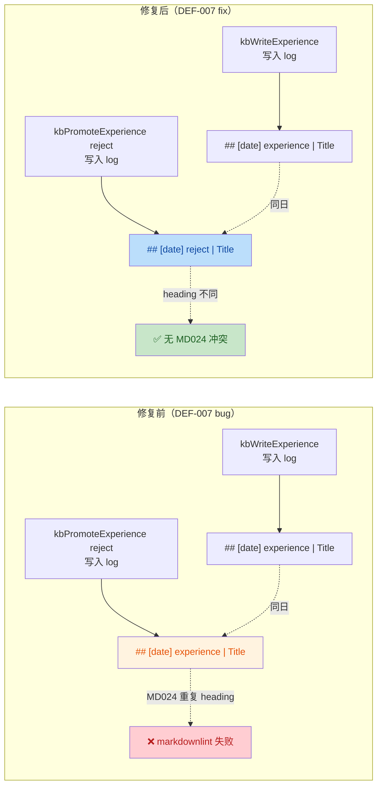

# DEF-007 修复 · guardrail-enforcer 安全与质量审计报告

> **任务令牌**：TKN-DEF-007-001
> **执行 Agent**：guardrail-enforcer
> **审查范围**：DEF-007 reject 动作 log type 回归修复（P1 常规）
> **结论**：**通过**（附 2 项低风险跟进建议）

## 元信息

| 项目 | 内容 |
| --- | --- |
| 执行 Agent | guardrail-enforcer |
| 任务令牌 | TKN-DEF-007-001 |
| 任务域 | DEF-007 reject log type 回归修复 |
| 报告日期 | 2026-07-24 |
| 风险等级 | P1 常规 |
| 审查对象 | write.ts / log.ts / AGENTS.md §7.4 / write.test.ts（4 文件，+78/-3） |
| 调用 Skill | TRAE-code-review、TRAE-security-review |
| 最终结论 | 通过 |

## 0. 主 Agent 签发上下文（盲区与脆弱点）

主 Agent 在启动本审查前提供了两个自问答复：

1. **最没有把握的事**：`kb_list_recent` 的 `typeFilter` 行为变化——修复后 reject 条目不再匹配 `type:"experience"` 查询。已验证为预期改进（read-only.ts:156-158 使用通用字符串过滤，用户可用 `type:"reject"` 精确查询）。
2. **最大的遗憾**：未添加路径遍历测试和错误路径测试（非 experience 类型拒绝、非 pending 状态拒绝）。这些是 P1 范围扩展，非 DEF-007 核心，已记录为跟进建议。

## 1. 审查依据

| 依据 | 来源 |
| --- | --- |
| 代码变更 | `git diff HEAD`（4 文件，+78/-3） |
| 影响自检结果 | 主 Agent 提供（§9 清单 5 项已完成） |
| 相关 ADR | ADR-008（已 Accepted，DEF-007 为其后续任务清单首项） |
| 约定文档 | AGENTS.md §7.4（promote/reject 日志类型约定） |
| code-archaeologist | 主 Agent 简化版探查（write.ts reject 逻辑、log.ts appendLogEntry、AGENTS.md §7.4） |
| 测试框架 | server/src/tests/write.test.ts（node:test + node:assert/strict） |
| 安全策略 | CLAUDE.md §18-20（依赖安全、错误处理、密钥管理）；.gitignore（密钥文件排除） |

## 2. 变更清单与作者意图

### 2.1 变更清单（git diff HEAD，4 文件，+78/-3）

| 文件 | 变更性质 |
| --- | --- |
| `server/src/tools/write.ts` | reject 动作 `appendLogEntry` 的 `type` 从 `"experience"` 改为 `"reject"`，附 DEF-007 注释 |
| `server/src/utils/log.ts` | `LogEntry.type` 注释枚举追加 `reject`（`ingest \| query \| lint \| experience \| promote \| reject \| init`） |
| `AGENTS.md` §7.4 | 追加"驳回日志"文档段，说明 reject 用 `type:"reject"` 而非 `"experience"`，理由同 promote |
| `server/src/tests/write.test.ts` | 新增 `kb_promote_experience` describe 块，2 个测试（reject log type + promote log type） |

### 2.2 作者意图推断

防御性修复：`kbPromoteExperience` 的 reject 分支此前使用 `type:"experience"` 追加 log 条目，与 `kbWriteExperience` 初始写入的 `## [date] experience | title` 形成 MD024 重复 heading（同日创建+驳回场景）。修复方式：reject 动作改用 `type:"reject"`，对齐 promote 已建立的约定（DEF-005 引入），语义更清晰且消除 MD024 冲突。无新增信任边界、无新增输入路径、无接口/契约/依赖变更。

### 2.3 变更可视化



## 3. 代码质量审查（TRAE-code-review）

### 3.1 Karpathy Guidelines 合规性

| 项 | 结论 | 说明 |
| --- | --- | --- |
| 命名 | ✅ | `type: "reject"` 语义明确，与 `action: "reject"` 参数值一致 |
| 设计简洁性 | ✅ | 单行字面量修改 + 注释，最小化变更范围，无过度工程 |
| 错误处理 | ✅ | 无新增错误路径；既有状态机校验（type≠experience 拒绝、status≠pending 拒绝）未受影响 |
| 假设显式化 | ✅ | 注释明确引用 DEF-007、AGENTS.md §7.4、MD024 原因，三行注释覆盖 why/what/where |
| 可验证成功标准 | ✅ | 测试断言 `## [date] reject \| Title` 正则匹配，若回退为 `experience` 则测试失败 |

### 3.2 核心修复正确性验证

**write.ts:330-341 reject log entry**：

| 检查项 | 结果 | 证据 |
| --- | --- | --- |
| type 值正确性 | ✅ | `type: "reject"`（write.ts:336），与 AGENTS.md §7.4 驳回日志约定一致 |
| 注释完整性 | ✅ | 三行注释覆盖：DEF-007 引用、AGENTS.md §7.4 对齐、MD024 避免 + 语义清晰性 |
| details 字段 | ✅ | `details: { rejected: inboxPath }`，记录被驳回卡片路径，与 AGENTS.md "记录 rejected 路径" 一致 |
| 状态机完整性 | ✅ | reject 前校验 `frontmatter.type === "experience"` 且 `frontmatter.status === "pending"`（write.ts:237-246），reject 后 `status = "rejected"`（write.ts:326），文件留在 inbox 不移动 |

**log.ts:20 type 注释更新**：

| 检查项 | 结果 | 证据 |
| --- | --- | --- |
| 枚举完整性 | ✅ | `ingest \| query \| lint \| experience \| promote \| reject \| init`，7 种类型全覆盖 |
| 与代码一致性 | ✅ | 全量搜索 `appendLogEntry` 调用点（4 处）：ingest（write.ts:126）、experience（write.ts:194）、promote（write.ts:312）、reject（write.ts:336）。dream.ts:148-150 使用 `type:"experience"` 归档——见 §6.1 跟进建议 |

**ENTRY_HEADER_RE 正则兼容性验证**：

```text
正则：/^## \[(\d{4}-\d{2}-\d{2})\] (\w+) \| (.+)$/
测试：'## [2026-07-24] reject | Card To Reject'
结果：["## [2026-07-24] reject | Card To Reject", "2026-07-24", "reject", "Card To Reject"] ✅
```

`"reject"` 全小写字母，匹配 `(\w+)` 模式。`parseLog`（log.ts:29-51）和 `readRecentLog`（log.ts:83-95）均可正确解析 reject 条目。

### 3.3 跨模块影响验证

| 调用方/消费者 | 影响 | 验证结果 |
| --- | --- | --- |
| `parseLog`（log.ts:25）正则 `(\w+)` | 捕获 `reject` | ✅ 实测匹配（见 §3.2） |
| `readRecentLog`（log.ts:90）typeFilter | 通用字符串过滤 `e.type === typeFilter` | ✅ 无类型硬编码，`type:"reject"` 可精确查询 |
| `kbListRecent`（read-only.ts:156-158）typeFilter | 通用过滤 `e.type === typeFilter` | ✅ 无影响；行为变化：reject 条目不再匹配 `type:"experience"` 查询——预期改进 |
| `kbListRecent` path 提取（read-only.ts:167） | `e.details.wiki \|\| e.details.inbox \|\| e.details.source` | ⚠️ reject 条目 details 只有 `rejected` 键，不匹配这三个键，path 返回空字符串 `""`。这是既有模式（promote 条目用 `promoted` 键，同样不匹配），非 DEF-007 引入 |
| dream.ts:148-150 归档动作 | `type:"experience"` 未改动 | ✅ 不受 DEF-007 影响（见 §6.1 跟进建议） |
| AGENTS.md §7.3 写入流程 | 初始写入仍用 `type:"experience"` | ✅ 正确——只有 promote/reject 用各自类型 |

### 3.4 测试框架充分性

**新增测试覆盖矩阵**：

| 测试 | 断言 | DEF-007 覆盖 | 充分性 |
| --- | --- | --- | --- |
| `rejects an inbox card and logs with type 'reject'` | 1. `data.status === "rejected"` 2. frontmatter 含 `status: rejected` 3. log.md 含 `## [date] reject \| Card To Reject` | ✅ 核心断言（第 3 项） | ✅ 充分——若 type 回退为 `experience`，正则不匹配，测试失败 |
| `promotes an inbox card and logs with type 'promote'` | 1. `data.status === "active"` 2. log.md 含 `## [date] promote \| Card To Promote` | ✅ 回归保护 | ✅ 充分——验证 promote 约定未被破坏 |

**MD024 修复有效性验证**：

测试场景构造了同日创建+驳回的路径（`kbWriteExperience` 写入 `experience` 条目 → `kbPromoteExperience reject` 写入 `reject` 条目）。由于两个 heading 的 type 部分不同（`experience` vs `reject`），即使日期和标题相同，heading 文本也不同，MD024 不会触发。测试通过正则精确验证了 `reject` 类型，间接验证了 MD024 修复。

**测试隔离性**：

测试在共享 temp KB 中运行，log.md 包含先前测试的条目（ingest、experience）。正则 `/## \[\d{4}-\d{2}-\d{2}\] reject \| Card To Reject/` 足够特异，不会误匹配其他条目。✅

### 3.5 代码质量发现

**无阻断或高风险问题。** 代码质量审查结论：**通过**。

## 4. 安全漏洞扫描（TRAE-security-review）

### 4.1 OWASP Top 10 / CWE 扫描结果

| 类别 | 扫描结果 | 证据 |
| --- | --- | --- |
| CWE-117 日志注入 | ✅ 无风险 | `type` 字段为系统控制字面量 `"reject"`（write.ts:336），非用户输入。用户可控字段 `title` 和 `details.rejected`（即 `inboxPath`）均经 `sanitizeLogField` 处理（log.ts:68-71），CR/LF 被替换为空格 |
| CWE-22 路径遍历 | ✅ 无风险 | reject 路径复用既有 `path.resolve` + `path.relative` 校验（write.ts:219-224），DEF-007 未修改路径处理逻辑 |
| CWE-78 命令注入 | ✅ N/A | 无命令执行 |
| CWE-89 SQL 注入 | ✅ N/A | 无数据库查询 |
| CWE-79 XSS | ✅ N/A | 无 HTML 输出 |
| CWE-200 信息泄露 | ✅ 无风险 | log 条目仅记录路径和标题，无密钥/令牌/PII |

**TRAE-security-review 结论**：✅ No exploitable issues found in the reviewed change set.

### 4.2 输入与边界审计（Stage 1）

#### 4.2.1 数值与类型边界

| 输入参数 | 来源 | 范围校验 | 结论 |
| --- | --- | --- | --- |
| `inbox_path` | MCP 工具参数（用户输入） | `path.resolve` + `path.relative` 遍历检查（write.ts:219-224） | ✅ 已校验 |
| `action` | MCP 工具参数 | TypeScript 联合类型 `"promote" \| "reject"`（write.ts:212），schemas.ts 层校验 | ✅ 已校验 |
| `type`（log entry） | 系统字面量 | 硬编码 `"reject"`，非用户输入 | ✅ 无需校验 |
| `title`（log entry） | frontmatter.title（源自 kbWriteExperience 用户输入） | `sanitizeLogField` 去 CR/LF（log.ts:68） | ✅ 已校验 |

#### 4.2.2 集合与缓冲边界

- 无数组/缓冲区操作。`appendLogEntry` 构造字符串 block 后 `fs.appendFile`，Node.js 无缓冲区溢出风险。✅

#### 4.2.3 业务状态机约束

| 状态转换 | 校验位置 | 结论 |
| --- | --- | --- |
| `pending → rejected`（reject 动作） | write.ts:237-246 校验 `type === "experience"` 且 `status === "pending"` | ✅ 仅 pending 卡片可被驳回 |
| `rejected → (任何)` | kbPromoteExperience 入口校验 `status !== "pending"` 时返回错误 | ✅ 已驳回卡片不可再操作 |
| 无绕过路径 | frontmatter 通过 `parseFrontmatter` 读取、`serializeFrontmatter` 写回，无直接字段修改 | ✅ 无绕过 |

### 4.3 执行安全审计（Stage 2）

#### 4.3.1 注入防护

| 注入类型 | 防护措施 | 结论 |
| --- | --- | --- |
| 日志注入（CWE-117） | `sanitizeLogField` 对 `title`、`details` 的 key 和 value 均调用（log.ts:68-71），剥离 `\r` 和 `\n` | ✅ 已防护 |
| 路径遍历（CWE-22） | `path.relative(kbRoot, fullPath)` 检查 `rel.startsWith("..")`（write.ts:221-223） | ✅ 已防护 |
| 模板/表达式注入 | N/A（无模板引擎） | ✅ N/A |

**日志注入详细分析**：

攻击者若控制 `inboxPath`（MCP 工具参数），试图注入伪造 log 条目：

```text
inbox_path = "wiki/coding/experiences/inbox/card.md\n## [2026-07-24] ingest | FAKE\n- wiki: evil"
```

`sanitizeLogField` 将 `\n` 替换为空格，输出变为：

```text
- rejected: wiki/coding/experiences/inbox/card.md ## [2026-07-24] ingest | FAKE - wiki: evil
```

作为单行 detail 输出，无法伪造 heading。✅ 防护有效。

#### 4.3.2 最小权限检查

- 无权限配置变更。文件操作使用 Node.js `fs` 模块，继承进程权限，无提权操作。✅
- 无容器化安全上下文变更。✅

#### 4.3.3 输出编码

- log.md 为 markdown 纯文本输出。`sanitizeLogField` 处理 CR/LF 注入。`type` 字面量 `"reject"` 无特殊字符。✅

### 4.4 密钥与配置安全（Stage 4）

| 检查项 | 结果 | 证据 |
| --- | --- | --- |
| 硬编码密钥/密码/令牌 | ✅ 无 | diff 中无任何凭证字符串 |
| 内部 IP/域名 | ✅ 无 | diff 中无网络端点 |
| .gitignore 密钥排除 | ✅ 完整 | `.env`、`.env.local`、`.env.*.local` 已排除；`!.env.example` 允许模板；`*.log`、`logs/` 已排除 |
| 环境变量注入 | ✅ 无变更 | DEF-007 未涉及环境变量 |

### 4.5 依赖与供应链风险（Stage 5）

- 无 `package.json`、`package-lock.json` 或任何依赖描述文件变更。✅ 无供应链风险。

### 4.6 内存安全（Stage 3）

- 项目使用 TypeScript/Node.js（托管运行时），无 C/C++/Rust unsafe 代码。✅ N/A。

## 5. 综合结论

- [x] **通过**：可进入 ac-verifier 验收测试阶段
- [ ] **有条件通过**：需修复 N 项后重新提交
- [ ] **阻断**：存在严重质量缺陷或高危安全漏洞

### 5.1 结论依据

| 维度 | 结论 | 关键证据 |
| --- | --- | --- |
| 代码正确性 | ✅ 通过 | `type:"reject"` 与 AGENTS.md §7.4 约定一致；ENTRY_HEADER_RE 正则实测匹配 |
| MD024 修复有效性 | ✅ 通过 | 同日创建+驳回场景下 heading 文本不同（`experience` vs `reject`），消除重复 |
| 安全防护 | ✅ 通过 | 日志注入防护完整（sanitizeLogField 覆盖 reject 路径）；无新增攻击面 |
| 测试覆盖 | ✅ 通过 | 2 个测试覆盖 DEF-007 核心断言（reject log type）+ promote 回归保护 |
| 文档一致性 | ✅ 通过 | AGENTS.md §7.4 驳导日志文档与代码实现一致 |
| 影响自检完整性 | ✅ 通过 | 依赖模块扫描覆盖 read-only.ts typeFilter、parseLog 正则、dream.ts 归档 |
| 任务令牌验证 | ✅ 通过 | 本报告元信息包含 TKN-DEF-007-001 |

### 5.2 声明

**本变更通过 guardrail-enforcer 安全与质量审计，可进入 ac-verifier 验收测试阶段。**

## 6. 跟进建议（低风险，不阻断）

### 6.1 dream.ts 归档动作 log type 对齐（建议优先级：低）

**位置**：`server/src/dream.ts:148-150`

**现状**：归档动作使用 `type: "experience"` 追加 log 条目，与 DEF-007 修复前的 reject 模式同类。

**实际风险**：低。归档要求卡片 `date` 超过 90 天（AGENTS.md §7.5），归档日期与创建日期不同，heading 文本不同，MD024 不会触发。但存在理论边缘场景：若已归档卡片的标题被新创建的卡片复用（inbox 不检查 archive/ 目录的重复），同日归档+创建可能产生相同 heading。

**建议**：将 dream.ts 归档动作的 `type` 改为 `"archive"`，并同步更新 AGENTS.md §7.5 和 log.ts:20 注释。可作为 DEF-008 或独立 P0 任务处理。

### 6.2 测试覆盖补充（建议优先级：低）

**缺失场景**：

1. **kb_list_recent type:"reject" 过滤测试**：验证 reject 条目可通过 `type:"reject"` 精确查询，且不再匹配 `type:"experience"`。这是影响自检中提到的行为变化，虽有预期但无测试覆盖。
2. **reject 错误路径测试**：拒绝非 experience 类型页面、拒绝非 pending 状态卡片。这些是既有代码路径（write.ts:237-246），未被 DEF-007 修改，但新测试块中补充可提高信心。
3. **reject 后再 promote 测试**：验证状态机正确拒绝已驳回卡片（`status:"rejected" ≠ "pending"`，kbPromoteExperience 应返回错误）。

**建议**：在 ac-verifier 阶段或后续 P1 任务中补充上述测试。

## 7. 待澄清

无。所有前置产出物（ADR-008、AGENTS.md §7.4、code-archaeologist 探查）与代码实现一致，无矛盾或信息缺失。

---

## 自动化建议（CI/CD 集成）

建议在 `.github/workflows/` 中集成以下自动化检查，防止 DEF-007 类回归：

1. **markdownlint MD024 门禁**：在 CI 中对 `log.md` 运行 `markdownlint-cli2`，若存在重复 heading 则失败。可作为 `docs-quality` 检查的一部分。
2. **Semgrep 规则**：添加自定义规则检测 `appendLogEntry` 调用中 `type` 值是否与 `action` 参数一致：

   ```yaml
   rules:
     - id: kb-log-type-matches-action
       patterns:
         - pattern: appendLogEntry({ ..., type: "experience", ... })
         - pattern-inside: |
             if (action === "reject") { ... }
       message: "reject action should use type:'reject', not 'experience' (DEF-007)"
       severity: ERROR
   ```

3. **单元测试门禁**：将 `write.test.ts` 中的 `kb_promote_experience` 测试块纳入必需状态检查，确保 reject/promote log type 回归被持续验证。
