# 安全与质量审计报告 · DEF-008 frontmatter 格式统一

## 元信息

| 项目 | 内容 |
| --- | --- |
| 执行 Agent | guardrail-enforcer |
| 任务令牌 | TKN-DEF-008-GUARDRAIL-001 |
| 任务域 | DEF-008（frontmatter 格式统一） |
| 报告日期 | 2026-07-24 |
| 审查范围 | `server/src/utils/frontmatter.ts`（核心）、`server/src/tests/frontmatter.test.ts`（新增 16 测试）、`server/src/tests/p3-evolution.test.ts`（断言修正）、`AGENTS.md` §3.1.1（文档）、4 张 experience 卡片批量修复 |
| 风险等级 | P1 常规（单模块内部逻辑优化，不改接口/契约/依赖） |
| 主 Agent 签发上下文 | **盲区 1**：日期引号去除正则边界覆盖——已验证扁平 frontmatter，但未覆盖日期作为嵌套对象值的情况。**盲区 2**：`p3-evolution.test.ts` 的 body 断言改用 `trim()` 隐藏了 body 格式精确变化，未测试 `kb_get_page` 多次写回后 body 稳态。 |

## 1. 审查依据

- 本次代码变更：分支 `fix/def-008-frontmatter-format`，commit `9296927`，`git diff main...HEAD`
- 影响自检结果：主 Agent 提供的影响自检（接口签名未变、无新增依赖、5 个调用点已核实）
- 相关 ADR：`docs/decisions/ADR-008-kb-content-layering-and-format-unification.md`（决策 1）
- code-archaeologist 报告：无（P1 简化，ADR-008 已包含 5 调用点源码核实）
- 测试框架与基础用例：`server/src/tests/frontmatter.test.ts`（16 个测试）
- 安全策略文件：`CLAUDE.md` §10（guardrail-enforcer 强制）、§18（依赖管理）、§19（错误处理）、§20（密钥管理）；`AGENTS.md` §3（frontmatter Schema）

## 2. 代码质量审查（TRAE-code-review）

### 2.1 Karpathy Guidelines 合规性

| 项 | 结论 | 说明 |
| --- | --- | --- |
| 命名 | 通过 | `serializeFrontmatter`、`normalizedBody`、`stripped` 命名清晰自解释，意图明确 |
| 设计简洁性 | 通过 | 函数职责单一（序列化 frontmatter + body），修改是外科手术式的——仅改变输出格式，不改变接口语义。JSDoc 详尽说明了 4 个格式不变量及理由 |
| 错误处理 | 通过 | `serializeFrontmatter` 是纯函数，无 I/O，无需错误处理。5 个调用点中 `kb_get_page`（`read-only.ts:209`）已有 try/catch 包裹写回失败，符合 §19.4 不吞异常 |
| 假设显式化 | 通过 | JSDoc 显式说明了 `flowLevel`、`lineWidth`、日期引号去除、body 空行注入的各自理由。注释解释了"为什么"而非"是什么" |

### 2.2 逻辑与性能

**修改内容概述（Mermaid）**：

```mermaid
flowchart TD
    A["serializeFrontmatter(frontmatter, body)"] --> B["dump(frontmatter, flowLevel:1, lineWidth:-1, noRefs:true)"]
    B --> C["正则去除日期引号<br/>/^(&#92;s*&#92;w[&#92;w-]*:&#92;s*)'(&#92;d{4}-&#92;d{2}-&#92;d{2})'$/gm"]
    C --> D["body 前导换行去除<br/>body.replace(/^&#92;n+/, '')"]
    D --> E["输出: ---&#92;n{yaml}---&#92;n&#92;n{body}"]
    style B fill:#bbdefb,color:#0d47a1
    style C fill:#fff3e0,color:#e65100
    style D fill:#fff3e0,color:#e65100
    style E fill:#c8e6c9,color:#1a5e20
```



**逻辑正确性分析**：

1. **`flowLevel: 1`**：顶层数组（`domain`、`tags`）使用 flow 风格 `[coding]`，与手写格式一致。当前 frontmatter schema（AGENTS.md §3）为扁平结构，无嵌套对象，`flowLevel: 1` 覆盖充分。已通过测试验证单域、多域、空数组三种情况。

2. **`lineWidth: -1`**：禁止换行，标量值保持单行。grep 友好。无逻辑风险。

3. **`noRefs: true`**：禁止 YAML 锚点/引用（`&anchor` / `*alias`）。这是正面的安全增强——防止 YAML 炸弹式扩展。**注意**：此选项为本次新增，旧代码未设置（js-yaml 默认 `noRefs: false`），但 frontmatter 数据来自受控对象字面量，不会产生循环引用，故无回归风险。

4. **日期引号去除正则**：详见 §2.5 专项分析。

5. **body 前导换行去除 + 空行注入**：`body.replace(/^\n+/, "")` 去除前导换行，输出 `---\n\n${normalizedBody}` 确保 MD022 合规。逻辑正确，稳态分析见 §2.6。

**性能**：正则在 js-yaml dump 输出（通常 <20 行 frontmatter）上执行，O(n) 线性扫描，无性能隐患。5 个调用点中 `kb_get_page` 为高频调用，但 frontmatter 序列化耗时可忽略（<1ms 量级）。

### 2.3 跨模块影响识别

主 Agent 影响自检声明 `serializeFrontmatter` 签名未变（参数、返回值类型不变），仅输出格式改变。guardrail-enforcer 独立核实了 5 个调用点：

| # | 调用点 | 文件:行 | 调用方式 | 影响评估 |
| --- | --- | --- | --- | --- |
| 1 | `kb_get_page` use_count 写回 | `server/src/tools/read-only.ts:209` | `serializeFrontmatter(frontmatter, body)` — body 来自 `parseFrontmatter` 解析的原始 body | 高频调用。写回后格式变化：frontmatter 数组变 flow 风格、date 去引号、body 前加空行。不影响 use_count 逻辑（仅 frontmatter.use_count 字段递增）。已有 try/catch 包裹。 |
| 2 | `kb_ingest_source` | `server/src/tools/write.ts:115` | `serializeFrontmatter(frontmatter, body)` — body 来自用户投放的原始资料转换后内容 | 首次写入，无格式回归风险。输出格式直接遵循新规范。 |
| 3 | `kb_write_experience` | `server/src/tools/write.ts:199` | `serializeFrontmatter(frontmatter, content)` — content 来自用户输入 | 首次写入。输出格式直接遵循新规范。 |
| 4 | `kb_promote_experience` promote | `server/src/tools/write.ts:319` | `serializeFrontmatter(frontmatter, body)` — body 来自 `parseFrontmatter` 解析的原始 body | 写回路径。body 经历 parse→serialize 往返，格式变化同 #1。 |
| 5 | `kb_promote_experience` reject | `server/src/tools/write.ts:360` | `serializeFrontmatter(frontmatter, body)` — body 来自 `parseFrontmatter` 解析的原始 body | 写回路径。同 #4。 |

**结论**：5 个调用点全部核实，影响面与 ADR-008 决策 1 评估一致。接口签名未变，仅输出格式变化。调用方均不依赖 frontmatter 的具体 YAML 风格（flow vs block）或 date 引号形式，故无 breaking change。

### 2.4 测试框架充分性

**新增测试**（`server/src/tests/frontmatter.test.ts`，16 个测试，3 个 describe 块）：

| describe 块 | 测试数 | 覆盖的不变量 |
| --- | --- | --- |
| `serializeFrontmatter (DEF-008 format invariants)` | 9 | flow 风格数组、无引号日期、空行分隔、body 前导换行规范化、保留需要引号的值、confidence 浮点、往返安全、空数组、多域数组 |
| `normalizeDate` | 3 | 字符串透传、Date 对象转换、非日期值返回 null |
| `parseFrontmatter (regression for DEF-008 + DEF-003)` | 4 | 无引号日期解析、带引号日期解析、malformed YAML 降级、无 frontmatter 块 |

**测试执行结果**：16/16 通过，0 失败。

**回归测试**（`server/src/tests/p3-evolution.test.ts`）：10/10 通过，0 失败。

**测试充分性评估**：

- 通过：4 个格式不变量（flow 数组、无引号日期、空行分隔、不换行）均有正向断言 + 反向断言（`doesNotMatch`）
- 通过：往返安全测试覆盖了完整的 frontmatter 字段集
- 通过：边界情况覆盖空数组、多域数组、malformed YAML
- 通过：`p3-evolution.test.ts` 的 use_count 写回 body 断言已适配新格式（`trim()` 隔离前导空行）
- 建议（低风险）：缺少多次写回稳态测试（详见 §2.6）

### 2.5 日期引号去除正则专项分析

**正则**：`/^(\s*\w[\w-]*:\s*)'(\d{4}-\d{2}-\d{2})'$/gm`

**ReDoS 评估**：无灾难性回溯风险。

- `\s*` 行首线性匹配
- `\w[\w-]*` 贪心线性匹配，无重叠交替
- `\d{4}-\d{2}-\d{2}` 固定模式
- 无嵌套量词

**过度匹配分析（中风险）**：

正则使用 `\w[\w-]*` 匹配**任意**键名，而非限定 `date` 键。这意味着任何值为 `'YYYY-MM-DD'` 格式的字段都会被去除引号。

guardrail-enforcer 通过实证测试验证了以下场景：

| 场景 | 输入 | js-yaml dump 输出 | 正则替换后 | re-parse 结果 | 风险 |
| --- | --- | --- | --- | --- | --- |
| `date: "2026-07-24"`（字符串） | date 字段 | `date: '2026-07-24'` | `date: 2026-07-24` | string `"2026-07-24"` | 无（预期行为） |
| `title: "2026-07-24"`（用户输入标题恰好是日期） | title 字段 | `title: '2026-07-24'` | `title: 2026-07-24` | string `"2026-07-24"` | 低（见下文分析） |
| `source_task: "2026-07-24"` | source_task 字段 | `source_task: '2026-07-24'` | `source_task: 2026-07-24` | string `"2026-07-24"` | 低 |

**关键发现：js-yaml v5.2.1 日期解析行为**：

实证测试（js-yaml v5.2.1）表明：

- `load("date: 2026-07-24")` → `{ date: "2026-07-24" }`（**string**，非 Date 对象）
- `load("date: '2026-07-24'")` → `{ date: "2026-07-24" }`（string）
- `load('date: "2026-07-24"')` → `{ date: "2026-07-24" }`（string）

即 js-yaml v5.2.1 的 `load()` 将 unquoted `YYYY-MM-DD` 解析为 **string**，而非 Date 对象。代码 JSDoc 注释中的陈述"js-yaml parses unquoted ISO dates into JavaScript Date objects at UTC midnight"描述的是 js-yaml v4 行为，在 v5 中已不成立。

**影响**：

1. 引号去除在 v5 中**语义安全**——quoted 和 unquoted `YYYY-MM-DD` 均解析为 string，类型不变。代码注释的核心结论"the quote-stripping is purely cosmetic and does not affect semantics"在 v5 中是**正确的**。
2. `normalizeDate` 的 `value instanceof Date` 分支在 v5 中为防御性死代码（`load()` 不返回 Date 对象），但作为前向兼容保留是合理的。
3. 过度匹配的**实际风险降低为低**——即使非 `date` 字段的日期格式字符串被去引号，类型仍为 string，不影响下游逻辑。

**建议（中风险，非阻断）**：将正则限定为 `date` 键，提升精确度与防御深度：

```typescript
// 当前（过度匹配）：
/^(\s*\w[\w-]*:\s*)'(\d{4}-\d{2}-\d{2})'$/gm

// 建议（精确匹配）：
/^(\s*date:\s*)'(\d{4}-\d{2}-\d{2})'$/gm
```

理由：当前 frontmatter 为扁平结构，`date` 始终在顶层（无缩进），`^(\s*date:\s*)` 可覆盖。若未来 frontmatter 演化为嵌套结构且 `date` 需要缩进匹配，可调整为 `^(\s*date:\s*)`（`\s*` 已覆盖缩进）。

### 2.6 body 多次写回稳态分析（主 Agent 盲区 2）

**分析链路**：

1. **首次写回**（`kb_get_page`）：
   - 原始文件 body = `"body text\n"`（`p3-evolution.test.ts` 测试数据）
   - `serializeFrontmatter` 处理：`normalizedBody = "body text\n".replace(/^\n+/, "") = "body text\n"`
   - 输出：`---\n...\n---\n\nbody text\n`

2. **首次 re-parse**（下次 `kb_get_page`）：
   - `FRONTMATTER_RE = /^---\r?\n([\s\S]*?)\r?\n---\r?\n([\s\S]*)$/`
   - body 匹配组 = `"\nbody text\n"`（前导 `\n` 来自 `---\n\n` 中的第二个 `\n`）

3. **第二次写回**：
   - `serializeFrontmatter` 处理：`normalizedBody = "\nbody text\n".replace(/^\n+/, "") = "body text\n"`
   - 输出：`---\n...\n---\n\nbody text\n`（与首次写回相同）

**结论**：body 在首次写回后达到**稳态**——每次后续写回的输出完全一致。`body.replace(/^\n+/, "")` 确保了无论 body 前导有多少换行，输出始终为 `---\n\n${body内容}`。逻辑分析确认稳态成立。

**建议（低风险）**：补充一个显式的多次写回稳态测试，将盲区转为已验证事实：

```typescript
it("body remains stable across multiple serialize→parse cycles", () => {
  let body = "body text\n";
  for (let i = 0; i < 3; i++) {
    const serialized = serializeFrontmatter({ title: "T" }, body);
    body = parseFrontmatter(serialized).body;
  }
  // After 3 cycles, body should be stable (no accumulating newlines)
  assert.equal(body, "\nbody text\n");
});
```

## 3. 安全漏洞扫描（TRAE-security-review）

### 3.1 OWASP Top 10 / CWE 扫描结果

| 类别 | 扫描结果 | 说明 |
| --- | --- | --- |
| A03 Injection | 无风险 | 纯字符串处理，无 SQL/NoSQL/OS 命令/代码/模板注入路径 |
| A04 Insecure Design | 无风险 | `noRefs: true` 是正面安全增强，禁止 YAML 锚点扩展 |
| A05 Security Misconfiguration | 无风险 | 无配置变更 |
| A06 Vulnerable Components | 无风险 | 无新增依赖 |
| A07 Auth Failures | N/A | 不涉及认证授权 |
| A08 Data Integrity Failures | 无风险 | js-yaml `load()` 在 v5 中使用安全默认 schema，不实例化任意类型；`parseFrontmatter` 已有 try/catch（DEF-003） |
| A09 Logging Failures | 无风险 | 无敏感信息日志 |
| A10 SSRF | N/A | 不涉及网络请求 |

**TRAE-security-review 结论**：No exploitable issues found in the reviewed change set.

### 3.2 输入与边界审计（Stage 1）

#### 3.2.1 数值与类型边界

- `serializeFrontmatter` 接收 `frontmatter: Record<string, unknown>` 和 `body: string`，均为受控输入（由 MCP 工具内部构造，非直接来自用户输入）。
- `confidence: 0.85` 等浮点数由 js-yaml dump 正确序列化为 `0.85`（无引号），正则不匹配。
- 无算术运算，无溢出风险。

#### 3.2.2 集合与缓冲边界

- `body.replace(/^\n+/, "")`：仅去除前导换行符，`+` 量词贪心匹配连续 `\n`，无缓冲区越界风险（JavaScript 字符串操作天然安全）。
- 正则替换在 js-yaml dump 输出上操作，输入长度受 frontmatter 字段数控制（通常 <20 行），无内存耗尽风险。

#### 3.2.3 业务状态机约束

- `serializeFrontmatter` 是纯函数，不涉及状态转换。
- 5 个调用点中 `kb_promote_experience` 涉及状态机（pending → active / rejected），但状态变更逻辑在调用方（`write.ts:309` `frontmatter.status = "active"` / `write.ts:358` `frontmatter.status = "rejected"`），不在 `serializeFrontmatter` 内。`serializeFrontmatter` 仅负责序列化，不修改状态。

### 3.3 执行安全审计（Stage 2）

#### 3.3.1 注入防护

| 注入类型 | 风险 | 分析 |
| --- | --- | --- |
| SQL/NoSQL 注入 | 无 | 不涉及数据库操作 |
| OS 命令注入 | 无 | 不涉及 `system()`/`exec()`/`subprocess` |
| 代码/表达式注入 | 无 | 不涉及 `eval()`/`Function()`/动态加载 |
| 模板引擎注入 | 无 | 不涉及模板引擎 |
| YAML 注入 | 无 | frontmatter 数据由 MCP 工具内部对象字面量构造，键名和值均受控。`noRefs: true` 禁止锚点引用，防止 YAML 炸弹。用户输入（如 `kb_write_experience` 的 `title`）经 js-yaml dump 自动转义特殊字符（如冒号触发引号包裹） |

#### 3.3.2 最小权限检查

- `serializeFrontmatter` 本身无 I/O 操作，无权限需求。
- 调用方 `kb_get_page`、`kb_ingest_source` 等的文件操作已有路径遍历防护（`read-only.ts:187-190`、`write.ts:178-181`、`write.ts:303-306`），不受本次修改影响。

#### 3.3.3 输出编码与特殊字符处理

- YAML 序列化由 js-yaml `dump()` 处理，自动对特殊字符（冒号、`#`、`[`、`]` 等）进行正确转义。
- 后处理正则仅去除日期值的单引号，不影响其他转义。测试 `preserves quotes around values that legitimately need them` 验证了含冒号的 title 保持引号。

### 3.4 密钥与配置安全（Stage 4）

- 扫描全部修改文件：无硬编码密钥、密码、token、API key、内部 IP/域名。
- 无 `.env` 文件变更。
- 无配置文件变更。
- `.gitignore` 不受影响。

### 3.5 依赖与供应链风险（Stage 5）

- 无新增依赖。`js-yaml` 为既有依赖（v5.2.1）。
- `package.json` 和 `package-lock.json` 未修改。
- js-yaml v5.2.1 无已知高危 CVE（项目已从 v4 升级至 v5，ADR-008 背景已记录）。

## 4. 综合结论

- [x] **通过**：可进入测试阶段
- [ ] 有条件通过：需修复 N 项后重新提交
- [ ] 阻断：存在严重质量缺陷或高危安全漏洞

**审计结论：通过。**

本次修改无阻断级漏洞、无高危安全风险。代码质量符合 Karpathy Guidelines，5 个调用点跨模块影响已正确识别，16 个单元测试 + 10 个回归测试全部通过。发现 2 项中低风险改进建议（非阻断），建议主 Agent 在后续迭代中采纳。

## 5. 改进建议（非阻断，不阻塞当前周期）

### 建议 1：正则精确化（中风险）

| 项目 | 内容 |
| --- | --- |
| 文件 | `server/src/utils/frontmatter.ts` |
| 行号 | 72-75（新版本行号） |
| 当前 | `/^(\s*\w[\w-]*:\s*)'(\d{4}-\d{2}-\d{2})'$/gm` |
| 建议 | `/^(\s*date:\s*)'(\d{4}-\d{2}-\d{2})'$/gm` |
| 理由 | 当前正则匹配任意键名 + 引号日期值，过度匹配。虽在 js-yaml v5 中语义安全（unquoted date 仍为 string），但限定 `date` 键可提升精确度与防御深度，避免未来 frontmatter schema 演化或 js-yaml 版本变更时引入非预期行为 |
| 优先级 | 中（建议在 DEF-008 合并后或下次触及该文件时一并修复） |

### 建议 2：补充多次写回稳态测试（低风险）

| 项目 | 内容 |
| --- | --- |
| 文件 | `server/src/tests/frontmatter.test.ts` |
| 内容 | 补充一个显式的多次 serialize→parse 往返稳态测试，将主 Agent 盲区 2 转为已验证事实 |
| 理由 | 逻辑分析已确认稳态成立，但缺乏显式测试断言。补充后可防止未来修改意外破坏稳态 |
| 优先级 | 低 |

### 建议 3：修正 JSDoc 注释（低风险）

| 项目 | 内容 |
| --- | --- |
| 文件 | `server/src/utils/frontmatter.ts` |
| 行号 | 49-54（新版本行号） |
| 内容 | 注释陈述"js-yaml parses unquoted ISO dates into JavaScript Date objects at UTC midnight"在 js-yaml v5.2.1 中不成立（实证测试表明 unquoted date 解析为 string）。建议修正为"js-yaml quotes date-like strings for interoperability with other YAML parsers; in js-yaml v5 both quoted and unquoted forms parse as strings, so quote-stripping is semantically safe" |
| 理由 | 避免误导未来开发者。`normalizeDate` 的 `instanceof Date` 分支可保留为前向兼容防御 |
| 优先级 | 低 |

## 6. 待澄清

无。所有前置产出物（ADR-008、影响自检、测试框架）信息完整，无矛盾或模糊点。

## 7. 保护机制验证

| 保护机制 | 验证结果 |
| --- | --- |
| js-yaml `load()` 安全 schema | 通过——v5 默认不实例化任意类型，`parseFrontmatter` 已有 try/catch（DEF-003） |
| `noRefs: true` 禁止锚点 | 通过——本次新增，防止 YAML 炸弹 |
| 路径遍历防护 | 通过——5 个调用点的文件操作均有 `path.relative` 检查，不受本次修改影响 |
| MD022 合规 | 通过——`---\n\n${body}` 确保空行分隔，4 张 experience 卡片批量修复后均合规 |
| 往返安全 | 通过——16 个测试覆盖 serialize→parse 等价性 |

## 8. 自动化建议（CI/CD 集成）

建议在 CI 中集成以下检查，防止未来回归：

1. **markdownlint MD022 检查**：已在 `.github/workflows/docs.yml` 中配置，确保 frontmatter 后空行合规。本次 4 张卡片修复后应通过。

2. **frontmatter 格式一致性检查**（建议新增）：添加自定义脚本扫描 `wiki/` 下所有 `.md` 文件，验证：
   - `domain` 字段为 flow 风格 `domain: [xxx]`（非 block 风格）
   - `date` 字段无引号
   - frontmatter 与 body 间有空行

   示例 Semgrep 规则：

   ```yaml
   rules:
     - id: frontmatter-domain-flow-style
       patterns:
         - pattern: "domain:\n  -"
       message: "domain should use flow style [xxx], not block style"
       languages: [generic]
       paths:
         - "wiki/**/*.md"
   ```

3. **往返安全测试**：当前 `frontmatter.test.ts` 已覆盖，建议在 CI 中确保该测试文件始终运行。
