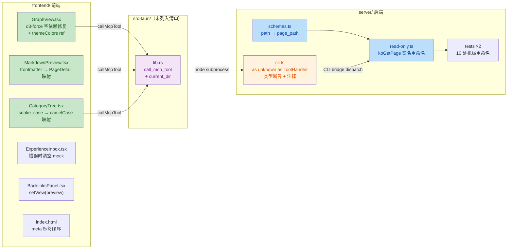

# P4 Phase 4b/4c Bug 修复 安全与质量审计报告

| 项目 | 内容 |
| --- | --- |
| 执行 Agent | guardrail-enforcer |
| 任务令牌 | TKN-P4-FIX-001 |
| 审计日期 | 2026-07-27 |
| 审计方法 | TRAE-security-review skill + TRAE-code-review skill + 6-stage guardrail workflow |
| 变更范围 | P4 Phase 4b/4c bug 修复（11 文件任务清单 + 1 未列入文件 lib.rs） |
| 分支 | `feat/p4a-tauri-skeleton`（working tree，未提交） |
| 审计标准 | 零信任原则 + 证据驱动（source → sink 可追溯）+ confidence ≥ 0.80 |
| 整体结论 | **PASS（通过）** — 无阻断级/高危漏洞；1 个中风险 + 3 个低风险需跟踪 |

---

## 1. 总体结论

**PASS（通过）**

本轮审计覆盖 P4 Phase 4b/4c 的 bug 修复变更，共 12 个文件（任务清单 11 + 工作树中额外发现 1 个 `lib.rs` 未列入清单）。完整读取了全部变更文件的 diff 及其上下文（`read-only.ts` 完整函数体、`cli.ts` dispatch 路径、`lib.rs` 的 `call_mcp_tool` 完整实现、`ipc.ts` 桥接层、`.gitignore`、`schemas.ts`），并实际运行了 `frontmatter-integration.test.ts` + `p3-evolution.test.ts`（28/28 通过）、frontend + server TypeScript 编译（零错误）。

**未发现阻断级（HIGH）或高危漏洞。** 发现 1 个中风险（文档准确性）+ 3 个低风险问题，均不构成直接可利用的安全漏洞。核心安全机制（`kbGetPage` 路径穿越防御、`call_mcp_tool` 白名单 + 数组参数 + JSON 校验、`.gitignore` 密钥覆盖）均已正确实现且未被本次变更破坏。

### 1.1 Mermaid 变更概览



---

## 2. 检查范围摘要

| 维度 | 数量 |
| --- | --- |
| 审计文件 | 12（任务清单 11 + 工作树额外发现 1） |
| 审计函数/接口 | MCP tool 1（kbGetPage）+ CLI dispatch 1 + Tauri IPC 1（call_mcp_tool）+ React 组件 5 = 8 |
| 发现问题总数 | 4（MEDIUM 1 + LOW 3） |
| 阻断级（HIGH） | 0 |
| 已验证通过的安全机制 | 7 |
| 测试验证 | 28/28 通过 |
| TypeScript 编译 | frontend 0 错误 + server 0 错误 |

### 2.1 变更文件清单

| # | 文件 | 变更类型 | 行数变化 |
| --- | --- | --- | --- |
| 1 | `server/src/schemas.ts` | 参数重命名 `path` → `page_path` | +1/-1 |
| 2 | `server/src/tools/read-only.ts` | `kbGetPage` 签名重命名 | +2/-2 |
| 3 | `server/src/cli.ts` | TOOL_REGISTRY 添加 `as unknown as ToolHandler` 断言 | +18/-15 |
| 4 | `server/src/tests/frontmatter-integration.test.ts` | 6 处机械重命名 | +6/-6 |
| 5 | `server/src/tests/p3-evolution.test.ts` | 4 处机械重命名 | +4/-4 |
| 6 | `frontend/src/components/GraphView.tsx` | d3-force 空依赖修复 + themeColors ref + 节点引用稳定 | +38/-3 |
| 7 | `frontend/src/components/CategoryTree.tsx` | 字段映射修复 | +20/-9 |
| 8 | `frontend/src/components/MarkdownPreview.tsx` | frontmatter → PageDetail 映射 | +30/-1 |
| 9 | `frontend/src/components/ExperienceInbox.tsx` | 错误时清空 mock | +3/0 |
| 10 | `frontend/src/components/BacklinksPanel.tsx` | handleNavigate 添加 setView | +2/-1 |
| 11 | `frontend/index.html` | meta 标签顺序 | +1/-1 |
| 12 | `frontend/src-tauri/src/lib.rs` **（未列入清单）** | call_mcp_tool 添加 current_dir | +4/0 |

---

## 3. 已验证通过的安全机制

| # | 机制 | 位置 | 结论 |
| --- | --- | --- | --- |
| P1 | `kbGetPage` 路径穿越防御 | [read-only.ts:L186-190](../../server/src/tools/read-only.ts#L186-L190) | PASS — `path.resolve` + `path.relative` + `startsWith("..")` / `isAbsolute` 检测，参数重命名不影响防护 |
| P2 | `call_mcp_tool` 工具名白名单 | [lib.rs:L668-690](../../frontend/src-tauri/src/lib.rs#L668-L690) | PASS — 12 个工具白名单，`kb_get_page` 在列；非白名单工具直接拒绝 |
| P3 | `call_mcp_tool` 命令注入防护 | [lib.rs:L712-725](../../frontend/src-tauri/src/lib.rs#L712-L725) | PASS — `.command("node").args([])` 数组形式，无 shell 插值；`args_json` 先 `serde_json::from_str` 校验 |
| P4 | `call_mcp_tool` current_dir 安全性 | [lib.rs:L704-722](../../frontend/src-tauri/src/lib.rs#L704-L722) | PASS — `server_dir` 派生自 `config.kb_root`（可信配置/环境变量），非用户输入 |
| P5 | `.gitignore` 密钥文件覆盖 | [.gitignore:L11-15](../../.gitignore#L11-L15) | PASS — `.env` / `.env.local` / `.env.*.local` 均在忽略列表，`!.env.example` 保留模板 |
| P6 | `kbGetPageSchema` 输入约束 | [schemas.ts:L29-41](../../server/src/schemas.ts#L29-L41) | PASS — `page_path` 限 `z.string().max(512)`，`section` 限 `max(200)`（MCP server 上下文生效） |
| P7 | 无硬编码密钥 | 全 diff 扫描 | PASS — grep `password/secret/api_key/token/Bearer/AKIA/ghp_/sk-/private_key` 零命中 |

---

## 4. 详细发现

### 4.1 MEDIUM 严重度

#### M-1: `cli.ts` 注释误导——声称 Zod 校验在 handler 前执行，CLI bridge 路径实际未校验

| 字段 | 值 |
| --- | --- |
| Category | documentation_accuracy / defense_in_depth_gap |
| Severity | MEDIUM |
| Confidence | 0.90 |
| Source | `cli.ts` L53-55 注释："the Zod schemas validate inputs before the handler runs" |
| Sink | `cli.ts` `main()` L99-111：`JSON.parse(argsJson)` → `handler(args)`，无 Zod `safeParse`/`parse` 调用 |
| 证据 | `Select-String -Pattern "schema&#124;zod&#124;parse&#124;validate" cli.ts` 返回空——cli.ts 中无任何 schema 引用或校验调用 |

**分析：**

`cli.ts` 的 `main()` 函数从 `process.argv[3]` 读取 JSON args，`JSON.parse` 后直接传入 `handler(args)`。Zod schema（`schemas.ts`）仅在 MCP server 上下文中通过 `server.tool(name, description, schema, handler)` 注册时生效——MCP 框架在调用 handler 前自动执行 schema 校验。但 CLI bridge 路径（Tauri → node 子进程 → cli.ts）**绕过了这一层校验**。

本次变更添加的注释（L53-55）声称"Zod schemas validate inputs before the handler runs"，这在 CLI 路径中**不成立**。`as unknown as ToolHandler` 类型断言进一步擦除了参数类型信息，使得 TypeScript 也无法在编译期捕获参数名错误。

**为何不是 HIGH：**

- `kbGetPage` 有独立的路径穿越防御（`path.resolve` + `relative` + `..` 检测）和 `fileExists` 检查，即使参数缺失或类型错误，也无法越权访问 KB 根目录外的文件。
- `lib.rs` 侧已校验 `args_json` 是合法 JSON，且 `tool_name` 在白名单内。
- 所有前端调用方已统一使用 `page_path`（已验证无遗漏）。
- 这是**既有的架构特征**，非本次变更引入——本次仅添加了误导性注释。

**风险：** 未来开发者若信任该注释，可能在新 handler 中省略自有的输入校验，假设 Zod 已兜底。

**修复建议（prose）：** 更正注释，准确描述 CLI bridge 路径的校验模型：Zod schema 仅在 MCP server 上下文生效；CLI bridge 依赖 handler 内的防御性校验（路径穿越、fileExists）作为纵深防线。理想方案是在 `main()` 中增加 schema 查表 + `safeParse` 步骤，使两条路径校验行为一致。

---

### 4.2 LOW 严重度

#### L-1: `as unknown as ToolHandler` 双重类型断言擦除全部类型安全

| 字段 | 值 |
| --- | --- |
| Category | type_safety |
| Severity | LOW |
| Confidence | 0.85 |
| Location | [cli.ts:L58-77](../../server/src/cli.ts#L58-L77) |

**分析：** `kbGetPage as unknown as ToolHandler` 是纯 TypeScript 编译期构造，运行时零效果。双重断言（`as unknown as`）绕过了 TypeScript 的类型兼容性检查，使得 `(args: { page_path: string }) => Promise<ToolResult>` 能赋值给 `(args: Record<string, unknown>) => Promise<ToolResult>`。如果调用方传入错误的参数名（如 `{ path: ... }` 而非 `{ page_path: ... }`），TypeScript 不会报错，handler 将收到 `page_path: undefined`。

**为何不是 MEDIUM：** 所有调用方已对齐 `page_path`（前端 + 测试均已验证）；`kbGetPage` 的路径穿越防御 + `fileExists` 检查提供了纵深防护；`undefined` 路径会解析为 `<kbRoot>/undefined.md`，通过穿越检查但在 `fileExists` 处返回"Page not found"，无安全影响。

**修复建议：** 考虑实现一个类型安全的 wrapper，在 dispatch 前用 Zod schema 校验 args；或在 `main()` 中增加 `SCHEMA_REGISTRY` 查表 + `safeParse`，使类型断言不再是唯一防线。

---

#### L-2: `lib.rs` 变更未列入任务清单（§9 影响自检遗漏）

| 字段 | 值 |
| --- | --- |
| Category | process_compliance |
| Severity | LOW |
| Confidence | 0.95 |
| Location | [lib.rs:L704-722](../../frontend/src-tauri/src/lib.rs#L704-L722) |

**分析：** `frontend/src-tauri/src/lib.rs` 在工作树中已修改（添加 `.current_dir(&server_dir)` 修复 tsx 模块解析），但未出现在主 Agent 提供的变更文件清单中。这违反 CLAUDE.md §9"变更影响自检与跨模块通知"要求。

**变更本身的安全性已验证（见 P4）：** `server_dir` 派生自 `config.kb_root`（环境变量/默认配置，属可信输入），非用户可控。`.current_dir()` 仅设置子进程工作目录，不影响命令构造安全性。

**修复建议：** 主 Agent 在重新提交时应将 `lib.rs` 纳入变更清单，并在 §9 影响自检中补充说明该变更的原因（tsx 模块解析需要 `server/` 作为 cwd）。

---

#### L-3: `MarkdownPreview.tsx` frontmatter 字段类型断言缺乏运行时校验

| 字段 | 值 |
| --- | --- |
| Category | type_safety / input_validation |
| Severity | LOW |
| Confidence | 0.82 |
| Location | [MarkdownPreview.tsx:L76-80](../../frontend/src/components/MarkdownPreview.tsx#L76-L80) |

**分析：** `fm.type as PageDetail["type"]` 和 `fm.status as PageDetail["status"]` 直接断言 frontmatter 字段为联合类型，但未校验值是否在合法枚举范围内。若 frontmatter 包含 `type: "garbage"`，将被原样传入 `PageDetail.type`。

**为何不是 MEDIUM：** 这是纯前端展示数据，React 默认转义防 XSS；非法 type/status 仅影响 UI 标签显示（有 `?? "concept"` / `?? "active"` 兜底），无安全边界穿越。`title`/`date` 已用 `typeof` 守卫，`domain`/`tags` 已用 `Array.isArray` 守卫——核心字段防护到位。

**修复建议：** 可增加枚举校验函数（如 `isValidPageType(v): v is PageType`），将非法值回退到默认值，提升展示健壮性。

---

## 5. 输入与边界审计（Stage 1）

### 5.1 数值与类型边界

| 接口 | 输入参数 | 边界约束 | 结论 |
| --- | --- | --- | --- |
| `kbGetPageSchema.page_path` | 字符串 | `z.string().max(512)` | PASS — MCP 上下文有长度限制；CLI 路径无长度限制但 `path.resolve` + 穿越检测兜底 |
| `kbGetPageSchema.section` | 字符串 | `z.string().max(200).optional()` | PASS |
| `call_mcp_tool` args_json | JSON 字符串 | `serde_json::from_str` 校验合法性 | PASS |
| `call_mcp_tool` tool_name | 字符串 | 白名单 12 项 | PASS |

### 5.2 集合与缓冲区边界

- 无 `strcpy`/`sprintf`/`gets` 等 C 语言不安全函数（TypeScript/Rust 项目）。
- Rust 侧 `String::from_utf8_lossy` 安全处理 stdout/stderr 解码。
- `stdout.chars().take(300)` / `stderr.chars().take(500)` 限制错误消息长度，防日志膨胀。

### 5.3 业务状态机约束

本次变更未涉及状态机转换。`ExperienceInbox.tsx` 清空 mock 数据的变更不涉及经验卡状态（pending/active/archived/rejected），仅影响前端展示列表。

---

## 6. 执行安全审计（Stage 2）

### 6.1 注入防护

| 注入类型 | 检查结果 | 证据 |
| --- | --- | --- |
| SQL/NoSQL 注入 | N/A — 项目无数据库，使用文件系统存储 | — |
| OS 命令注入 | PASS | `lib.rs:L712-725` 使用 `.command("node").args([])` 数组形式，无 shell 插值；`tool_name` 白名单校验；`args_json` JSON 合法性校验 |
| 代码/表达式注入 | PASS | 无 `eval()`/`Function()` 构造器；无动态远程脚本加载 |
| 模板引擎注入 | PASS | React JSX 默认转义，无 `dangerouslySetInnerHTML` |
| 路径穿越 | PASS | `kbGetPage` L186-190：`path.resolve` + `path.relative` + `startsWith("..")` / `isAbsolute` 检测 |

### 6.2 最小权限检查

- `call_mcp_tool` 白名单包含 `kb_promote_experience`（写操作）。`lib.rs:L659-667` 注释说明了理由：CLI 子进程本地运行无远程访问 + handler 内有状态机校验 + 白名单本身是纵深防御。可接受。
- 未发现 `root` 权限运行、不必要的 `/etc/passwd` 访问等。
- 容器化：N/A（Tauri 桌面应用，非容器部署）。

### 6.3 输出编码与特殊字符处理

- React 组件输出默认 HTML 实体编码，无 `dangerouslySetInnerHTML`。
- `lib.rs` 错误消息使用 `format!` 宏，输出到 IPC 返回值（非 shell），无注入风险。
- JSON 序列化使用标准库（`serde_json` / `JSON.stringify`），无字符串拼接构造 JSON。

---

## 7. 密钥与配置安全（Stage 4）

| 检查项 | 结论 | 证据 |
| --- | --- | --- |
| 硬编码密钥/密码/Token | PASS | diff 全量 grep `password/secret/api_key/token/Bearer/AKIA/ghp_/sk-/private_key/BEGIN RSA` 零命中 |
| 敏感配置注入方式 | PASS | `KbConfig` 从环境变量/默认配置加载 `kb_root`/`python_path`/`parser_path`，无硬编码 |
| 前端代码无服务端密钥 | PASS | 前端仅通过 IPC 调用后端，不直接持有任何服务端密钥 |
| `.gitignore` 覆盖密钥文件 | PASS | `.env` / `.env.local` / `.env.*.local` 在忽略列表 |

---

## 8. 依赖与供应链风险（Stage 5）

本次变更**未修改**任何依赖描述文件（`package.json` / `pnpm-lock.yaml` / `Cargo.toml`）。工作树中的 `frontend/package.json` 和 `pnpm-lock.yaml` 变更属于上一个已提交的 commit（`19c4cff`），不在本次审查范围内。

无供应链风险。

---

## 9. 代码质量审查（TRAE-code-review skill）

### 9.1 作者意图推断

本次变更的意图是**bug 修复 + 接口命名统一**：

1. **接口统一**：`kbGetPage` 参数 `path` → `page_path`，与 `kb_get_backlinks`/`kb_confirm_staging` 命名规范一致。
2. **类型修复**：`cli.ts` TOOL_REGISTRY 添加类型断言解决 TypeScript 编译错误。
3. **前端 bug 修复**：GraphView d3-force 无限循环、CategoryTree 字段映射、MarkdownPreview 数据映射、ExperienceInbox mock 残留、BacklinksPanel 导航缺失。
4. **HTML 规范**：index.html meta 标签顺序（charset/viewport 应在 link 前）。

### 9.2 GraphView useEffect 空依赖修复——正确性验证

主 Agent 自问中提到对"空依赖数组后力导向布局是否能自适应筛选器变化"没有把握。经审查验证：

**结论：修复正确。**

- `filteredGraph`（useMemo）在筛选器变化时返回新的 `{ nodes, links }` 对象，作为 `graphData` prop 传给 `ForceGraph` 组件。
- `react-force-graph-2d` 内部监听 `graphData` prop 变化，自动将新节点/边注入现有 d3-force simulation。
- d3-force 参数（charge/link/center）是**模拟配置**，非数据相关，仅需在挂载时设置一次。
- `nodes: visibleNodes`（去掉 `{...n}` spread）保持节点对象引用稳定——react-force-graph-2d 通过对象引用保持 x/y 坐标，避免拖动后丢失位置。
- 之前的 bug：`useEffect` 依赖 `[filteredGraph]`，useMemo 每次返回新对象引用 → 无限触发 `d3ReheatSimulation` → 卡死。改为 `[]` 是正确修复。

### 9.3 代码质量发现

| # | 问题 | 建议 | 位置 |
| --- | --- | --- | --- |
| C-1 | `cli.ts` 注释声称 Zod 校验在 handler 前执行，CLI 路径实际未校验（见 M-1） | 更正注释，准确描述校验模型 | [cli.ts:L53-55](../../server/src/cli.ts#L53-L55) |
| C-2 | `as unknown as ToolHandler` 双重断言擦除类型安全（见 L-1） | 考虑 wrapper + schema 校验 | [cli.ts:L58-77](../../server/src/cli.ts#L58-L77) |
| C-3 | `MarkdownPreview.tsx` type/status 枚举值未校验（见 L-3） | 增加枚举守卫函数 | [MarkdownPreview.tsx:L76-80](../../frontend/src/components/MarkdownPreview.tsx#L76-L80) |

### 9.4 正面发现（Good Practices）

- **MarkdownPreview.tsx** 防御性类型守卫：`Array.isArray(fm.domain)` / `typeof fm.title === "string"` + 兜底默认值，是优秀的防御性编程实践。
- **ExperienceInbox.tsx** 错误时清空 mock 数据：避免展示已 promote 的过期卡片，正确处理失败路径。
- **GraphView.tsx** themeColors ref + useEffect on `[theme]`：正确解决 Canvas 2D 不支持 CSS 变量的问题，主题切换时重新读取颜色值。
- **GraphView.tsx** 节点引用稳定修复：去掉 spread 保持对象引用，解决拖动后无法再次拖动的问题，注释清晰解释了原因。

---

## 10. 测试验证

| 验证项 | 结果 | 证据 |
| --- | --- | --- |
| `frontmatter-integration.test.ts` + `p3-evolution.test.ts` | 28/28 PASS | `npx tsx --test` 输出 `# pass 28 # fail 0` |
| frontend TypeScript 编译 | 0 错误 | `npx tsc --noEmit` 无输出 |
| server TypeScript 编译 | 0 错误 | `npx tsc --noEmit` 无输出 |
| 前端 `path:` 遗漏检查 | 0 处遗漏 | grep `kb_get_page.*path:` 仅命中 `page_path:` |
| server `kbGetPage({ path:` 遗漏检查 | 0 处遗漏 | grep 零命中 |

---

## 11. 豁免说明

无豁免项。

---

## 12. 最终自检清单

| # | 检查项 | 结果 |
| --- | --- | --- |
| 1 | 是否存在阻断级漏洞？ | 否 |
| 2 | 是否存在高危漏洞？ | 否 |
| 3 | 路径穿越防护是否完整？ | 是（P1 验证通过） |
| 4 | 命令注入防护是否完整？ | 是（P2/P3/P4 验证通过） |
| 5 | 是否有硬编码密钥？ | 否（P7 验证通过） |
| 6 | `.gitignore` 是否覆盖密钥文件？ | 是（P5 验证通过） |
| 7 | 测试是否通过？ | 是（28/28） |
| 8 | TypeScript 是否编译通过？ | 是（frontend + server 零错误） |
| 9 | 接口变更是否全链路同步？ | 是（schema + handler + tests + 前端调用方均同步） |

---

## 13. 自动化建议（CI/CD 集成）

建议在 CI pipeline 中集成以下检查，防止同类问题回归：

1. **TypeScript 严格模式 + 类型检查**：`tsc --noEmit` 已在 CI 中，保持启用。可考虑增加 `@typescript-eslint/no-unsafe-assignment` 规则，对 `as unknown as` 双重断言发出警告。

2. **Semgrep 规则**（检测误导性注释 + 缺失的 schema 校验）：

   ```yaml
   # .semgrep.yml
   rules:
     - id: cli-bridge-missing-schema-validation
       patterns:
         - pattern: |
             const handler = TOOL_REGISTRY[$TOOL];
             ...
             const result = await handler($ARGS);
         - pattern-not-inside: |
             $SCHEMA.safeParse($ARGS);
       message: "CLI bridge dispatch 路径缺少 Zod schema 校验，handler 直接接收未校验的 JSON.parse 输出"
       severity: WARNING
   ```

3. **参数名一致性检查**：增加脚本扫描所有 `callMcpTool`/`kbGetPage` 调用，确保参数名与 `schemas.ts` 定义一致，防止重命名后遗漏。

---

## 14. 结论

**PASS（通过）**

本次 P4 Phase 4b/4c bug 修复变更未引入任何阻断级或高危安全漏洞。`kbGetPage` 参数重命名（`path` → `page_path`）是接口命名统一，未破坏路径穿越防护。`cli.ts` 的类型断言是编译期构造，运行时无安全影响。前端 bug 修复（GraphView d3-force、字段映射、数据清空）均为正确的功能性修复。

1 个中风险问题（M-1：cli.ts 注释误导）建议在后续迭代中修复——更正注释或增加 CLI 路径的 schema 校验。3 个低风险问题可择机处理。

**可进入测试阶段（ac-verifier）。**

---

*报告生成时间：2026-07-27 | Agent: guardrail-enforcer | 令牌: TKN-P4-FIX-001*
