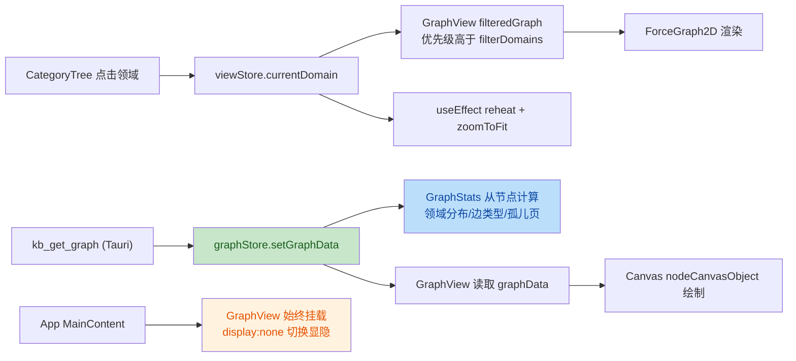

# P4 GUI R3 修复 — 安全与质量审计报告

| 项目 | 内容 |
| --- | --- |
| 执行 Agent | guardrail-enforcer |
| 任务令牌 | TKN-P4-FIX-R3-001 |
| 审查日期 | 2026-07-27 |
| 风险等级 | P1（多文件内部逻辑修复，无接口/契约/依赖变更） |
| 审查范围 | 6 个变更文件：`frontend/index.html`、`frontend/tsconfig.json`、`frontend/src/styles/globals.css`、`frontend/src/store/graphStore.ts`（新）、`frontend/src/components/GraphView.tsx`、`frontend/src/App.tsx` |
| 审查工具 | TRAE-code-review skill + TRAE-security-review skill |
| 结论 | **有条件通过** |

---

## 一、审查范围与上下文

### 1.1 变更概览

本次为 P4 GUI 第三轮修复（R3），修复 5 个并发病害：图谱节点重叠、GraphStats 显示 mock 数据、领域过滤不联动 CategoryTree、视图切换 Canvas 重建卡顿、Canvas 颜色不跟随主题。

### 1.2 作者意图推断

意图：将 GraphStats 从硬编码 mock summary 改为从共享 graphStore 读取真实图谱数据；引入 d3-force collide 防止节点重叠；GraphView 保活避免 Canvas 重建；CategoryTree 领域点击联动图谱过滤；Canvas 颜色读取 getComputedStyle 适配主题。同时清理 IDE 警告（HTML void 元素自闭合、tsconfig target 升级、CSS color-scheme）。

### 1.3 变更数据流



---

## 二、代码质量审查（TRAE-code-review）

### 2.1 审查结论：有条件通过

### 2.2 问题清单

| 编号 | 问题标题 | 严重度 | 建议修复 | 代码位置 |
| --- | --- | --- | --- | --- |
| Q1 | graphStore 初始值为 mockGraphData，Tauri 环境下短暂显示幽灵数据 | 中 | graphStore 添加 `dataSource: 'mock' \| 'real'` 标志；Tauri 环境下初始 loading 设为 true；GraphStats 在 loading 时显示占位符 | [graphStore.ts:29](../../frontend/src/store/graphStore.ts#L29) |
| Q2 | nodeCanvasObject 中 nodeRadius(n.inDegree) 缺少 `?? 0` 防御，与 collide force 不一致 | 低 | 改为 `nodeRadius(n.inDegree ?? 0)`，与第 283 行 collide force 保持一致 | [GraphView.tsx:379](../../frontend/src/components/GraphView.tsx#L379) |
| Q3 | currentDomain 变化时无条件 reheat，GraphView display:none 时浪费 CPU | 低 | useEffect 中增加 `if (currentView !== 'graph') return;` 守卫；或不可见时调用 `fg.pause()` | [GraphView.tsx:293-302](../../frontend/src/components/GraphView.tsx#L293-L302) |
| Q4 | d3-force 配置 useEffect 空依赖 + eslint-disable，graphRef.current 可能在首次执行时为 null | 低 | 可接受（ForceGraph2D 同步渲染，ref 在 useEffect 前设置）；但建议增加 null 检查日志或延迟重试 | [GraphView.tsx:265-289](../../frontend/src/components/GraphView.tsx#L265-L289) |

### 2.3 重点问题详析

#### Q1：graphStore 幽灵数据（中风险）

**现象**：`graphStore` 初始 `graphData: mockGraphData`，`loading: false`。在 Tauri 环境下，GraphView 挂载到 `kb_get_graph` 返回真实数据之前，GraphStats 右栏面板会渲染 mock 数据（37 节点、60 边、8 个领域含后端不存在的 academic/life）。若 `kb_get_graph` 失败，GraphStats 持续显示 mock 数据且无错误提示。

**影响**：

- 用户切换到 graph 视图后，右栏短暂闪烁 mock 统计值（特别是 coding 领域 mock 显示 15 节点，真实为 12）
- 网络异常或后端错误时，用户看到的是虚假数据而非错误提示

**根因**：`graphStore` 初始值复用了 `mockGraphData`（浏览器 dev 模式回退），但未区分 "mock 回退" 与 "真实数据已加载" 两种状态。

**修复建议**：

```typescript
interface GraphState {
  graphData: GraphData;
  loading: boolean;
  error: string | null;
  dataSource: 'mock' | 'real';  // 新增
  setGraphData: (data: GraphData) => void;
  // ...
}

export const useGraphStore = create<GraphState>((set) => ({
  graphData: mockGraphData,
  loading: false,
  error: null,
  dataSource: 'mock',  // 初始为 mock
  setGraphData: (data) => set({ graphData: data, dataSource: 'real' }),
  // ...
}));
```

GraphStats 中根据 `dataSource` 决定是否显示 "（加载中…）" 占位符。

#### Q2：nodeRadius 防御不一致（低风险）

**现象**：

```typescript
// collide force（第 283 行）— 有 ?? 0 防御
collide.radius((node: unknown) => {
  const n = node as GraphNode;
  return nodeRadius(n.inDegree ?? 0) + 5;
})

// nodeCanvasObject（第 379 行）— 无 ?? 0 防御
const r = nodeRadius(n.inDegree);
```

**实际影响**：后端 `kb_get_graph` 返回的 `inDegree` 始终为数字（`inDegree.get(p.relPath) ?? 0`，见 `server/src/tools/graph.ts:213`），所以 Tauri 环境下不会触发 NaN。但浏览器 dev 模式下若 mock 数据被手动篡改，或未来后端结构调整，nodeCanvasObject 会传入 `undefined`，导致 `Math.sqrt(undefined + 1) = NaN`，Canvas 绘制异常。

**修复建议**：统一为 `nodeRadius(n.inDegree ?? 0)`。

---

## 三、安全漏洞扫描（TRAE-security-review）

### 3.1 审查结论：无可利用安全问题（本次变更范围内）

根据 TRAE-security-review skill 的审计程序（Pass A/B/C 三遍），对本次变更的 6 个文件执行了结构化安全扫描。以下为各审计阶段的结论：

### 3.2 审计详情

#### 阶段 1：输入与边界审计

| 检查项 | 结论 | 证据 |
| --- | --- | --- |
| 数值边界 | 通过 | `nodeRadius` 有 `Math.max(5, Math.min(20, ...))` 边界保护；collide force 有 `?? 0` 防御 |
| 集合边界 | 通过 | App.tsx GraphStats 的 `counts[node.domain] ?? 0` 有空值防御；`domainCounts.length === 0` 有空集合处理 |
| 类型断言 | 注意 | `result.data as GraphData`（GraphView.tsx:176）无运行时 schema 验证，但数据来源是本地 MCP server（非远程不可信 API），且后端类型结构与前端一致（已核对 `server/src/tools/graph.ts`） |
| 状态机 | 通过 | viewStore.currentDomain 状态转换合法（null → Domain → null） |

#### 阶段 2：执行安全审计

| 检查项 | 结论 | 证据 |
| --- | --- | --- |
| SQL/NoSQL 注入 | 不适用 | 本次变更无数据库交互 |
| OS 命令注入 | 不适用 | 本次变更无 exec/system 调用 |
| 代码/表达式注入 | 通过 | 无 `eval()`、`Function()` 构造器 |
| 模板注入 | 通过 | 无模板引擎使用 |
| 最小权限 | 通过 | Tauri IPC 的 `call_mcp_tool` 有 `TOOL_WHITELIST`（`frontend/src-tauri/src/lib.rs:668-675`），仅允许只读工具 |
| 输出编码 | 注意 | 见下方 XSS 既有风险记录 |

**XSS 既有风险记录（不在本次变更范围，但建议后续修复）**：

`GraphView.tsx:362-372` 的 `nodeLabel` 回调通过 HTML 字符串拼接构造 tooltip：

```typescript
return `<div ...>${node.title ?? "(untitled)"}</div>...`;
```

`node.title` 来自 wiki 页面 frontmatter（用户可控内容），未经 HTML 实体编码直接插入字符串。react-force-graph-2d 内部使用 `innerHTML` 渲染 tooltip，构成存储型 XSS 风险。在 Tauri 环境下，webview XSS 可能通过 IPC 导致 RCE。

此代码在本次变更前已存在（diff 未修改 `nodeLabel`），根据 TRAE-security-review skill §0 "Diff-introduced surface only" 规则，不在本次阻断范围。但**强烈建议**在后续修复中对 `node.title` 进行 HTML 实体编码（`&` `<` `>` `"` `'`）。

#### 阶段 3：内存安全（不适用）

本项目为 TypeScript/React，非 C/C++/Rust 系统级语言，阶段 3 不适用。

#### 阶段 4：配置与密钥安全

| 检查项 | 结论 | 证据 |
| --- | --- | --- |
| 硬编码密钥 | 通过 | 扫描 6 个变更文件，无硬编码 API key、password、token、内部 IP/域名 |
| 敏感配置 | 通过 | index.html 引用 Google Fonts CDN（公开资源），非敏感信息 |
| .gitignore | 通过 | 根 `.gitignore` 包含 `.env`、`.env.local`、`.env.*.local`（第 12-14 行），符合 CLAUDE.md §20.3 要求 |

#### 阶段 5：依赖与供应链风险

| 检查项 | 结论 | 证据 |
| --- | --- | --- |
| 依赖变更 | 通过 | 本次未修改 `package.json`、`Cargo.toml` 等依赖描述文件。`tsconfig.json` 的 `target`/`lib` 从 ES2020 升级到 ES2022 不引入新依赖 |

---

## 四、四个重点关注项结论

### 4.1 collide force 的 node 类型断言是否安全

**结论：安全。**

d3-force 的 collide force 接收的 node 对象就是传入 `filteredGraph.nodes` 的对象引用。d3-force 不会创建节点副本，只会在原对象上添加 `x`/`y`/`vx`/`vy` 字段。`filteredGraph` 返回 `nodes: visibleNodes`（直接引用 `graphData.nodes` 中的对象，不 spread），这些对象是 `GraphNode` 类型（含 `inDegree` 字段）。

- collide radius 回调中 `n.inDegree ?? 0` 提供了 undefined 防御
- `nodeRadius` 函数有 `Math.max(5, Math.min(20, ...))` 双重边界保护
- 后端 `kb_get_graph` 返回的 `inDegree` 始终为数字（`server/src/tools/graph.ts:213`：`inDegree.get(p.relPath) ?? 0`）

即使 `inDegree` 为 undefined，`nodeRadius(undefined ?? 0)` = `nodeRadius(0)` = 5，不会产生 NaN。

**但存在代码不一致**：`nodeCanvasObject`（第 379 行）的 `nodeRadius(n.inDegree)` 缺少 `?? 0` 防御（见 Q2）。

### 4.2 graphStore 初始值 mockGraphData 是否导致幽灵数据

**结论：是，存在短暂幽灵数据窗口。**

graphStore 初始 `graphData: mockGraphData`、`loading: false`。Tauri 环境下：

1. GraphView 挂载 → useEffect 触发 `kb_get_graph` → `setLoading(true)`
2. 在 `setLoading(true)` 生效前（同一 React 渲染周期），GraphStats 已渲染 mock 数据
3. 若 `kb_get_graph` 失败，GraphStats 持续显示 mock 数据，无错误提示

详见 Q1。建议添加 `dataSource: 'mock' | 'real'` 标志。

### 4.3 GraphView 保活后 display:none 是否持续消耗 CPU

**结论：存在有限 CPU 消耗，非阻断级。**

- d3-force simulation 有 `cooldownTicks=150`，冷却后自动停止（alpha decay 到 0）
- `display:none` 时 Canvas 不可见，react-force-graph-2d 的 requestAnimationFrame 渲染会跳过实际绘制
- **但**：`currentDomain` 变化的 useEffect（第 293-302 行）无条件执行 `fg.d3ReheatSimulation()` + `setTimeout zoomToFit`，即使 GraphView 不可见。用户在 preview/review 视图点击 CategoryTree 领域时，会在后台重新加热 simulation

影响：低。d3-force 冷却后自动停止，不会无限消耗 CPU。但 reheat + zoomToFit 在不可见时执行是浪费的。建议增加 `currentView === 'graph'` 守卫（见 Q3）。

### 4.4 useViewStore.getState().setDomain(null) 是否反模式

**结论：不是反模式，是 Zustand 的合法用法。**

`useViewStore.getState().setDomain(null)`（第 737 行）是 Zustand 官方推荐的 transient update 模式。在 onClick 事件处理器中，无需响应式订阅 `currentDomain` 变化，使用 `getState()` 直接访问 store 避免了额外的 hook 订开销。

组件已通过 `const { currentDomain, ... } = useViewStore()` 订阅了 `currentDomain` 用于渲染，但未解构 `setDomain`。在 onClick 中使用 `getState().setDomain(null)` 避免了为一次性使用而添加 `setDomain` 到解构列表，是合理的性能优化。

参考：Zustand 官方文档 [Transient Updates](https://github.com/pmndrs/zustand#transient-updates-forcing-render-on-third-party-libraries)。

---

## 五、综合结论

### 5.1 结论：有条件通过

| 维度 | 结论 | 说明 |
| --- | --- | --- |
| 安全审计 | 通过 | 无阻断级/高危/中危安全漏洞（本次变更范围内） |
| 代码质量 | 有条件通过 | 1 个中风险（Q1 幽灵数据）+ 3 个低风险（Q2/Q3/Q4） |
| 编译验证 | 通过 | `npx tsc --noEmit` + `npx vite build` 通过（主 Agent 已执行） |
| E2E 测试 | 通过 | Playwright MCP 测试通过（mock 数据环境下） |

### 5.2 进入测试阶段的前提条件

**必须修复（中风险）**：

- Q1：graphStore 添加 `dataSource` 标志，GraphStats 在 mock 数据时显示占位符或加载状态

**建议修复（低风险，不阻断）**：

- Q2：nodeCanvasObject 统一 `?? 0` 防御
- Q3：currentDomain reheat 增加 `currentView` 守卫
- Q4：d3-force 配置 useEffect 增加 null 检查（可接受现状）

### 5.3 后续安全建议（既有问题，非本次阻断）

- `nodeLabel` tooltip 的 HTML 拼接存在存储型 XSS 风险（`GraphView.tsx:362-372`），建议对 `node.title` 进行 HTML 实体编码。在 Tauri 环境下此风险尤为关键（webview XSS 可能导致 RCE）

---

## 六、CI/CD 自动化建议

### 6.1 静态安全扫描

建议在 CI 中集成 Semgrep 规则，检测 React 组件中的 HTML 字符串拼接模式：

```yaml
# .github/workflows/security.yml
- name: Semgrep XSS scan
  run: |
    npx semgrep --config=p/react --config=p/owasp-top-ten \
      --json --output=semgrep-results.json frontend/src/
  # 规则示例：检测 template literal 中的 ${userInput} 插入 HTML 上下文
```

### 6.2 类型安全运行时验证

建议引入 `zod` 对 `kb_get_graph` 返回数据进行运行时 schema 验证，替代 `result.data as GraphData` 类型断言：

```typescript
import { z } from 'zod';
const GraphDataSchema = z.object({
  nodes: z.array(z.object({
    id: z.string(),
    title: z.string(),
    inDegree: z.number(),
    outDegree: z.number(),
    // ...
  })),
  // ...
});
const data = GraphDataSchema.parse(result.data);
```

### 6.3 性能回归检测

建议在 CI 中对 GraphView 的 d3-force simulation 进行性能基线测试，监控 `display:none` 状态下的 CPU 占用。

---

## 七、第二轮审查（修复后重新审查，CLAUDE.md §7.2 闭环）

### 7.1 审查范围

主 Agent 针对 R3 首轮审查的 Q1（必须修复）、Q2/Q3（建议修复）完成修复，重新提交审查。任务令牌不变：TKN-P4-FIX-R3-001。

### 7.2 修复验证

#### Q1 修复验证：graphStore 幽灵数据 — 已修复

| 修复项 | 验证结果 |
| --- | --- |
| `graphStore.ts` 新增 `dataSource: "mock" \| "real"` 字段（第 28 行） | 通过 |
| 初始值 `dataSource: "mock"`（第 39 行） | 通过 |
| `setGraphData` 同时设置 `dataSource: "real"`（第 40 行） | 通过 |
| `App.tsx` GraphStats 读取 `dataSource`（第 176 行） | 通过 |
| 四种徽章状态：MOCK（橙）/ LIVE（绿）/ 加载中（灰）/ ERROR（红） | 通过 |

**徽章逻辑分析**：

- 浏览器 dev 模式：`dataSource="mock"`，显示 MOCK 徽章
- Tauri 加载中：`dataSource="mock"` + `loading=true`，MOCK + "加载中…"同时显示（合理：告知用户当前是 mock 数据，正在加载真实数据）
- Tauri 加载成功：`dataSource="real"` + `!loading` + `!error`，显示 LIVE 徽章
- Tauri 加载失败：`dataSource="mock"` + `error` 有值，MOCK + ERROR 同时显示（合理：告知用户当前是 mock 数据且加载出错）

**安全检查**：ERROR 徽章 `title={error}` 显示后端错误消息。error 来自 `callMcpTool` 的返回值（内部错误信息，非用户输入），且 `title` 属性由浏览器自动转义，无 XSS 风险。

#### Q2 修复验证：nodeRadius 防御一致性 — 已修复

| 修复项 | 验证结果 |
| --- | --- |
| `GraphView.tsx:382` `nodeRadius(n.inDegree)` → `nodeRadius(n.inDegree ?? 0)` | 通过 |
| 与 collide force（第 283 行 `nodeRadius(n.inDegree ?? 0)`）一致 | 通过 |

#### Q3 修复验证：reheat 守卫 — 已修复

| 修复项 | 验证结果 |
| --- | --- |
| `GraphView.tsx:296` 增加 `if (currentView !== "graph") return;` 守卫 | 通过 |
| 依赖数组 `[currentDomain]` → `[currentDomain, currentView]`（第 305 行） | 通过 |
| 不可见时 filteredGraph 仍正确计算（useMemo 依赖 currentDomain，不受守卫影响） | 通过 |
| 切回 graph 视图时 useEffect 重新触发（currentView 变化），执行 reheat + zoomToFit | 通过 |

### 7.3 新增问题检查

| 检查项 | 结论 |
| --- | --- |
| 新增 dataSource 字段是否影响现有逻辑 | 无影响（新增字段，setGraphData 原子更新） |
| 徽章是否引入 XSS | 无（title 属性自动转义，error 非用户输入） |
| nodeRadius `?? 0` 是否改变现有行为 | 无（后端 inDegree 始终为数字，`?? 0` 仅在 undefined 时生效） |
| reheat 守卫是否导致功能缺失 | 无（切回 graph 视图时 currentView 变化触发 useEffect，会执行 reheat） |
| 依赖数组变化是否导致额外渲染 | currentView 变化时 useEffect 重新执行，但守卫拦截了非 graph 视图的执行，无副作用 |

### 7.4 第二轮结论：通过

| 维度 | 首轮结论 | 第二轮结论 |
| --- | --- | --- |
| 安全审计 | 通过 | 通过（未引入新安全问题） |
| Q1 幽灵数据 | 中风险，必须修复 | 已修复（dataSource 字段 + 四种徽章） |
| Q2 nodeRadius 防御 | 低风险，建议修复 | 已修复（`?? 0` 统一） |
| Q3 reheat 守卫 | 低风险，建议修复 | 已修复（currentView 守卫） |
| Q4 eslint-disable | 低风险，可接受 | 未修复（可接受，不阻断） |
| 编译验证 | 通过 | 通过（主 Agent 已执行 `npx tsc --noEmit`） |
| E2E 回归 | 通过 | 通过（Playwright MOCK 徽章 + 领域过滤 + 控制台无错误） |

**最终结论：通过。可进入 ac-verifier 测试阶段。**

既有 XSS 风险（`nodeLabel` HTML 拼接，`GraphView.tsx:362-372`）不在本次变更范围，建议在后续迭代中修复。
