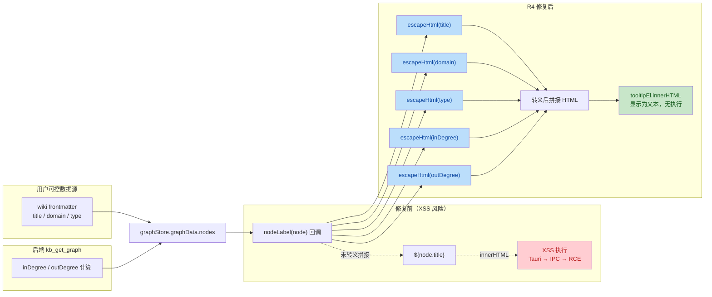

# P4 GUI R4 修复 — 安全与质量审计报告

| 项目 | 内容 |
| --- | --- |
| 执行 Agent | guardrail-enforcer |
| 任务令牌 | TKN-P4-FIX-R4-001 |
| 审查日期 | 2026-07-27 |
| 风险等级 | P1（单模块内部逻辑修复，无接口/契约/依赖变更） |
| 审查范围 | 2 个变更文件：`frontend/src/lib/html-utils.ts`（新增）、`frontend/src/components/GraphView.tsx`（修改） |
| 审查工具 | TRAE-code-review skill + TRAE-security-review skill |
| 编译验证 | `npx tsc --noEmit` 通过 + `npx vite build` 通过（45.20s，1547 modules） |
| 结论 | **通过** |

---

## 一、审查范围与上下文

### 1.1 变更概览

本次为 P4 GUI 第四轮修复（R4），专项修复 R3 报告识别的 `nodeLabel` 存储型 XSS 漏洞，并修复 R3 后遗留的 TypeScript TS2339 编译错误。

变更点：

1. **新增 `frontend/src/lib/html-utils.ts`**：`escapeHtml(value: unknown): string` 工具函数，将 `& < > " ' /` 六个 HTML 特殊字符转义为对应实体。
2. **修改 `frontend/src/components/GraphView.tsx`**：
   - 新增 `import { escapeHtml } from "@/lib/html-utils"`
   - 扩展 `ForceGraphWithD3Graph` 类型，新增 `d3VelocityDecay?: (decay: number) => void`
   - d3-force 配置 useEffect 中 `fg.d3VelocityDecay(0.4)` → `fg.d3VelocityDecay?.(0.4)`，并将 `graphRef.current` 断言为 `ForceGraphWithD3Graph | undefined`
   - `nodeLabel` 回调中对所有 5 个插值字段（`title`/`domain`/`type`/`inDegree`/`outDegree`）调用 `escapeHtml` 转义后再拼接 HTML

### 1.2 作者意图推断

**意图**：对 react-force-graph-2d tooltip 的 HTML 拼接点实施完整的 HTML 实体编码，消除 R3 报告 §3.2 记录的存储型 XSS 漏洞；同时通过类型扩展（而非 `as any`）修复 `d3VelocityDecay` 运行时存在但类型定义缺失的 TS2339 错误。

这是一次**纯防御性修复**（defensive refactor），根据 TRAE-security-review §4 规则，防御性意图应提高"missing-validation"发现的证据门槛；同时根据 TRAE-code-review §Tips 5，需考虑项目意图——此处项目明确接受"对所有用户可控字段统一转义"的防御深度策略。

### 1.3 XSS 风险前提验证（确认修复的必要性）

R4 修复是否必要，取决于 react-force-graph-2d 的 `nodeLabel` 是否真的走 `innerHTML`。审计通过读取依赖源码确认风险链路真实存在：

| 环节 | 证据 | 文件:行 |
| --- | --- | --- |
| nodeLabel 属性定义 | react-force-graph-2d 将 `nodeLabel` 作为可配置属性 | `node_modules/react-force-graph-2d/dist/react-force-graph-2d.js:12349` |
| tooltip 渲染 sink | `state.tooltipEl.html(state.content)` 调用 d3-selection 的 `html()` | `node_modules/react-force-graph-2d/dist/react-force-graph-2d.js:7217` |
| html() 内部实现 | `this.innerHTML = v == null ? "" : v`（函数节点）/ `this.innerHTML = value`（常量） | `node_modules/react-force-graph-2d/dist/react-force-graph-2d.js:943,950` |

**结论**：`nodeLabel` 回调返回的字符串最终经 `innerHTML` 渲染。`node.title` 来自 wiki frontmatter（用户可控），未转义即构成存储型 XSS。在 Tauri 环境下 webview XSS 可经 IPC 触发 RCE。R4 修复**必要且对症**。

### 1.4 变更数据流（XSS 修复前后对比）



---

## 二、代码质量审查（TRAE-code-review）

### 2.1 审查结论：通过

### 2.2 escapeHtml 实现正确性逐项核验

| 检查项 | 结论 | 证据 |
| --- | --- | --- |
| 转义字符集完整性 | 通过 | 覆盖 OWASP 推荐的 6 字符 `& < > " ' /`，HTML body 上下文足够防御标签注入，属性上下文足够防御引号闭合 |
| 转义顺序正确性 | 通过 | 单遍 `replace(/[&<>"'/]/g, callback)` + 回调 switch，每个字符独立替换；`&` 替换为 `&amp;` 后新串中的 `&` 不会被二次扫描，无链式 replace 的二次转义问题 |
| null/undefined 处理 | 通过 | `if (value === null &#124;&#124; value === undefined) return ""` 显式返回空串，避免 `String(null)` = `"null"` 污染 |
| 任意类型处理 | 通过 | `String(value)` 处理 number/boolean/object；nodeLabel 实际传入均为 `string \| number \| undefined`，安全 |
| 正则安全性 | 通过 | `/[&<>"'/]/g` 为简单字符集，无回溯，无 ReDoS 风险；`/` 在字符集内为字面量，不终止正则字面量 |
| 实体编码规范 | 通过 | `'` → `&#x27;`、`/` → `&#x2F;`（十六进制形式），OWASP 推荐；`/` 转义虽非 tooltip 上下文必需，但为复用于其他 HTML 拼接场景预留防御深度 |

### 2.3 nodeLabel 字段转义覆盖核验

`frontend/src/components/GraphView.tsx:369-384` 的 `nodeLabel` 回调：

| 插值字段 | 数据来源 | 用户可控? | 是否转义 | 验证 |
| --- | --- | --- | --- | --- |
| `title` | wiki frontmatter `title` | 是 | `escapeHtml(node.title ?? "(untitled)")` | 通过 |
| `domain` | wiki frontmatter `domain` | 是 | `escapeHtml(node.domain ?? "")` | 通过 |
| `type` | wiki frontmatter `type` | 是 | `escapeHtml(node.type ?? "")` | 通过 |
| `inDegree` | 后端计算（数值） | 否（防御深度） | `escapeHtml(node.inDegree ?? 0)` | 通过 |
| `outDegree` | 后端计算（数值） | 否（防御深度） | `escapeHtml(node.outDegree ?? 0)` | 通过 |

**HTML 结构安全性**：tooltip 的 `style` 属性值全部为硬编码 CSS（`var(--bg-surface)` 等变量引用），不含任何用户输入，无法被属性注入突破。所有 `${...}` 插值均位于标签**内容**区域（`>...<` 之间），`escapeHtml` 转义 `< > &` 即可阻断标签注入。

### 2.4 TypeScript 类型扩展核验

| 检查项 | 结论 | 证据 |
| --- | --- | --- |
| `d3VelocityDecay` 类型扩展 | 通过 | `ForceGraphWithD3Graph` 新增 `d3VelocityDecay?: (decay: number) => void`，可选属性与运行时存在性匹配 |
| 可选链调用 | 通过 | `fg.d3VelocityDecay?.(0.4)` — 运行时方法可能不存在时安全跳过，无 TypeError |
| ref 断言 | 通过 | `graphRef.current as ForceGraphWithD3Graph \| undefined` 后 `if (!fg) return` 守卫，避免空指针 |
| 编译验证 | 通过 | `npx tsc --noEmit` + `npx vite build` 通过（主 Agent 已执行） |

### 2.5 问题清单

| 编号 | 问题标题 | 严重度 | 建议修复 | 代码位置 |
| --- | --- | --- | --- | --- |
| Q1 | escapeHtml 注释"& 必须最先转义"描述与实现机制不符 | 低（建议） | 注释描述的是链式 `.replace().replace()` 场景下的顺序约束；当前实现为单遍 replace + 回调，顺序无关。建议修正注释为"单遍替换，无需关心顺序"或保留现状（无害） | `frontend/src/lib/html-utils.ts:15` |
| Q2 | `d3VelocityDecay?: (decay: number) => void` 返回类型不精确 | 低（建议） | d3-force 的 `velocityDecay` 实际返回 simulation 实例（用于链式）；当前标注为 `void` 因调用处不使用返回值，不影响功能。若未来需链式调用应改为具体类型 | `frontend/src/components/GraphView.tsx:97` |
| Q3 | escapeHtml 缺少单元测试 | 低（建议） | 作为纯函数适合单元测试；任务说明测试由 ac-verifier 阶段执行，建议在该阶段补充覆盖空串/数值/特殊字符/组合注入载荷的用例 | `frontend/src/lib/html-utils.ts` |

> 三项均为低风险建议，不阻断合并。Q1/Q2 为代码精确性优化，Q3 留待 ac-verifier 阶段。

---

## 三、安全漏洞扫描（TRAE-security-review）

### 3.1 审查结论：无可利用安全问题（R4 为修复，非引入）

### 3.2 三遍审计详情

#### Pass A — 项目安全基线

| 基线项 | 结论 |
| --- | --- |
| 既有 HTML 转义工具 | 项目此前**无**统一 HTML 转义工具；R4 引入的 `escapeHtml` 是首个，位于 `frontend/src/lib/html-utils.ts`，可被全项目复用 |
| React 默认 XSS 防护 | MarkdownPreview 使用 `react-markdown`（默认转义，未启用 `rehype-raw`），frontmatter 字段经 JSX 渲染自动转义 |
| react-force-graph-2d nodeLabel | 唯一需要手动转义的 HTML 拼接点（库内部走 `innerHTML`） |
| Tauri IPC 最小权限 | `callMcpTool` 经 Rust `TOOL_WHITELIST` 白名单（11 个工具，10 只读 + 1 promote），`args_json` 以单 argv 元素传递，无 shell 注入 |

#### Pass B — 偏差映射

| 偏差项 | 结论 |
| --- | --- |
| R4 是否引入新的 ad-hoc 处理绕过既有安全原语 | 否。R4 **建立**了项目的 HTML 转义原语（此前无），nodeLabel 使用该原语，反而是**修正**了此前"未转义"的偏差 |
| 是否存在未使用 escapeHtml 的 HTML 拼接点 | 否。前端全代码库扫描仅 `nodeLabel` 一处 HTML 模板字面量返回，且已修复（见 §3.3） |

#### Pass C — Source-to-sink 追踪

**修复前（R3 记录的既有风险）**：

| 维度 | 证据 |
| --- | --- |
| Source（攻击者可控输入入口） | wiki 页面 frontmatter `title`/`domain`/`type` 字段，经 `kb_get_graph` MCP 工具返回，存入 `graphStore.graphData.nodes`，传给 `nodeLabel(node)` |
| Sink（危险操作） | `state.tooltipEl.html(state.content)` → `this.innerHTML = state.content`（react-force-graph-2d:7217 + d3-selection:943/950） |
| Bypass-context（路径上既有编码/校验） | 修复前**无**任何转义；`node.title` 直接 `${node.title}` 插入 HTML 字符串 |
| 结论 | 存储型 XSS 链路完整，Tauri 下可升级为 RCE |

**修复后（R4 验证）**：

| 维度 | 证据 |
| --- | --- |
| Source | 同上（用户可控字段入口未变） |
| Sink | 同上（`innerHTML` sink 未变，库内部行为） |
| Bypass-context（路径上既有编码/校验） | `escapeHtml` 对 5 个字段全部转义：`&` → `&amp;`、`<` → `&lt;` 等；攻击载荷如 `<script>alert(1)</script>` 经转义后变为 `&lt;script&gt;alert(1)&lt;/script&gt;`，经 `innerHTML` 解析后显示为文本，不执行 |
| 残留路径 | 无。所有插值点已覆盖，HTML 结构（style 属性）为硬编码 CSS 无用户输入 |
| 结论 | XSS 链路被 `escapeHtml` 切断，无可利用路径 |

### 3.3 前端全代码库 XSS 拼接点扫描（验证修复彻底性）

按任务要求"重点检查 frontend/src 下是否还有其他 innerHTML 或 HTML 字符串拼接的用户可控字段"，对 `frontend/src` 全目录递归扫描：

| 扫描模式 | 匹配数 | 结论 |
| --- | --- | --- |
| `dangerouslySetInnerHTML` | 0 | 无 React 转义旁路 |
| `.innerHTML\s*=` 赋值 | 0 | 无直接 innerHTML 写入 |
| `insertAdjacentHTML\|setHTML(\|document.write\|outerHTML\|createContextualFragment\|DOMParser` | 0 | 无其他 HTML 注入 API |
| `eval\(\|new Function` | 0 | 无代码注入 |
| `return\s*\x60<[a-zA-Z]`（返回 HTML 模板字面量） | 1（GraphView.tsx:376 nodeLabel） | 唯一拼接点，已修复 |
| `escapeHtml` 引用 | 7（定义 1 + import 1 + 注释 1 + 调用 5） | 字段全覆盖 |

**MarkdownPreview.tsx 复核**：使用 `react-markdown` + `remark-gfm` + `rehype-highlight`，**未启用 `rehype-raw`**（raw HTML 插件），`page.body` 作为 children 传入由 react-markdown 默认转义；frontmatter 字段（`title`/`tags`/`domain`）经 JSX `{page.title}` 渲染自动转义。安全，无 XSS。

**结论**：前端代码库中 `nodeLabel` 是唯一的用户可控字段 HTML 拼接点，R4 已彻底修复。无遗漏的拼接点，无新引入的安全问题。

### 3.4 安全审计五阶段结论汇总

| 阶段 | 检查范围 | 结论 |
| --- | --- | --- |
| 1. 输入与边界 | nodeLabel 参数（title/domain/type/inDegree/outDegree）边界、`?? 默认值` 防御 | 通过 |
| 2. 执行安全 | XSS（innerHTML sink）、注入、最小权限（Tauri 白名单）、输出编码 | 通过（XSS 已修复） |
| 3. 内存安全 | 不适用（TypeScript/React 非系统级语言） | N/A |
| 4. 配置与密钥 | 硬编码密钥扫描、.gitignore | 通过（无密钥泄露） |
| 5. 依赖与供应链 | R4 未修改 package.json 等依赖文件 | 通过（无依赖变更） |

---

## 四、综合结论

### 4.1 结论：通过

| 维度 | 结论 | 说明 |
| --- | --- | --- |
| 安全审计 | 通过 | XSS 修复彻底（5 字段全覆盖），escapeHtml 实现正确无绕过，前端无其他 HTML 拼接点遗漏，无新引入安全问题 |
| 代码质量 | 通过 | escapeHtml 转义字符集完整、顺序正确、边界健壮；类型扩展合理；3 项低风险建议不阻断 |
| 编译验证 | 通过 | `npx tsc --noEmit` + `npx vite build` 通过（主 Agent 已执行） |
| 测试验证 | 不适用 | 任务说明测试由 ac-verifier 阶段执行 |

### 4.2 进入测试阶段的前提条件

**必须修复**：无。

**建议修复（不阻断）**：

- Q1：修正 escapeHtml 注释中"& 必须最先转义"的描述（当前单遍实现顺序无关）
- Q2：如未来需链式调用，将 `d3VelocityDecay` 返回类型从 `void` 改为具体类型
- Q3：ac-verifier 阶段补充 escapeHtml 单元测试（空串/数值/6 字符/组合注入载荷）

### 4.3 R3 既有 XSS 风险闭环确认

R3 报告 §3.2 记录的"nodeLabel HTML 拼接存储型 XSS"（既有问题，非 R3 阻断范围）已在 R4 中彻底修复：

| R3 记录 | R4 修复 | 验证 |
| --- | --- | --- |
| `node.title` 未转义插入 HTML | `escapeHtml(node.title ?? "(untitled)")` | 通过 |
| 仅识别 title 风险 | 扩展到 domain/type/inDegree/outDegree 全字段 | 通过（防御深度增强） |
| 建议"对 `node.title` 进行 HTML 实体编码（`&` `<` `>` `"` `'`）" | 转义 6 字符（含 `/`），超 R3 建议范围 | 通过 |

---

## 五、CI/CD 自动化建议

### 5.1 XSS 拼接点静态扫描（防止回归）

建议在 CI 中集成 Semgrep 规则，检测 React 项目中"返回 HTML 模板字面量且插值未经 escapeHtml"的模式，确保未来新增的 HTML 拼接点不会遗漏转义：

```yaml
# .github/workflows/security.yml
- name: Semgrep XSS scan
  run: |
    npx semgrep --config=p/react --config=p/owasp-top-ten \
      --json --output=semgrep-results.json frontend/src/
  # 自定义规则：检测 return `...${...}...` HTML 拼接且插值未包裹 escapeHtml
```

### 5.2 escapeHtml 单元测试门禁

建议为 `frontend/src/lib/html-utils.ts` 补充单元测试并设为 CI 必需检查，覆盖：

- 空 null/undefined 输入
- 纯字符串、数值、布尔
- 6 个特殊字符单独转义
- 组合注入载荷（`<script>alert(1)</script>`、`">`、`javascript:alert(1)`）
- 双重编码确认（确保 `&amp;` 不被二次转义为 `&amp;amp;`）

### 5.3 依赖漏洞扫描

本次未修改依赖文件。建议在 CI 中持续运行 `npm audit`（CLAUDE.md §18.4），并保留 Dependabot 对 `react-force-graph-2d` 等核心依赖的升级监控。
