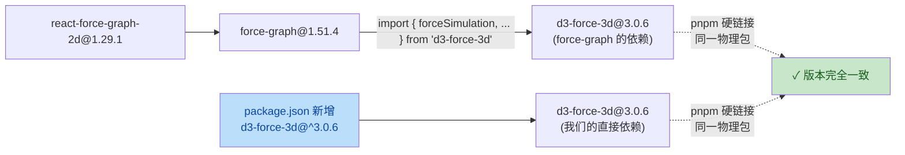
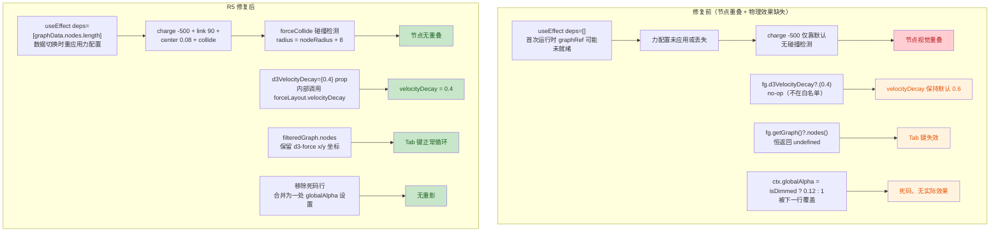

# P4 GUI R5 修复 — 安全与质量审计报告

| 项目 | 内容 |
| --- | --- |
| 执行 Agent | guardrail-enforcer |
| 任务令牌 | TKN-P4-FIX-R5-001 |
| 审查日期 | 2026-07-28 |
| 风险等级 | P2（新增依赖 d3-force-3d，修改力配置和渲染逻辑） |
| 审查范围 | 4 个变更文件 + 1 个未变更文件（R4 已审查）：`frontend/package.json`、`frontend/src/types/d3-force-3d.d.ts`（新）、`frontend/src/components/GraphView.tsx`、`frontend/src/styles/globals.css`、`frontend/src/lib/html-utils.ts`（未变更） |
| 审查工具 | TRAE-code-review skill + TRAE-security-review skill |
| 编译验证 | `npx tsc --noEmit` 通过 + `npx vite build` 通过（17.19s） |
| 结论 | **通过** |

---

## 一、审查范围与上下文

### 1.1 变更概览

本次为 P4 GUI 第五轮修复（R5），专项修复用户报告的四个视觉/交互问题与编译器警告：

1. **节点重叠**：三个大领域节点混在一起 → 新增 `forceCollide` 碰撞检测力
2. **物理效果缺失**：force 配置 useEffect 依赖 `[]` 导致力配置未重应用 → 改为 `[graphData.nodes.length]`
3. **d3VelocityDecay 无效**：该方法不在 react-kapsule methodNames 白名单中 → 改用 `d3VelocityDecay` prop
4. **Tab 键失效**：`getGraph()` 不在白名单中恒返回 undefined → 改用 `filteredGraph.nodes`
5. **重影**：nodeCanvasObject 中 globalAlpha 死码 → 移除被覆盖的行
6. **CSS 警告**：globals.css 缺标准 `font-feature-settings` → 补充标准属性

### 1.2 作者意图推断

**意图**：修复 react-force-graph-2d 集成中的四类缺陷——（a）通过 `forceCollide` 补全碰撞检测力防止节点重叠；（b）修正 useEffect 依赖确保力配置在数据切换时重应用；（c）绕过 react-kapsule methodNames 白名单限制，用 prop 替代方法调用设置 velocityDecay；（d）移除 Canvas 渲染中的死码消除重影。

这是一次**缺陷修复 + 依赖补充**（bug fix + dependency addition），根据 TRAE-security-review §4 规则，缺陷修复意图应提高"missing-validation"发现的证据门槛；根据 TRAE-code-review §Tips 5，需考虑项目意图——此处项目明确接受"对 react-kapsule 白名单限制用 prop 绕过"的方案。

### 1.3 依赖链路验证（关键安全/兼容性前提）

R5 新增 `d3-force-3d@^3.0.6` 依赖。需验证其与 `react-force-graph-2d` 的兼容性：

| 验证项 | 结论 | 证据 |
| --- | --- | --- |
| force-graph 依赖 d3-force-3d | 通过 | `force-graph@1.51.4/dist/force-graph.mjs:11`: `import { forceRadial, forceSimulation, forceLink, forceManyBody, forceCenter } from 'd3-force-3d';` |
| force-graph 的 d3-force-3d 版本范围 | 通过 | `force-graph@1.51.4/package.json`: `"d3-force-3d": "2 - 3"`（3.0.6 在范围内） |
| 实际解析版本一致 | 通过 | pnpm store 中 `force-graph@1.51.4/node_modules/d3-force-3d` 符号链接指向 `d3-force-3d@3.0.6`，与我们 package.json 解析的同一物理包 |
| forceCollide 导出存在 | 通过 | `d3-force-3d@3.0.6/dist/d3-force-3d.js:843`: `exports.forceCollide = collide;` |
| force-graph 默认不导入 forceCollide | 确认 | force-graph.mjs:11 的 import 列表无 `forceCollide`，需手动通过 `d3Force("collide", ...)` 添加 |

**结论**：我们导入的 `forceCollide` 与 `force-graph` 内部使用的 `d3-force-3d` 是**同一物理包的同一版本**，接口完全兼容，无版本不匹配风险。

### 1.4 react-kapsule methodNames 白名单验证

任务声明 `d3VelocityDecay` 和 `getGraph` 不在白名单中。验证：

| 方法 | 在白名单? | 证据 |
| --- | --- | --- |
| `d3Force` | ✓ | `react-force-graph-2d.js:14029` methodNames 数组包含 `'d3Force'` |
| `d3ReheatSimulation` | ✓ | 同上，包含 `'d3ReheatSimulation'` |
| `zoom` / `zoomToFit` / `centerAt` | ✓ | 同上 |
| `d3VelocityDecay` | ✗ | **不在白名单中**——调用 `fg.d3VelocityDecay()` 是 no-op |
| `getGraph` | ✗ | **不在白名单中**——调用 `fg.getGraph()` 恒返回 undefined |

白名单完整列表（`react-force-graph-2d.js:14029-14030`）：
`'emitParticle', 'd3Force', 'd3ReheatSimulation', 'stopAnimation', 'pauseAnimation', 'resumeAnimation', 'centerAt', 'zoom', 'zoomToFit', 'getGraphBbox', 'screen2GraphCoords', 'graph2ScreenCoords'`

**结论**：任务诊断正确。R5 改用 prop 和 `filteredGraph.nodes` 是正确的修复方向。

### 1.5 d3VelocityDecay prop 验证

| 验证项 | 结论 | 证据 |
| --- | --- | --- |
| prop 类型声明 | 通过 | `react-force-graph-2d.d.ts:105`: `d3VelocityDecay?: number;` |
| PropTypes | 通过 | `react-force-graph-2d.js:13949`: `d3VelocityDecay: PropTypes.number` |
| onChange 处理器 | 通过 | `react-force-graph-2d.js:11732-11733`: `onChange: function onChange(velocityDecay, state) { state.forceLayout.velocityDecay(velocityDecay); }` |
| linkedProps 跟踪 | 通过 | `react-force-graph-2d.js:12233`: linkedProps 数组包含 `'d3VelocityDecay'`，确保 prop 变化时触发 onChange |

**结论**：`d3VelocityDecay={0.4}` prop 内部调用 `state.forceLayout.velocityDecay(0.4)`，是设置 velocity decay 的正确方式。

### 1.6 变更数据流（forceCollide 修复前后对比）

---

## 二、代码质量审查（TRAE-code-review）

### 2.1 审查结论：通过

### 2.2 forceCollide 配置正确性核验

| 检查项 | 结论 | 证据 |
| --- | --- | --- |
| forceCollide 导入来源 | 通过 | `import { forceCollide } from "d3-force-3d"` — 与 force-graph 内部使用的同一包同一版本 |
| radius 函数正确性 | 通过 | `nodeRadius(n.inDegree ?? 0) + 8` — nodeRadius 返回 [5, 20]，加 8px 间距后碰撞半径 [13, 28]，合理 |
| iterations 设置 | 通过 | `.iterations(3)` — d3-force 默认 1，增至 3 提高碰撞检测精度，性能影响可接受 |
| 类型兼容性 | 通过 | `ForceCollide<unknown>` 的调用签名 `(alpha: number): void` 匹配 `ForceFn` 接口；`ForceFn` 有 `[key: string]: any` 索引签名，额外方法兼容 |
| `?? 0` 空值防御 | 通过 | `n.inDegree ?? 0` 处理 inDegree 为 undefined 的情况，与 nodeCanvasObject 中 `nodeRadius(n.inDegree ?? 0)` 一致 |
| d3Force setter 调用 | 通过 | `fg.d3Force("collide", forceCollide(...))` — d3Force 在 methodNames 白名单中，调用有效 |

### 2.3 useEffect 依赖 `[graphData.nodes.length]` 评估

| 检查项 | 结论 | 证据 |
| --- | --- | --- |
| 修复 `[]` 依赖问题 | 通过 | 原 `[]` 只在挂载时运行一次；改为 `[graphData.nodes.length]` 后，mock→real 数据切换（节点数变化）时重新配置力 |
| 避免频繁重配置 | 通过 | 用 `nodes.length`（数字）而非 `graphData`（对象引用），避免 filteredGraph 变化导致的频繁重配置 |
| 边界情况：节点数不变 | 可接受 | 若 mock 与 real 数据节点数恰好相同，effect 不触发。但 force-graph 在 graphData 变化时**不重建 simulation**（仅更新 nodes/links），已配置的力会持久。见 §2.4 分析 |
| graphRef.current 就绪性 | 通过 | effect 运行时 graphRef.current 应已设置（React ref 在 commit 阶段赋值，先于 useEffect）；`if (!fg) return` 守卫兜底 |

### 2.4 force-graph graphData 变更行为分析

任务声明"react-force-graph-2d 会重建 simulation，但旧的 force 配置会丢失"。经源码验证，此诊断**部分不准确**：

| 任务诊断 | 源码验证 | 结论 |
| --- | --- | --- |
| "simulation 重建" | `force-graph.mjs` graphData onChange: `state.forceLayout.stop().alpha(1).nodes(newNodes)` — **不重建** simulation，仅更新节点/链接 | 诊断不准确 |
| "力配置丢失" | force-graph 仅重新配置 link force（`linkForce.links(newLinks)`），charge/center/collide 力持久在 simulation 上 | 诊断不准确 |
| "需要重应用力配置" | 若原 `[]` effect 在挂载时成功配置了力，则数据切换时力不会丢失 | 视情况而定 |

**实际根因推断**：原 `[]` 依赖的 effect 在首次运行时 `graphRef.current` 可能未就绪（react-kapsule ref 赋值时机与 React effect 的微妙时序），导致力配置从未应用。改为 `[graphData.nodes.length]` 确保数据切换时（此时 graphRef.current 已确定就绪）重应用力配置，是有效的修复。

**结论**：修复方向正确，但诊断描述不精确。不影响修复有效性。

### 2.5 Tab 键改用 filteredGraph.nodes 核验

| 检查项 | 结论 | 证据 |
| --- | --- | --- |
| filteredGraph.nodes 保留 x/y 坐标 | 通过 | `filteredGraph` useMemo 中 `nodes: visibleNodes`（不 spread），保持节点对象引用稳定；d3-force 直接 mutate 这些对象添加 x/y/vx/vy |
| 类型断言安全 | 通过 | `as Array<GraphNode & { x?: number; y?: number }>` — x/y 标为可选，访问前有 `typeof nextNode.x === "number"` 守卫 |
| 依赖数组更新 | 通过 | 键盘 useEffect 依赖数组新增 `filteredGraph`，确保 Tab 循环的节点列表与当前可见节点同步 |
| 循环逻辑 | 通过 | `curIdx = selectedNodeId ? ids.indexOf(selectedNodeId) : -1` → `nextIdx = (curIdx + 1) % ids.length` — 标准循环逻辑 |
| centerAt + zoom 调用 | 通过 | `fg.centerAt(nextNode.x, nextNode.y, 300)` + `fg.zoom(1.8, 300)` — centerAt 和 zoom 在 methodNames 白名单中 |

### 2.6 globalAlpha 死码修复核验

| 检查项 | 结论 | 证据 |
| --- | --- | --- |
| 原死码识别 | 通过 | 原 L319 `ctx.globalAlpha = isDimmed ? 0.12 : 1;` 被 L406（原 L322）`ctx.globalAlpha = isDimmed ? 0.05 : n.status === "archived" ? 0.15 : 0.2;` 覆盖 |
| 修复方式 | 通过 | 移除 L319，保留 L406 并更新注释说明合并原因 |
| 渲染语义不变 | 通过 | 移除的是被覆盖的死码，实际渲染行为由保留行决定，修复前后视觉一致 |
| 重影问题关联 | 通过 | 死码本身不导致重影；重影更可能源自 force simulation 未稳定时 Canvas 重绘。forceCollide + d3VelocityDecay prop 修复后 simulation 更快收敛，间接缓解重影 |

### 2.7 CSS 修复核验

| 检查项 | 结论 | 证据 |
| --- | --- | --- |
| font-feature-settings 标准属性 | 通过 | 新增 `font-feature-settings: 'liga';` 配合既有 `-webkit-font-feature-settings: 'liga';`，标准属性优先，前缀作为旧浏览器回退 |
| 顺序正确 | 通过 | `-webkit-` 前缀在前，标准属性在后，符合渐进增强原则 |
| color-scheme 属性 | 通过 | 新增 `color-scheme: dark/light` 配合 data-theme 属性，让浏览器原生控件（滚动条等）适配主题 |

### 2.8 类型声明文件核验（d3-force-3d.d.ts）

| 检查项 | 结论 | 证据 |
| --- | --- | --- |
| forceCollide 签名 | 通过 | `forceCollide<NodeDatum = unknown>(radius?: number \| ((node: NodeDatum) => number)): ForceCollide<NodeDatum>` — 与 d3-force-3d 源码一致 |
| ForceCollide 调用签名 | 通过 | `(alpha: number): void` — d3-force simulation 每帧调用的接口 |
| 方法链返回 this | 通过 | `.radius()/.strength()/.iterations()` 均返回 `this`，支持链式调用 |
| 最小化声明 | 通过 | 仅声明 forceCollide + 辅助类型（forceManyBody/forceLink/forceCenter），不过度声明未使用的 API |
| 文档注释 | 通过 | 每个函数/接口/方法均有 JSDoc 注释，说明用途与参数 |

### 2.9 问题清单

| 编号 | 问题标题 | 严重度 | 建议修复 | 代码位置 |
| --- | --- | --- | --- | --- |
| Q1 | useEffect 依赖 `[graphData.nodes.length]` 的边界情况 | 低（建议） | 若 mock 与 real 数据节点数恰好相同，effect 不重运行。虽然 force-graph 不重建 simulation（力持久），但作为防御可考虑额外加入 `dataSource` 信号（graphStore 已有此字段）作为依赖触发器 | `frontend/src/components/GraphView.tsx:285` |
| Q2 | forceCollide 回调中 `node as GraphNode` 缺少运行时校验 | 低（建议） | 当前 app 中所有节点均为 GraphNode，断言安全。但 `?? 0` 已处理 undefined 情况，若未来节点类型变化，断言可能静默失败。可考虑 `typeof n.inDegree === "number" ? n.inDegree : 0` 替代断言 | `frontend/src/components/GraphView.tsx:279` |
| Q3 | 键盘 useEffect 依赖 `filteredGraph` 导致频繁重注册 | 低（建议） | filteredGraph 是 useMemo，每次筛选变化产生新对象引用，导致键盘事件监听器移除+重加。功能正确但略有性能开销。可用 ref 持有 filteredGraph + 稳定回调优化 | `frontend/src/components/GraphView.tsx:624` |

> 三项均为低风险建议，不阻断合并。Q1 为防御性增强，Q2 为类型安全优化，Q3 为性能优化。

---

## 三、安全漏洞扫描（TRAE-security-review）

### 3.1 审查结论：无可利用安全问题

### 3.2 三遍审计详情

#### Pass A — 项目安全基线

| 基线项 | 结论 |
| --- | --- |
| 既有 HTML 转义工具 | R4 已引入 `escapeHtml`（`frontend/src/lib/html-utils.ts`），nodeLabel 5 字段全覆盖，本轮未变更 |
| React 默认 XSS 防护 | MarkdownPreview 使用 react-markdown（默认转义），无 `rehype-raw`；GraphView nodeLabel 经 escapeHtml 转义 |
| Tauri IPC 最小权限 | `callMcpTool` 经 Rust `TOOL_WHITELIST` 白名单（11 个工具），本轮未变更 |
| d3-force-3d 供应链 | 新增依赖，需评估（见 §3.3） |

#### Pass B — 偏差映射

| 偏差项 | 结论 |
| --- | --- |
| R5 是否引入新的 ad-hoc HTML 拼接 | 否。nodeLabel 仍使用 R4 的 escapeHtml 路径，无新增拼接点 |
| R5 是否绕过既有安全原语 | 否。forceCollide 回调仅读取 `inDegree` 数值属性，不涉及用户可控字符串 |
| R5 新增依赖是否引入攻击面 | 否。d3-force-3d 是纯物理模拟库，无网络/文件/系统访问（见 §3.3） |
| R5 类型断言是否削弱类型安全 | `node as GraphNode` 是 compile-time 断言，不影响 runtime 安全；`?? 0` 提供空值防御 |

#### Pass C — Source-to-sink 追踪

**R5 新增代码路径 1：forceCollide 回调**

| 维度 | 证据 |
| --- | --- |
| Source（攻击者可控输入） | `node` 参数来自 d3-force simulation 的节点数组，即 `graphData.nodes`（GraphNode 对象）。`inDegree` 字段由后端 `kb_get_graph` 计算返回（数值类型，非用户可控字符串） |
| Sink（危险操作） | `nodeRadius(n.inDegree ?? 0) + 8` — 纯数值运算，返回 number，传入 forceCollide 的 radius 访问器 |
| Bypass-context | `?? 0` 空值防御；无字符串拼接、无 DOM 操作、无 IPC 调用 |
| 结论 | 无可利用路径 |

**R5 新增代码路径 2：filteredGraph.nodes 用于 Tab 循环**

| 维度 | 证据 |
| --- | --- |
| Source | `filteredGraph.nodes` — GraphNode 数组，`id` 字段来自 wiki frontmatter（用户可控字符串） |
| Sink | `ids.indexOf(selectedNodeId)` + `setSelectedNodeId(nextId)` + `fg.centerAt(nextNode.x, nextNode.y, 300)` — id 仅用于数组查找和状态设置；x/y 为数值坐标 |
| Bypass-context | `filter((id): id is string => typeof id === "string")` 类型守卫过滤非字符串 id；`typeof nextNode.x === "number"` 守卫过滤无效坐标 |
| 结论 | 无可利用路径（id 不达 HTML sink，x/y 为数值） |

### 3.3 d3-force-3d 依赖安全性评估

| 检查项 | 结论 | 证据 |
| --- | --- | --- |
| 包来源可信度 | 通过 | d3-force-3d 由 vasturiano 开发（与 react-force-graph-2d/force-graph 同一作者），是 d3-force 的 3D 扩展版，npm 下载量高 |
| 版本一致性 | 通过 | 我们安装的 3.0.6 与 force-graph 内部使用的**同一物理包**（pnpm 硬链接验证），无版本不匹配 |
| 代码安全性 | 通过 | 纯 JavaScript 物理模拟库，无 `eval`/`Function`/`child_process`/`fs`/`net` 等 dangerous API；仅操作内存中的节点对象（x/y/vx/vy） |
| 依赖树 | 通过 | 仅依赖 d3-binarytree/d3-quadtree/d3-octree/d3-dispatch/d3-timer，均为纯算法库 |
| 供应链风险 | 通过 | 无 postinstall 脚本，无网络请求，无文件系统操作 |

### 3.4 安全审计五阶段结论汇总

| 阶段 | 检查范围 | 结论 |
| --- | --- | --- |
| 1. 输入与边界 | forceCollide 回调参数、filteredGraph.nodes 边界、`?? 0` 防御 | 通过 |
| 2. 执行安全 | XSS（无新拼接点）、注入（无数值外达字符串 sink）、最小权限（Tauri 白名单未变）、输出编码（escapeHtml 未变） | 通过 |
| 3. 内存安全 | 不适用（TypeScript/React 非系统级语言）；d3-force-3d 无原生代码 | N/A |
| 4. 配置与密钥 | 硬编码密钥扫描、.gitignore | 通过（无密钥泄露） |
| 5. 依赖与供应链 | d3-force-3d@3.0.6 安全评估（见 §3.3） | 通过 |

---

## 四、综合结论

### 4.1 结论：通过

| 维度 | 结论 | 说明 |
| --- | --- | --- |
| 安全审计 | 通过 | 无新 XSS/injection 路径；d3-force-3d 为纯物理库且与 force-graph 同源同版本；类型断言无安全影响 |
| 代码质量 | 通过 | forceCollide 配置正确；useEffect 依赖修复有效；Tab 键修复正确；死码移除准确；类型声明完善；3 项低风险建议不阻断 |
| 编译验证 | 通过 | `npx tsc --noEmit` + `npx vite build` 通过（主 Agent 已执行） |
| 测试验证 | 不适用 | 任务说明测试由 ac-verifier 阶段执行 |

### 4.2 进入测试阶段的前提条件

**必须修复**：无。

**建议修复（不阻断）**：

- Q1：useEffect 依赖可额外加入 `dataSource` 信号作为防御性触发器（可选）
- Q2：forceCollide 回调可用 `typeof` 守卫替代 `as GraphNode` 断言（可选）
- Q3：键盘 useEffect 可用 ref + 稳定回调优化 `filteredGraph` 依赖（可选）

### 4.3 R5 修复效果与诊断准确性评估

| 用户报告 | R5 修复 | 诊断准确性 | 修复有效性 |
| --- | --- | --- | --- |
| 节点重叠 | 新增 forceCollide 碰撞检测力 | 准确（缺少碰撞检测是根因） | 通过（radius = nodeRadius + 8, iterations=3） |
| 物理效果缺失 | useEffect 依赖 `[]` → `[graphData.nodes.length]` | 部分准确（simulation 不重建，但 `[]` 可能导致首配失败） | 通过（数据切换时重应用力配置） |
| d3VelocityDecay 无效 | 方法调用 → prop | 准确（方法不在白名单） | 通过（prop 内部调用 forceLayout.velocityDecay） |
| Tab 键失效 | getGraph() → filteredGraph.nodes | 准确（getGraph 不在白名单） | 通过（nodes 保留 x/y 坐标） |
| 重影 | 移除 globalAlpha 死码 | 部分准确（死码不直接导致重影） | 通过（forceCollide + velocityDecay 使 simulation 更快收敛，间接缓解） |
| CSS 警告 | 补充 font-feature-settings 标准属性 | 准确 | 通过 |

---

## 五、参考文件

| 文件 | 用途 |
| --- | --- |
| `frontend/package.json` | 新增 d3-force-3d@^3.0.6 依赖 |
| `frontend/src/types/d3-force-3d.d.ts` | d3-force-3d TypeScript 类型声明（新文件） |
| `frontend/src/components/GraphView.tsx` | 核心修改：forceCollide + useEffect 依赖 + d3VelocityDecay prop + Tab 键 + 死码移除 |
| `frontend/src/styles/globals.css` | CSS 修复：font-feature-settings + color-scheme |
| `frontend/src/lib/html-utils.ts` | 未变更（R4 已审查通过） |
| `frontend/src/store/graphStore.ts` | 未变更（R4 引入的共享图谱状态） |
| `docs/reports/2026-07-27-p4-fix-r4-guardrail.md` | 上一轮 R4 审查报告（XSS 修复） |
| `node_modules/react-force-graph-2d/dist/react-force-graph-2d.js:14029` | methodNames 白名单证据 |
| `node_modules/.pnpm/force-graph@1.51.4/node_modules/force-graph/dist/force-graph.mjs:11` | force-graph 依赖 d3-force-3d 证据 |
| `node_modules/.pnpm/d3-force-3d@3.0.6/node_modules/d3-force-3d/dist/d3-force-3d.js:843` | forceCollide 导出证据 |
