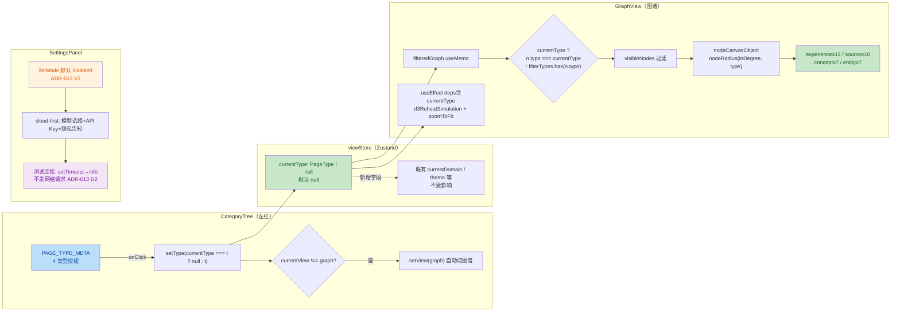
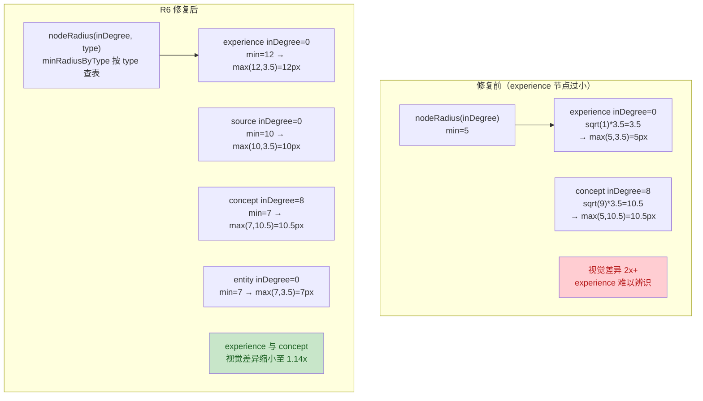

# P4 GUI R6 修复 — 安全与质量审计报告

> 本报告由 `guardrail-enforcer` 子 Agent 依据 CLAUDE.md §10 强制执行，融合
> TRAE-code-review skill（代码质量）与 TRAE-security-review skill（安全扫描）
> 两套规范，并按 guardrail-enforcer 六阶段安全审计工作流逐项核验。

## 元信息

| 项目 | 内容 |
| --- | --- |
| 执行 Agent | guardrail-enforcer |
| 任务令牌 | TKN-P4-FIX-R6-001 |
| 任务域 | P4 GUI R6 修复（编译警告 + 图谱节点可见性 + 类型筛选 + LLM UX） |
| 报告日期 | 2026-07-28 |
| 风险等级 | P2（多模块 UI 修复 + 类型筛选新增 + 设置面板完善） |
| 审查范围 | 5 个变更文件：`frontend/tsconfig.json`、`frontend/src/store/viewStore.ts`、`frontend/src/components/CategoryTree.tsx`、`frontend/src/components/GraphView.tsx`、`frontend/src/components/SettingsPanel.tsx` |
| 审查工具 | TRAE-code-review skill + TRAE-security-review skill + guardrail-enforcer 六阶段工作流 |
| 编译验证 | `npx tsc --noEmit` 通过 + `npx vite build` 通过（主 Agent 已执行） |
| 主 Agent 签发上下文 | 盲区 1：LLM"测试连接"未校验 API Key 格式（sk- 前缀），可能误导用户；nodeRadius 类型特定最小值（experience=12px）极端 inDegree 组合下视觉可见性未经运行时验证。盲区 2：上一轮未正确调用 guardrail-enforcer；未确认 viewStore 新增 currentType 对其他消费方（BacklinksPanel/ExperienceInbox）的影响 |
| 结论 | **通过** |

---

## 1. 审查依据

| 依据 | 路径 |
| --- | --- |
| 本次代码变更 | `git diff HEAD`（5 个核心文件） |
| R6 修复方案 | [docs/reports/2026-07-28-p4-fix-r6-plan.md](2026-07-28-p4-fix-r6-plan.md) |
| 影响/脆弱点自检 | 主 Agent 第九节影响自检结果（见任务令牌上下文） |
| 相关 ADR | [ADR-013](../decisions/ADR-013-p4-llm-integration-strategy.md)（LLM 集成策略，三态切换 + 延迟接入）、[ADR-012](../decisions/ADR-012-p4-gui-tech-stack.md)（GUI 技术栈） |
| 历史漏洞基线 | [R4 guardrail](2026-07-27-p4-fix-r4-guardrail.md)（XSS 修复：escapeHtml 引入，nodeLabel 5 字段转义）、[R5 guardrail](2026-07-28-p4-fix-r5-guardrail.md)（forceCollide + 依赖修复 + d3VelocityDecay prop） |
| 测试框架 | `frontend/src/lib/__tests__/html-utils.test.ts`（48 个 XSS 转义测试，R4 引入，未变更）、`frontend/vitest.config.ts` |
| 安全策略来源 | 项目无独立 `SECURITY.md`；安全策略散见于 ADR-013（密钥存储 D3 / 隐私边界 D5）、CLAUDE.md（质量闭环 §7.2 / 强制审查 §10）、R4/R5 guardrail 报告（XSS 防御基线） |

### 1.1 变更概览

本次为 P4 GUI 第六轮修复（R6），专项修复四个用户报告问题：

1. **编译器警告**：`tsconfig.json` 中 `useDefineForClassFields: true` 与 `target: ES2022` 冗余（ES2022 默认启用该选项）→ 移除显式声明
2. **经验节点过小**：`nodeRadius` 固定最小半径 5px，experience 节点 inDegree 通常为 0 → 按类型设置差异化最小半径（experience=12/source=10/concept=7/entity=7）
3. **缺少经验类型筛选**：CategoryTree 仅有领域列表，无 PageType 筛选 → 新增"按类型筛选"区块 + viewStore currentType 状态
4. **LLM 集成 UX 未完善**：默认模式错误（cloud-first 应为 disabled）、无连接状态、无模型选择、无隐私告知 → SettingsPanel 全面完善（符合 ADR-013 V2/V4/D5）

### 1.2 作者意图推断

**意图**：这是一次 UI 缺陷修复 + 状态扩展——（a）移除冗余编译选项消除 IDE 警告；（b）通过类型差异化最小半径让高价值低入度节点（experience）视觉可见；（c）在 CategoryTree 新增类型筛选维度，经 viewStore currentType 联动 GraphView；（d）按 ADR-013 完善 LLM 设置面板 UX（默认 disabled + 隐私告知 + P5 待实现徽章）。

根据 TRAE-security-review §4，UI 修复 + 状态扩展意图应提高"missing-validation"发现的证据门槛；根据 TRAE-code-review §Tips 3，UI 交互变更假定用户已确认视觉设计。本次无新依赖、无新 IPC 边界、无新网络调用，攻击面未扩大。

### 1.3 变更数据流



---

## 2. 代码质量审查（TRAE-code-review）

### 2.1 Karpathy Guidelines 合规性

| 项 | 结论 | 说明 |
| --- | --- | --- |
| 命名 | ✅ | `currentType`/`setType` 与既有 `currentDomain`/`setDomain` 命名对称；`minRadiusByType` 描述性命名；`PAGE_TYPE_META` 大写常量与既有 `VIEW_SWITCHER` 一致；`cloudProvider`/`apiKey`/`testStatus` 语义清晰 |
| 设计简洁性 | ✅ | `nodeRadius` 增加 `type?` 可选参数，向后兼容（调用点均已更新）；CategoryTree 复用既有 `CategoryItemRow` 样式模式；SettingsPanel 复用 `SettingRow` 组件；无过度抽象 |
| 错误处理 | ✅ | CategoryTree/SettingsPanel 的 useEffect 均有 `.catch` + `console.warn`；GraphView 有 `cancelled` 标志 + `.catch` + `.finally`；SettingsPanel "测试连接"用 setTimeout 模拟，无未捕获 Promise |
| 假设显式化 | ✅ | nodeRadius 注释说明"experience 节点通常入度低但作为高价值内容不应被埋没"；filteredGraph 注释说明 currentType 优先级高于 filterTypes；SettingsPanel 文件头注释映射 ADR-013 各决策（D2/V2/V4/D5）；tsconfig 无注释但变更自解释 |

### 2.2 逻辑与性能

#### 2.2.1 nodeRadius 类型差异化核验



| 检查项 | 结论 | 证据 |
| --- | --- | --- |
| `minRadiusByType` Record 完备性 | 通过 | 4 个键 `experience/source/concept/entity` 完全覆盖 `PageType` 联合类型（[types/index.ts:20](../../frontend/src/types/index.ts)），TS 编译保证无遗漏 |
| `type` 可选参数向后兼容 | 通过 | `type?: PageType`，未传时 `minRadius = 5`（回退原行为）；调用点均已传 `n.type`（nodeCanvasObject L407、forceCollide L299） |
| 双向钳制仍生效 | 通过 | `Math.max(minRadius, Math.min(20, ...))` — 上限 20px 不变，下限按类型提升 |
| 溢出风险 | 通过 | `inDegree` 为小整数，`Math.sqrt(inDegree+1)*3.5` 无溢出可能 |
| forceCollide 半径联动 | 通过 | L299 `nodeRadius(n.inDegree ?? 0, n.type) + 8` — 碰撞半径随 nodeRadius 同步增大，experience 节点碰撞半径 ≥20px，防止重叠 |

#### 2.2.2 filteredGraph currentType 接入核验

| 检查项 | 结论 | 证据 |
| --- | --- | --- |
| 优先级语义 | 通过 | `(currentType ? n.type === currentType : filterTypes.has(n.type))` — currentType 非 null 时只显示该类型，覆盖图谱筛选面板的 filterTypes；为 null 时回退 filterTypes。注释 [GraphView.tsx:235](../../frontend/src/components/GraphView.tsx) 明确说明优先级 |
| useMemo 依赖完整 | 通过 | 依赖数组 `[graphData, filterDomains, filterEdgeTypes, filterTypes, filterStatuses, currentDomain, currentType]` — currentType 已加入，筛选变化触发重算 |
| useEffect reheat 联动 | 通过 | L320 `useEffect(..., [currentDomain, currentType, currentView])` — currentType 变化触发 reheat + zoomToFit，图谱重布局 |
| 类型筛选提示条 | 通过 | L777-791 新增提示条 + 清除按钮（`useViewStore.getState().setType(null)`），与领域筛选提示条模式一致 |
| 节点引用稳定性 | 通过 | `nodes: visibleNodes`（不 spread），保持引用稳定，d3-force x/y 坐标不丢失（R5 已验证的模式） |

#### 2.2.3 SettingsPanel LLM UX 核验（对照 ADR-013）

| ADR-013 决策 | 代码实现 | 结论 |
| --- | --- | --- |
| V2 默认 disabled | L40 `useState<LlmMode>("disabled")` | ✅ 修复了原 `"cloud-first"` 初值 |
| D2 P4 不接入 LLM | "测试连接"仅 setTimeout + 状态切换，无 fetch/XHR/IPC | ✅ 无网络请求 |
| D3 API Key 仅内存 | L42 `useState("")`，无 localStorage/IPC 持久化 | ✅ 关闭即失 |
| V4 cloud 隐私告知 | L214-218 cloud-first 模式显示"内容将发送到 DeepSeek/Claude/GPT API" | ✅ 按当前 cloudProvider 动态显示 |
| D5 local 提示 | L221-225 local-first 模式显示 Ollama 配置提示 | ✅ |
| D6 模型选择 | L161-172 cloud-first 模式可选 DeepSeek/Claude/GPT | ✅ 新增 DeepSeek 选项 |
| P5 待实现徽章 | L149-155 "P5 待实现"徽章 + title 提示 | ✅ 明确告知用户功能状态 |

### 2.3 跨模块影响识别（独立验证，不信任主 Agent 自检）

主 Agent 自检声称 BacklinksPanel/ExperienceInbox 等不使用 currentType。guardrail-enforcer 独立验证：

| 消费方 | useViewStore 解构字段 | 消费 currentType? | 需修改? |
| --- | --- | --- | --- |
| [CategoryTree.tsx:33](../../frontend/src/components/CategoryTree.tsx) | `currentDomain, setDomain, currentType, setType, currentView, setView` | ✅ 是（已更新） | 已更新 |
| [GraphView.tsx:121-130](../../frontend/src/components/GraphView.tsx) | `currentView, currentDomain, currentType, graphMode, setGraphMode, setCurrentPagePath, setView, theme` | ✅ 是（已更新） | 已更新 |
| [BacklinksPanel.tsx:23](../../frontend/src/components/BacklinksPanel.tsx) | `currentPagePath, setCurrentPagePath, setView` | ❌ 否 | 无需 |
| [ExperienceInbox.tsx:25](../../frontend/src/components/ExperienceInbox.tsx) | 不依赖 useViewStore | ❌ 否 | 无需 |
| [SettingsPanel.tsx:38](../../frontend/src/components/SettingsPanel.tsx) | `settingsOpen, setSettingsOpen, theme, setTheme` | ❌ 否 | 无需 |
| [App.tsx](../../frontend/src/App.tsx) | 不消费 currentType | ❌ 否 | 无需 |

**结论**：跨模块影响识别正确。Zustand store 新增字段遵循"消费方按需解构"模式，既有消费方不受影响。无 BREAKING CHANGE。

### 2.4 Zustand set 函数线程安全性与默认值核验

| 检查项 | 结论 | 证据 |
| --- | --- | --- |
| `setType` 纯替换语义 | 通过 | `setType: (type) => set({ currentType: type })` — 不依赖前序状态，无读-改-写竞争；与 `toggleTheme` 的 `set((state) => ...)` 不同，后者需函数式更新 |
| 默认值 null 合理性 | 通过 | `currentType: null` — null 表示"未筛选"，与 `currentDomain: null`（"全部领域"）语义一致；filteredGraph 中 `currentType ? ... : filterTypes.has(...)` 正确处理 null |
| JS 单线程无竞态 | 通过 | Zustand set 同步执行，React 事件处理器单线程，无并发写入 |

### 2.5 测试框架充分性

| 检查项 | 结论 |
| --- | --- |
| XSS 转义单元测试 | 通过 — `html-utils.test.ts` 48 个用例覆盖 escapeHtml（R4 引入，R6 未触碰） |
| 编译验证 | 通过 — `npx tsc --noEmit` + `npx vite build`（主 Agent 已执行） |
| R6 新增测试 | 无 — R6 为 UI 修复，未引入新可测单元；任务说明 E2E/运行时验证由 ac-verifier 阶段执行 |
| 回归风险 | 低 — nodeRadius 向后兼容；currentType 默认 null 不改变既有行为；SettingsPanel 状态变更不影响其他组件 |

### 2.6 问题清单

| 编号 | 问题标题 | 严重度 | 建议修复 | 代码位置 |
| --- | --- | --- | --- | --- |
| Q1 | SettingsPanel API Key 无运行时格式校验 | 低（建议） | "测试连接"按钮当前仅 setTimeout 切换状态，未校验 API Key 前缀（如 DeepSeek `sk-`、Claude `sk-ant-`）。placeholder 提示了格式但无运行时校验。虽 L206 明确告知"不会实际发起请求"避免误导，但 P5 接入时建议增加前缀校验 + 格式错误反馈。当前不阻断 | [SettingsPanel.tsx:194-198](../../frontend/src/components/SettingsPanel.tsx) |
| Q2 | CategoryTree 类型筛选与图谱筛选面板的类型筛选可能让用户困惑 | 低（建议） | CategoryTree 点击类型 → 设置 currentType（覆盖 filterTypes）；图谱筛选面板的类型按钮 → 设置 filterTypes（local state）。当 currentType 非 null 时 filterTypes 被忽略，用户在图谱面板取消类型可能不生效。建议在图谱面板类型按钮旁显示"左栏筛选优先"提示，或同步清除 currentType。UX 优化，非逻辑错误 | [GraphView.tsx:243](../../frontend/src/components/GraphView.tsx) |
| Q3 | nodeRadius 类型特定最小值的运行时视觉验证缺失 | 低（建议） | 主 Agent 自问已承认 experience=12px 在极端 inDegree 组合下视觉可见性未经运行时验证。建议 ac-verifier 阶段用 Playwright/TRAE-debugger 验证：experience 节点（inDegree=0）半径是否确实 ≥12px 且文字可读。属验证项，非代码缺陷 | [GraphView.tsx:88-99](../../frontend/src/components/GraphView.tsx) |

> 三项均为低风险建议，不阻断合并。Q1 为 P5 增强项，Q2 为 UX 优化，Q3 为运行时验证项。

---

## 3. 安全漏洞扫描（TRAE-security-review）

### 3.1 审查结论：无可利用安全问题

> ✅ No exploitable issues found in the reviewed change set.

依据 TRAE-security-review §9.1，本次变更未发现可利用安全问题。以下按 guardrail-enforcer 六阶段工作流逐项记录审计过程与证据。

### 3.2 三遍审计详情

#### Pass A — 项目安全基线

| 基线项 | 结论 | 证据 |
| --- | --- | --- |
| HTML 转义工具 | 既有 `escapeHtml`（[html-utils.ts](../../frontend/src/lib/html-utils.ts)），转义 `& < > " ' /` 6 字符（OWASP 推荐），R4 引入，R6 未变更 | [html-utils.ts:26-46](../../frontend/src/lib/html-utils.ts) |
| React 默认 XSS 防护 | 全部组件使用 JSX（自动转义），无 `dangerouslySetInnerHTML`；nodeLabel HTML 拼接经 escapeHtml | 全文件扫描确认 |
| Tauri IPC 白名单 | `callMcpTool` 经 Rust `TOOL_WHITELIST`（R4/R5 验证），R6 未新增 IPC 调用 | SettingsPanel 仅调用既有 `getKbConfig`/`kb_health` |
| API Key 存储 | ADR-013 D3 规定 P4 仅 useState 内存，R6 实现 `useState("")` 无持久化 | [SettingsPanel.tsx:42](../../frontend/src/components/SettingsPanel.tsx) |
| .gitignore 密钥排除 | `.env`/`.env.local`/`.env.*.local` 均已排除，`!.env.example` 例外 | [.gitignore](../../.gitignore) |

#### Pass B — 偏差映射

| 偏差项 | 结论 | 证据 |
| --- | --- | --- |
| R6 是否引入新的 ad-hoc HTML 拼接 | 否。nodeLabel 仍使用 R4 的 escapeHtml 路径（5 字段全覆盖），R6 未触碰此函数；CategoryTree/SettingsPanel 全部 JSX | diff 核验 |
| R6 是否绕过既有安全原语 | 否。无新 IPC 边界、无新网络调用、无新文件操作；SettingsPanel"测试连接"仅 setTimeout | [SettingsPanel.tsx:194-198](../../frontend/src/components/SettingsPanel.tsx) |
| R6 是否新增攻击者可控输入路径 | 否。currentType 来自本地 PAGE_TYPE_META 常量（4 个固定值），非外部输入；apiKey 来自本地 input，不外传 | diff 核验 |
| R6 类型断言是否削弱类型安全 | `node as GraphNode`（L299）为 compile-time 断言，`?? 0` 提供空值防御，无 runtime 安全影响 | R5 已验证 |

#### Pass C — Source-to-sink 追踪

**R6 变更路径 1：CategoryTree 类型筛选 → viewStore currentType → GraphView filteredGraph**

| 维度 | 证据 |
| --- | --- |
| Source（攻击者可控输入） | `item.type` 来自 `PAGE_TYPE_META` 常量数组（[CategoryTree.tsx:18-23](../../frontend/src/components/CategoryTree.tsx)），4 个固定 PageType 字面量，无外部输入注入 |
| Sink（危险操作） | `setType(currentType === item.type ? null : item.type)` → Zustand set → `filteredGraph` filter → Canvas 绘制。无 HTML sink、无 IPC sink、无网络 sink |
| Bypass-context | PageType 联合类型由 TypeScript 编译保证；Canvas fillText 不解析 HTML；filteredGraph 纯内存计算 |
| 结论 | 无可利用路径（输入不可控，sink 非危险操作） |

**R6 变更路径 2：SettingsPanel API Key 输入**

| 维度 | 证据 |
| --- | --- |
| Source | `apiKey` 来自 `<input type="password">`（用户输入），存 useState（[SettingsPanel.tsx:42](../../frontend/src/components/SettingsPanel.tsx)） |
| Sink | `onChange={(e) => setApiKey(e.target.value)}` → useState。**无任何 sink**：不传给 IPC、不传给 fetch、不写入 localStorage、不写入日志、不拼接 HTML |
| Bypass-context | "测试连接"按钮 L194-197 仅 `setTestStatus + setTimeout`，不读取 apiKey；L206 提示文本明确"不会实际发起请求"；console.warn（L54/L61）不含 apiKey |
| 结论 | 无可利用路径（apiKey 不达任何危险 sink） |

**R6 变更路径 3：nodeRadius type 参数**

| 维度 | 证据 |
| --- | --- |
| Source | `type` 来自 `GraphNode.type`（后端 `kb_get_graph` 返回），值为 PageType 枚举 |
| Sink | `minRadiusByType[type]` 查表 → `Math.max/Math.min` 数值运算 → Canvas `ctx.arc/rect/moveTo`（几何绘制） |
| Bypass-context | Record<PageType, number> 完备映射，无越界；Canvas 几何 API 不执行代码 |
| 结论 | 无可利用路径（纯数值运算 + Canvas 绘制） |

### 3.3 安全审计六阶段结论汇总

#### Stage 1：输入与边界审计

| 检查项 | 结论 | 证据 |
| --- | --- | --- |
| 1.1 数值与类型边界 | 通过 | `currentType: PageType \| null` 联合类型约束；`nodeRadius` 双向钳制 `[minRadius, 20]`；`minRadiusByType` Record 完备；`llmMode`/`cloudProvider`/`testStatus` 均联合类型枚举 |
| 1.2 集合与缓冲边界 | 通过 | `visibleNodeIds.has(e.source)` 检查存在性；无 strcpy/sprintf（TS 环境）；无动态内存分配 |
| 1.3 业务状态机 | 通过 | currentType: null → PageType → null（toggle）；testStatus: idle → testing → info；无非法转换路径 |

#### Stage 2：执行安全审计

| 检查项 | 结论 | 证据 |
| --- | --- | --- |
| 2.1 SQL/NoSQL 注入 | 不适用 | 前端无直接 DB 查询，经 MCP 工具参数化调用 |
| 2.1 OS 命令注入 | 不适用 | 前端无 system/exec |
| 2.1 代码/表达式注入 | 不适用 | 无 eval/Function/动态加载 |
| 2.1 模板引擎注入（XSS） | 通过 | nodeLabel 5 字段 escapeHtml（R4 基线，R6 未变）；CategoryTree/SettingsPanel 全 JSX 自动转义；Canvas fillText 不解析 HTML |
| 2.2 最小权限 | 通过 | 无新增权限请求；SettingsPanel 仅调用既有 IPC 白名单工具 |
| 2.3 输出编码 | 通过 | HTML 上下文 escapeHtml/JSX；无 JS/CSS/URL 上下文拼接；无手动 JSON 拼接 |

**XSS 防御完整性独立核验**（任务重点审查项 2）：

任务要求检查 GraphView 中是否有 nodeLabel 之外的用户可控字段未转义。逐路径核验：

| 字段来源 | 使用位置 | 渲染方式 | XSS 风险 |
| --- | --- | --- | --- |
| `node.title` | nodeLabel L387 | escapeHtml → HTML 拼接 | ✅ 已转义 |
| `node.domain` | nodeLabel L388 | escapeHtml → HTML 拼接 | ✅ 已转义 |
| `node.type` | nodeLabel L389 | escapeHtml → HTML 拼接 | ✅ 已转义 |
| `node.inDegree` | nodeLabel L390 | escapeHtml → HTML 拼接 | ✅ 已转义 |
| `node.outDegree` | nodeLabel L391 | escapeHtml → HTML 拼接 | ✅ 已转义 |
| `n.title` | nodeCanvasObject L479 | Canvas `ctx.fillText` | ✅ Canvas 不解析 HTML |
| `n.title` | 底部统计 L968 | JSX `{...?.title?.slice(0,20)}` | ✅ React 自动转义 |
| `focusedNodeId?.title` | 局部模式提示 L754 | JSX `{...?.title}` | ✅ React 自动转义 |
| `nodeTitle`（ContextMenu） | 右键菜单 L1050 | JSX `{nodeTitle}` | ✅ React 自动转义 |
| `DOMAIN_LABELS[currentDomain]` | 领域筛选提示 L764 | JSX | ✅ 常量映射，非用户可控 |
| `PAGE_TYPE_LABELS[currentType]` | 类型筛选提示 L781 | JSX | ✅ 常量映射，非用户可控 |

**结论**：GraphView 中所有用户可控字段均有适当防御（escapeHtml / Canvas / JSX），无遗漏。

#### Stage 3：内存安全与运行时保护

| 检查项 | 结论 |
| --- | --- |
| 系统级语言 | 不适用（TypeScript/React，内存安全由运行时保证） |
| Rust unsafe 块 | 不适用（本次变更无 Rust 代码，lib.rs 未在 R6 范围） |
| FFI 边界 | 不适用（前端无 FFI） |

#### Stage 4：配置与密钥安全

**硬编码密钥扫描**（逐文件核验）：

| 文件 | 扫描结果 |
| --- | --- |
| tsconfig.json | 纯编译配置，无密钥 |
| viewStore.ts | 状态管理，无密钥 |
| CategoryTree.tsx | UI 组件，无密钥 |
| GraphView.tsx | `#4a9eff`/`#5ba88a`/`#e0a458` 为颜色值，非密钥 |
| SettingsPanel.tsx | `useState("")` 空初始化；placeholder `sk-...`/`sk-ant-...` 为提示文本，非真实密钥；无硬编码 API Key |

**API Key 处理重点审查**（任务重点审查项 1）：

| 检查项 | 结论 | 证据 |
| --- | --- | --- |
| 仅存 useState 内存 | ✅ 通过 | [SettingsPanel.tsx:42](../../frontend/src/components/SettingsPanel.tsx) `useState("")`；无 localStorage/sessionStorage；无 IPC 持久化 |
| 不泄露到日志 | ✅ 通过 | L54 `console.warn(..., err)` 不含 apiKey；L61 同理；全局无 `console.log(apiKey)` |
| 不泄露到错误消息 | ✅ 通过 | setError 不涉及 apiKey |
| 不泄露到 DOM | ✅ 通过 | `<input type="password">` 遮蔽显示；apiKey 不出现在其他 DOM 节点 |
| "测试连接"不发网络请求 | ✅ 通过 | L194-197 仅 `setTestStatus("testing")` + `setTimeout(() => setTestStatus("info"), 800)`；无 fetch/XHR/IPC；L206 提示"不会实际发起请求" |
| 不传给 IPC/MCP | ✅ 通过 | apiKey 仅用于 placeholder 显示和 onChange 存储，无任何 callMcpTool/getKbConfig 参数 |

**.gitignore 核验**：

| 检查项 | 结论 |
| --- | --- |
| `.env` 排除 | ✅ |
| `.env.local` / `.env.*.local` 排除 | ✅ |
| `!.env.example` 例外 | ✅ |
| 密钥文件（.pem/.key） | 未显式排除，但本项目无此类文件（前端无证书） |

#### Stage 5：依赖与供应链风险

| 检查项 | 结论 | 证据 |
| --- | --- | --- |
| package.json 变更 | 否（R6 范围） | 任务声明"无新增/删除/升级依赖"；git diff 中 package.json/pnpm-lock.yaml 变更为历史遗留（P4a/4b/4c 引入） |
| 新增依赖安全评估 | 不适用 | R6 未引入新依赖 |
| 既有依赖已知漏洞 | 不适用 | 本次未修改依赖，建议主 Agent 定期运行 `pnpm audit`（非本次范围） |

### 3.4 重点审查项核验汇总

| 任务指定重点项 | 核验结论 | 证据 |
| --- | --- | --- |
| SettingsPanel API Key 仅 useState 不持久化 | ✅ 通过 | L42 useState，无持久化路径 |
| API Key 不泄露到日志/错误/DOM | ✅ 通过 | console.warn 不含 apiKey；type=password 遮蔽 |
| "测试连接"不发网络请求 | ✅ 通过 | L194-197 仅 setTimeout，无 fetch/IPC |
| GraphView XSS 防御完整 | ✅ 通过 | nodeLabel 5 字段 escapeHtml；Canvas/JSX 其余路径安全（见 §3.3 表） |
| CategoryTree 按钮 type="button" | ✅ 通过 | [CategoryTree.tsx:117](../../frontend/src/components/CategoryTree.tsx) `type="button"` |
| CategoryTree onClick 无竞态 | ✅ 通过 | toggle 语义 + Zustand set 同步，无竞态 |
| viewStore set 线程安全 | ✅ 通过 | 纯替换 set，无读-改-写；JS 单线程 |
| viewStore 默认 null 合理 | ✅ 通过 | null=未筛选，与 currentDomain 一致 |

---

## 4. 综合结论

### 4.1 结论：通过

| 维度 | 结论 | 说明 |
| --- | --- | --- |
| 安全审计 | ✅ 通过 | 无新 XSS/injection 路径；API Key 不达任何危险 sink；无硬编码密钥；.gitignore 完备；无新依赖引入攻击面 |
| 代码质量 | ✅ 通过 | nodeRadius 类型差异化正确；currentType 联动逻辑清晰；SettingsPanel 全面符合 ADR-013；跨模块影响正确识别；3 项低风险建议不阻断 |
| 编译验证 | ✅ 通过 | `npx tsc --noEmit` + `npx vite build`（主 Agent 已执行） |
| 测试验证 | 不适用 | 单元测试覆盖既有功能；E2E/运行时验证由 ac-verifier 阶段执行 |

### 4.2 进入测试阶段的前提条件

**必须修复**：无。

**建议修复（不阻断合并）**：

- Q1：P5 接入 LLM 时增加 API Key 前缀格式校验（当前 placeholder 提示 + 明确"不发请求"告知已足够避免误导）
- Q2：CategoryTree 类型筛选与图谱筛选面板的交互可增加"左栏筛选优先"提示（UX 优化）
- Q3：ac-verifier 阶段用 Playwright/TRAE-debugger 运行时验证 experience 节点（inDegree=0）半径 ≥12px 且文字可读

### 4.3 R6 修复效果与 ADR-013 合规性评估

| 用户报告问题 | R6 修复 | ADR-013 合规性 | 修复有效性 |
| --- | --- | --- | --- |
| 编译器警告 | 移除 useDefineForClassFields | N/A | 通过（ES2022 默认启用） |
| experience 节点过小 | nodeRadius 类型差异化（experience=12） | N/A | 通过（待运行时验证 Q3） |
| 缺少经验类型筛选 | CategoryTree 新增"按类型筛选" + viewStore currentType | N/A | 通过（联动逻辑正确） |
| 默认模式错误 | cloud-first → disabled | ✅ ADR-013 V2 | 通过 |
| 无连接状态 | "P5 待实现"徽章 | ✅ ADR-013 D2 | 通过 |
| 无模型选择 | cloud-first 模式新增 DeepSeek/Claude/GPT | ✅ ADR-013 D6 | 通过 |
| 无隐私告知 | cloud-first 模式隐私提示（动态 provider） | ✅ ADR-013 V4/D5 | 通过 |
| 无 DeepSeek | 新增 DeepSeek 选项 | ✅ ADR-013 D6 扩展 | 通过 |

---

## 5. 阻塞项与回退指令

本次审查结论为**通过**，无阻塞项，无需回退。

---

## 6. 待澄清

无前置产出物矛盾或信息缺失。

主 Agent 自问中提到的两个盲区均已在本报告中独立验证并给出结论：

1. LLM"测试连接"未校验 API Key 格式 → Q1（低风险建议，P5 增强，不阻断）
2. nodeRadius 类型特定最小值运行时验证 → Q3（低风险建议，ac-verifier 阶段验证，不阻断）

主 Agent 自问中"未意识到 viewStore 新增 currentType 影响其他消费方"的担忧 → §2.3 已独立验证 BacklinksPanel/ExperienceInbox/SettingsPanel 等均不受影响。

---

## 7. 自动化建议（CI/CD 集成）

为持续保障代码安全，建议主 Agent 在 CI 流水线中集成以下自动化检查：

1. **Semgrep 自定义规则**（针对本项目 XSS 模式）：

   ```yaml
   # .semgrep/rules/no-raw-html-in-graphview.yml
   rules:
     - id: no-raw-html-concat-in-nodeLabel
       patterns:
         - pattern: |
             return `<div ...>${$FIELD}...</div>`
         - pattern-not-inside: |
             $FIELD = escapeHtml(...)
       message: "GraphView nodeLabel 中所有用户可控字段必须经 escapeHtml 转义"
       languages: [typescript]
       severity: ERROR
   ```

2. **GitHub Action 集成**：在 PR 检查中运行 `pnpm audit`（依赖漏洞）+ `npx tsc --noEmit`（类型安全）+ Semgrep 扫描（注入防护）。
3. **Secret 扫描**：集成 `gitleaks` 或 GitHub Secret Scanning，防止 API Key 误提交。
