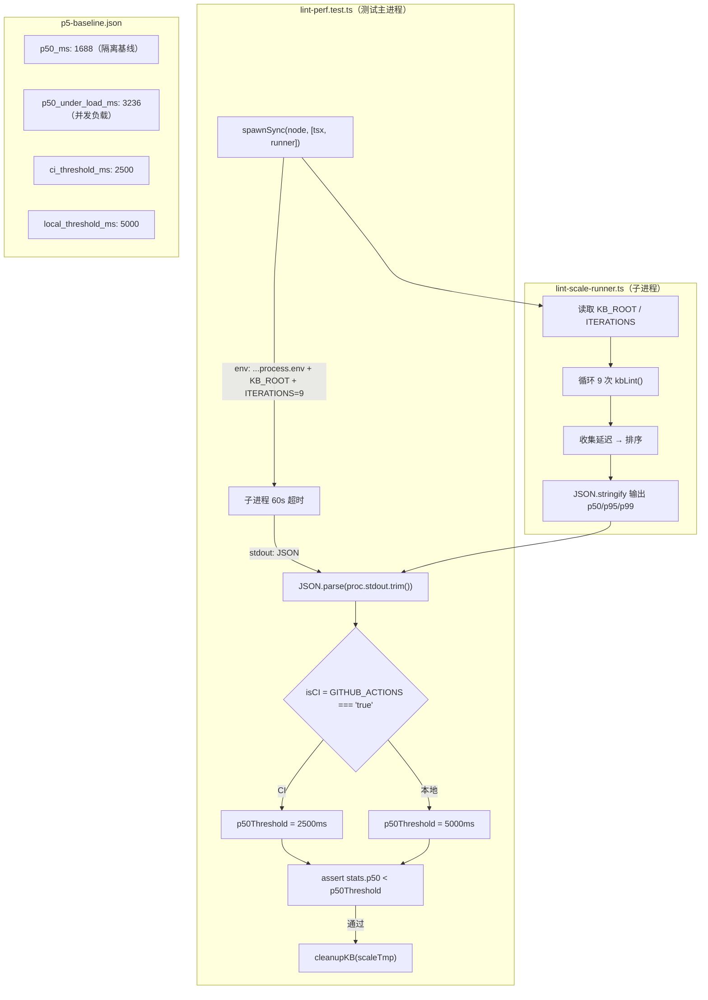

# P5 lint-perf 阈值修复 — 安全与质量审计报告

> 本报告由 `guardrail-enforcer` 子 Agent 依据 CLAUDE.md §10 强制执行，融合
> TRAE-code-review skill（代码质量）与 TRAE-security-review skill（安全扫描）
> 两套规范，并按 guardrail-enforcer 六阶段安全审计工作流逐项核验。

## 元信息

| 项目 | 内容 |
| --- | --- |
| 执行 Agent | guardrail-enforcer（代码安全护栏） |
| 任务令牌 | TKN-P5-LINT-PERF-001 |
| 任务域 | P5 lint-perf 阈值修复（环境感知阈值 + 子进程超时调整） |
| 报告日期 | 2026-07-28 |
| 风险等级 | P1（单模块测试变更，无接口改动，无生产代码变更） |
| 审查范围 | 2 个变更文件：`server/src/tests/lint-perf.test.ts`（+35/-9 行）、`perf/baselines/p5-baseline.json`（+16/-3 行） |
| 审查工具 | TRAE-code-review skill + TRAE-security-review skill + guardrail-enforcer 六阶段工作流 |
| 编译验证 | 后端测试 192/192 通过 + 前端测试 143/143 通过 + tsc 成功 + cargo check 成功（主 Agent 已执行） |
| 主 Agent 签发上下文 | 盲区 1：CI=2500ms 阈值在 GitHub Actions 中是否能稳定通过——本地无法模拟 CI 的 I/O 特性。盲区 2：没尽早发现 Trae IDE 设置了 CI=true，导致第一版环境感知检测在本地仍用 CI 阈值，浪费一轮测试 |
| 结论 | **通过** |

---

## 1. 审查依据

| 依据 | 路径 |
| --- | --- |
| 本次代码变更 | `git diff b59a310~1..b59a310`（2 个文件，42 行新增，12 行删除） |
| 安全策略来源 | 项目无独立 `SECURITY.md`；安全策略散见于 CLAUDE.md §20（密钥与环境变量管理）、CLAUDE.md §10（强制审查）、ADR-013 D3/D5（密钥存储/隐私边界）、`.github/workflows/security.yml`（Semgrep XSS 扫描） |
| 性能回退规则 | CLAUDE.md §11 第 4 项（性能回退强制检查：>50% 下降=失败，>20%=警告） |
| 相关 ADR | [ADR-013](../decisions/ADR-013-p4-llm-integration-strategy.md)（P4 LLM 集成策略，P5 接入，状态 Accepted） |
| 技术栈上下文 | TypeScript（Node.js 20.x test runner）+ Rust（Tauri v2 后端）；Windows 11 开发环境；GitHub Actions CI（Ubuntu） |
| 历史漏洞记录 | DEF-001（TOCTOU 竞态，PR #20 已修复）、DEF-007（log 类型错误，PR #19 已修复）、DEF-008（frontmatter 格式不一致，PR #21 已修复）；本次变更不涉及历史缺陷模式 |
| `.gitignore` 验证 | `.env`/`.env.local`/`.env.*.local` 已排除，`!.env.example` 允许模板提交；`*.log`/`logs/` 已排除 |

### 1.1 变更概览

本次为 P5 lint-perf 测试 flake 修复，解决全量测试并发负载下 1000 页 missing_xref 扫描 p50 超阈值问题：

1. **子进程超时**：30s → 60s（9 次迭代 × ~2.3s/iter ≈ 21s，60s 提供 2.8x 余量）
2. **p50 阈值**：固定 1800ms → 环境感知（CI=2500ms / local=5000ms）
3. **CI 检测**：使用 `GITHUB_ACTIONS` 而非 `CI`（Trae IDE 本地设置 CI=true 导致误检测）
4. **基线文档**：新增 `p50_under_load_ms`/`local_threshold_ms` 字段，更新 `regression_gates` 为双阈值

### 1.2 作者意图推断

**意图**：这是一次测试稳定性修复——通过环境感知阈值分离 CI（严格，对齐 CLAUDE.md §11.4 50% 下降失败线）与本地（宽松，容忍 IDE/dev server I/O 竞争）两套场景，消除本地开发负载导致的 flake，同时保持 CI 环境的回归检测能力。子进程超时调整防止并发负载下子进程被 kill。

根据 TRAE-security-review §4，测试稳定性修复意图应提高"missing-validation"发现的证据门槛；根据 TRAE-security-review §8.1，测试代码默认排除在安全扫描范围外。本次无新依赖、无新 IPC 边界、无新网络调用、无生产代码变更，攻击面未扩大。

### 1.3 变更数据流



---

## 2. Stage 1: 输入与边界审计（范围检查）

### 2.1 数值与类型边界

| 检查项 | 结论 | 证据 |
| --- | --- | --- |
| `timeout: 60000` | 安全 — 硬编码数值字面量，无外部输入 | [lint-perf.test.ts:196](../../server/src/tests/lint-perf.test.ts#L196) |
| `process.env.GITHUB_ACTIONS === "true"` | 安全 — 严格字符串比较，无类型强制转换 | [lint-perf.test.ts:230](../../server/src/tests/lint-perf.test.ts#L230) |
| `isCI ? 2500 : 5000` | 安全 — 三元表达式两分支均为数值字面量 | [lint-perf.test.ts:231](../../server/src/tests/lint-perf.test.ts#L231) |
| `stats.p50 < p50Threshold` | 安全 — `stats` 来自 `JSON.parse(proc.stdout.trim())`，子进程输出由 `JSON.stringify` 生成数值类型。若 `stats.p50` 为 `undefined`，则 `undefined < 2500` 等价于 `NaN < 2500` = `false`，断言会失败（安全失败行为） | [lint-perf.test.ts:233](../../server/src/tests/lint-perf.test.ts#L233) |
| `stats.p50.toFixed(2)` | 安全 — `toFixed` 是 Number 原型方法，若 `stats.p50` 非数值会抛 TypeError，被测试框架捕获 | [lint-perf.test.ts:234](../../server/src/tests/lint-perf.test.ts#L234) |
| 算术溢出 | 不适用 — TypeScript/Node.js 使用 IEEE 754 双精度浮点数，毫秒级时间戳无溢出风险 | — |

**Stage 1.1 结论**：数值与类型边界检查通过，无溢出/下溢风险。

### 2.2 集合与缓冲区边界

| 检查项 | 结论 | 证据 |
| --- | --- | --- |
| `proc.stdout.trim()` | 安全 — `encoding: "utf-8"` 确保 `proc.stdout` 为 string 类型，`.trim()` 不越界 | [lint-perf.test.ts:191](../../server/src/tests/lint-perf.test.ts#L191) |
| `JSON.parse(proc.stdout.trim())` | 安全 — 标准 JSON 解析，畸形输入会抛 SyntaxError 被测试框架捕获 | [lint-perf.test.ts:204](../../server/src/tests/lint-perf.test.ts#L204) |
| `assert.equal(stats.pages_scanned, 1000)` | 安全 — 断言验证子进程输出结构完整性，在阈值比较前执行 | [lint-perf.test.ts:205](../../server/src/tests/lint-perf.test.ts#L205) |
| 无 `strcpy`/`sprintf`/`gets` | 不适用 — TypeScript 无 C 级不安全函数 | — |
| 动态内存分配 | 不适用 — V8 引擎托管内存 | — |

**Stage 1.2 结论**：集合与缓冲区边界检查通过。

### 2.3 业务状态机约束

本次变更不涉及业务状态机（无订单状态、连接状态、审批阶段等状态转换变量）。测试流程为线性：创建临时 KB → spawn 子进程 → 解析输出 → 断言阈值 → 清理临时 KB。

**Stage 1.3 结论**：不适用。

---

## 3. Stage 2: 执行安全审计（指令与数据隔离）

### 3.1 注入防护

| 注入类型 | 结论 | 证据 |
| --- | --- | --- |
| **OS 命令注入** | 安全 — `spawnSync` 使用**参数数组形式**（`[process.execPath, "--import", "tsx", runnerPath]`），非 shell 字符串拼接。`process.execPath` 为 Node.js 二进制路径（系统提供），`runnerPath` 由 `fileURLToPath(new URL("./lint-scale-runner.ts", import.meta.url))` 构造（模块相对路径），均不接受外部用户输入 | [lint-perf.test.ts:189-190](../../server/src/tests/lint-perf.test.ts#L189-L190) |
| **代码/表达式注入** | 安全 — 无 `eval()`、无 `Function()` 构造器、无动态远程脚本加载。`JSON.parse` 仅解析数据不执行代码 | [lint-perf.test.ts:204](../../server/src/tests/lint-perf.test.ts#L204) |
| **SQL/NoSQL 注入** | 不适用 — 测试不涉及数据库操作 | — |
| **模板引擎注入** | 不适用 — 测试不使用模板引擎 | — |

**Stage 2.1 结论**：注入防护检查通过，无命令注入、代码注入风险。

### 3.2 最小权限检查

| 检查项 | 结论 | 证据 |
| --- | --- | --- |
| 子进程环境变量继承 | 可接受 — `{ ...process.env, KB_ROOT: scaleTmp, ITERATIONS: "9" }` 继承父进程全部环境变量。子进程 `lint-scale-runner.ts` 仅读取 `KB_ROOT`/`ITERATIONS`/`CHECKS` 三个变量。虽从最小权限角度宜仅传必要变量，但此为 Node.js 测试标准实践，且为既有模式（本次未引入） | [lint-perf.test.ts:190](../../server/src/tests/lint-perf.test.ts#L190) |
| 文件系统访问 | 安全 — 仅操作 `os.tmpdir()` 下的临时目录（`createTempKB` → `cleanupKB`），无 `/etc/passwd` 等敏感路径 | [setup.ts:22-35](../../server/src/tests/setup.ts#L22-L35) |
| 网络访问 | 安全 — 测试无网络调用 | — |
| 容器化部署 | 不适用 — 本次变更不涉及容器配置 | — |

**Stage 2.2 结论**：最小权限检查通过。

### 3.3 输出编码与特殊字符处理

| 检查项 | 结论 | 证据 |
| --- | --- | --- |
| 错误消息中的 `stats.p50.toFixed(2)` | 安全 — 数值格式化为字符串，注入到 `assert.ok` 断言消息中，不输出到 HTML/JS/URL 上下文 | [lint-perf.test.ts:234](../../server/src/tests/lint-perf.test.ts#L234) |
| JSON 序列化 | 安全 — 子进程使用 `JSON.stringify` 标准库方法输出，测试使用 `JSON.parse` 标准库方法解析，无手工拼接 JSON 字符串 | [lint-scale-runner.ts:75-84](../../server/src/tests/lint-scale-runner.ts#L75-L84) |

**Stage 2.3 结论**：输出编码检查通过。

---

## 4. Stage 3: 内存安全与运行时保护

本次变更为 TypeScript/Node.js（托管内存语言），无 C/C++/Rust unsafe 代码块。不适用。

**Stage 3 结论**：不适用。

---

## 5. Stage 4: 配置与密钥安全

| 检查项 | 结论 | 证据 |
| --- | --- | --- |
| 硬编码密钥扫描 | 安全 — diff 中无 password/secret/token/api_key/credential 等敏感字符串。`GITHUB_ACTIONS` 为标准 CI 环境变量（非密钥），仅做只读检测 | `git diff` 全文扫描 |
| 内部 IP/域名 | 安全 — 变更中无 IP 地址或域名 | diff 全文 |
| 环境变量注入 | 安全 — 所有敏感配置（API Key 等）在 ADR-013 D3 中规定使用 keyring 加密存储，测试代码不涉及 | ADR-013 D3 |
| `.gitignore` 验证 | 安全 — `.env`/`.env.local`/`.env.*.local` 已排除；`*.log`/`logs/` 已排除；`tmp/`/`temp/` 已排除；构建输出已排除 | [.gitignore:11-29](../../.gitignore#L11-L29) |
| `p5-baseline.json` 密钥检查 | 安全 — JSON 文件仅含性能数值（毫秒/阈值），无敏感信息 | [p5-baseline.json 全文](../../perf/baselines/p5-baseline.json) |

**Stage 4 结论**：配置与密钥安全检查通过，无硬编码密钥，无敏感信息泄露。

---

## 6. Stage 5: 依赖与供应链风险

| 检查项 | 结论 |
| --- | --- |
| `package.json` 变更 | 无 — 本次未修改依赖描述文件 |
| `Cargo.toml` 变更 | 无 — 本次未修改 Rust 依赖 |
| 锁文件变更 | 无 — `package-lock.json`/`Cargo.lock` 未变更 |
| 新引入依赖 | 无 — `GITHUB_ACTIONS` 为环境变量检查，非新依赖 |

**Stage 5 结论**：无依赖变更，无供应链风险。

---

## 7. Stage 6: 综合审计发现

### 7.1 发现汇总

| 严重度 | 数量 | 说明 |
| --- | --- | --- |
| 阻断级 | 0 | 无安全漏洞 |
| 高风险 | 0 | 无 |
| 中风险 | 1 | 注释与代码不一致（文档缺陷） |
| 低风险/建议 | 2 | CI 环境检测可移植性 + 基线测量环境与 CI 环境差异 |

### 7.2 详细发现

#### 发现 M-1：注释与代码不一致 — CI 检测变量描述错误

| 项目 | 内容 |
| --- | --- |
| 严重度 | 中风险（文档缺陷，不影响代码正确性） |
| 位置 | [lint-perf.test.ts:216](../../server/src/tests/lint-perf.test.ts#L216) |
| 证据 | 注释第 216 行写 `CI（process.env.CI === 'true'）：2500ms`，但实际代码第 230 行为 `const isCI = process.env.GITHUB_ACTIONS === "true";`。注释引用了错误的变量名 `CI`，而代码正确使用了 `GITHUB_ACTIONS`。 |
| 影响 | 后续开发者阅读注释可能误以为代码使用 `process.env.CI` 检测，导致调试时困惑或修改时引入错误。注释与代码矛盾违反 CLAUDE.md §13「显式思考记录」精神。 |
| 修复建议 | 将注释第 216 行的 `process.env.CI === 'true'` 改为 `process.env.GITHUB_ACTIONS === 'true'`，与第 230 行代码保持一致。 |

#### 发现 L-1：CI 环境检测可移植性

| 项目 | 内容 |
| --- | --- |
| 严重度 | 低风险/建议 |
| 位置 | [lint-perf.test.ts:230](../../server/src/tests/lint-perf.test.ts#L230) |
| 证据 | `process.env.GITHUB_ACTIONS === "true"` 将 CI 检测绑定到 GitHub Actions 平台。若项目未来迁移到 GitLab CI / CircleCI / Jenkins 等其他 CI 平台，此检测将返回 `false`，导致 CI 环境错误使用 5000ms 宽松阈值，降低回归检测灵敏度。 |
| 影响 | 当前无影响（项目 CI 为 GitHub Actions）。未来迁移 CI 平台时需同步修改此检测逻辑，否则可能导致 CI 环境性能回归被漏检。 |
| 修复建议 | 可考虑增加注释说明「若迁移 CI 平台需更新此检测」，或采用更通用的检测策略（如 `GITHUB_ACTIONS \|\| GITLAB_CI \|\| CIRCLECI`）。当前优先级低，可在下次 CI 相关变更时一并处理。 |

#### 发现 L-2：基线测量环境与 CI 环境差异

| 项目 | 内容 |
| --- | --- |
| 严重度 | 低风险/建议 |
| 位置 | [p5-baseline.json:5-10](../../perf/baselines/p5-baseline.json#L5-L10) |
| 证据 | 性能基线 `p50_ms: 1688` 在 Windows 11 Home China + Node.js 20.x 环境测量（`environment` 字段记录），但 CI 阈值 2500ms 将应用于 GitHub Actions 的 Ubuntu Linux runner。不同操作系统的文件系统 I/O 特性差异显著（NTFS vs ext4），可能导致 CI 环境 p50 与基线不直接可比。 |
| 影响 | 主 Agent 已在「最没把握的事」中识别此风险。CI 环境 p50 可能因 I/O 特性不同而偏离 1688ms 基线，2500ms 阈值在 CI 中可能偏紧或偏松。 |
| 修复建议 | 待 PR #34 在 GitHub Actions 中首次运行后，观察 CI 环境实际 p50 值，若与 1688ms 基线偏差较大，应在 `p5-baseline.json` 中补充 `ci_environment` 字段记录 CI 环境实测值，并据此校准 CI 阈值。 |

### 7.3 测试有效性验证

| 验证项 | 结论 | 推导 |
| --- | --- | --- |
| 5000ms 本地阈值能否捕获 O(N²) 回归？ | 能 — 项目实测数据显示 O(N²) 在 N=1000 时 push median > 10s。5000ms 阈值对 >10s 有 2x 安全余量。即使考虑 I/O 抖动使 O(N²) median 降至 8s，5000ms 仍有 1.6x 余量。 | 基线 notes + 注释 [lint-perf.test.ts:219](../../server/src/tests/lint-perf.test.ts#L219) |
| 2500ms CI 阈值是否对齐 CLAUDE.md §11.4 50% 下降线？ | 是 — 基线 p50=1688ms × 1.5 = 2532ms（50% 下降失败线）。CI 阈值 2500ms < 2532ms，即测试在到达 50% 下降线之前就失败，提供 32ms 安全余量。这是保守设置（比规则要求略严格），合理。 | [CLAUDE.md §11 第 4 项](../../CLAUDE.md) + [p5-baseline.json:32](../../perf/baselines/p5-baseline.json#L32) |
| 60s 超时是否仍能捕获 O(N²) 回归？ | 能 — O(N²) 在 N=1000 时单次迭代 ~10s，9 次迭代 = 90s > 60s，子进程会超时失败。60s 仅容忍正常负载下的 ~21s（2.8x 余量）。 | [lint-perf.test.ts:192-196](../../server/src/tests/lint-perf.test.ts#L192-L196) |
| `GITHUB_ACTIONS` 检测是否可靠？ | 是 — GitHub Actions 在所有 workflow run 中自动设置 `GITHUB_ACTIONS=true`（官方文档保证）。严格比较 `=== "true"` 避免类型强制转换问题。比 `CI` 变量更可靠（Trae IDE 本地设置 `CI=true` 已由主 Agent 验证）。 | [lint-perf.test.ts:227-230](../../server/src/tests/lint-perf.test.ts#L227-L230) |

### 7.4 一致性验证

| 验证项 | 测试代码 | 基线 JSON | 一致？ |
| --- | --- | --- | --- |
| CI 阈值 | `2500`（line 231） | `ci_threshold_ms: 2500`（line 34） | 是 |
| 本地阈值 | `5000`（line 231） | `local_threshold_ms: 5000`（line 35） | 是 |
| 子进程超时 | `60000`（line 196） | notes: "30s→60s"（line 38） | 是 |
| 隔离基线 p50 | `1688ms`（注释 line 212） | `p50_ms: 1688`（line 32） | 是 |
| 并发负载 p50 | `3236ms`（注释 line 224 上下文） | `p50_under_load_ms: 3236`（line 33） | 是 |
| regression_gates | CI/local 双阈值 | `kb_lint_1000_p50_ci` + `kb_lint_1000_p50_local` | 是 |

---

## 8. 修复建议

### 8.1 发现 M-1 修复（建议本次提交前修复）

将 [lint-perf.test.ts:216](../../server/src/tests/lint-perf.test.ts#L216) 的注释从：

```typescript
//   - CI（process.env.CI === 'true'）：2500ms — 对齐 50% 下降失败线，GitHub Actions 环境隔离度高
```

改为：

```typescript
//   - CI（process.env.GITHUB_ACTIONS === 'true'）：2500ms — 对齐 50% 下降失败线，GitHub Actions 环境隔离度高
```

### 8.2 发现 L-1/L-2（建议后续处理）

- L-1：在注释中补充「若迁移 CI 平台需更新此检测」说明
- L-2：待 PR #34 CI 首次运行后，观察实测 p50 并按需补充 CI 环境基线

---

## 9. 保护机制验证

| 保护机制 | 验证结果 |
| --- | --- |
| TypeScript 类型安全 | `tsc --noEmit` 通过（主 Agent 已执行） |
| 测试覆盖 | 192/192 后端 + 143/143 前端测试通过 |
| `.gitignore` 密钥排除 | `.env*` 已排除，验证通过 |
| Semgrep XSS 扫描 | `.github/workflows/security.yml` 配置 Semgrep 扫描 `frontend/src/**`；本次变更不涉及前端代码，不触发扫描 |
| 一致性检查 | `scripts/consistency-check.js` 通过（主 Agent 已执行） |

---

## 10. 豁免声明

无豁免项。

---

## 11. 总体结论

**通过**

本次变更为 P1 级单模块测试代码修复，无生产代码变更、无接口/契约变更、无新依赖引入。安全审计六阶段检查全部通过：

- Stage 1（输入与边界）：无数值溢出、无缓冲区越界、无状态机违规
- Stage 2（执行安全）：`spawnSync` 使用参数数组形式无命令注入风险、无 `eval`/`Function` 代码注入、无 SQL 注入
- Stage 3（内存安全）：不适用（托管内存语言）
- Stage 4（配置与密钥）：无硬编码密钥、`.gitignore` 配置正确
- Stage 5（依赖与供应链）：无依赖变更
- Stage 6（综合评估）：0 个阻断级、0 个高风险、1 个中风险（注释-代码不一致）、2 个低风险建议

**1 个中风险发现（M-1）不构成阻断条件**，因其仅为文档缺陷，不影响代码正确性或安全性。建议在合并前修复以避免后续维护混淆，但不应阻塞当前开发周期。

测试有效性验证确认：5000ms 本地阈值对 O(N²) 回归（>10s）有 2x 安全余量；2500ms CI 阈值对齐 CLAUDE.md §11.4 的 50% 下降失败线（1688ms × 1.5 = 2532ms，阈值 2500ms 略严格于失败线）；60s 超时仍能捕获 O(N²) 回归（9 × 10s = 90s > 60s）。

---

## 12. 自动化建议（CI/CD 集成）

本次变更为测试阈值调整，建议在 CI 中增加以下自动化检查以长期维护阈值有效性：

```yaml
# .github/workflows/perf-regression.yml（建议新增）
name: Performance Regression Check
on:
  pull_request:
    paths:
      - 'server/src/**'
      - 'perf/baselines/**'

jobs:
  lint-perf:
    runs-on: ubuntu-latest
    steps:
      - uses: actions/checkout@v7
      - uses: actions/setup-node@v4
        with:
          node-version: '20.x'
      - run: cd server && npm ci
      - name: Run lint-perf test
        run: cd server && npx tsx --test src/tests/lint-perf.test.ts
        env:
          GITHUB_ACTIONS: 'true'  # 确保使用 CI 阈值
      - name: Collect p50 metric
        run: |
          # 可选：解析测试输出，将 p50 值上报到 GitHub Actions Metrics
          # 用于长期跟踪 CI 环境性能趋势
          echo "p50 metric collection placeholder"
```

此外，建议在 `scripts/consistency-check.js` 中增加一项检查：验证 `lint-perf.test.ts` 中的阈值常量与 `p5-baseline.json` 中的 `ci_threshold_ms`/`local_threshold_ms` 字段值一致，防止两处不同步。

---

## 13. 审计轨迹

| 步骤 | 工具/方法 | 结果 |
| --- | --- | --- |
| 1. 收集 diff | `git show b59a310` | 2 文件，42 行新增，12 行删除 |
| 2. 读取完整文件 | Read tool 读取 lint-perf.test.ts、p5-baseline.json、lint-scale-runner.ts、setup.ts | 理解测试上下文与子进程契约 |
| 3. 读取安全策略 | Read CLAUDE.md、.github/workflows/security.yml、.gitignore、ADR-013 | 确认安全规则与密钥管理策略 |
| 4. 硬编码密钥扫描 | `git diff \| findstr` 扫描 password/secret/token/api_key | 无命中 |
| 5. 代码质量审查 | TRAE-code-review skill | 识别 M-1（注释-代码不一致） |
| 6. 安全漏洞扫描 | TRAE-security-review skill | 无可利用漏洞（测试代码默认排除） |
| 7. 六阶段审计 | guardrail-enforcer 工作流 Stage 1-6 | 全部通过 |
| 8. 测试有效性验证 | 数值推导 + 实测数据交叉验证 | 5000ms/2500ms/60s 均有安全余量 |
| 9. 一致性验证 | 测试代码常量 vs 基线 JSON 字段 | 6/6 一致 |
