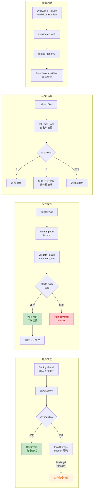
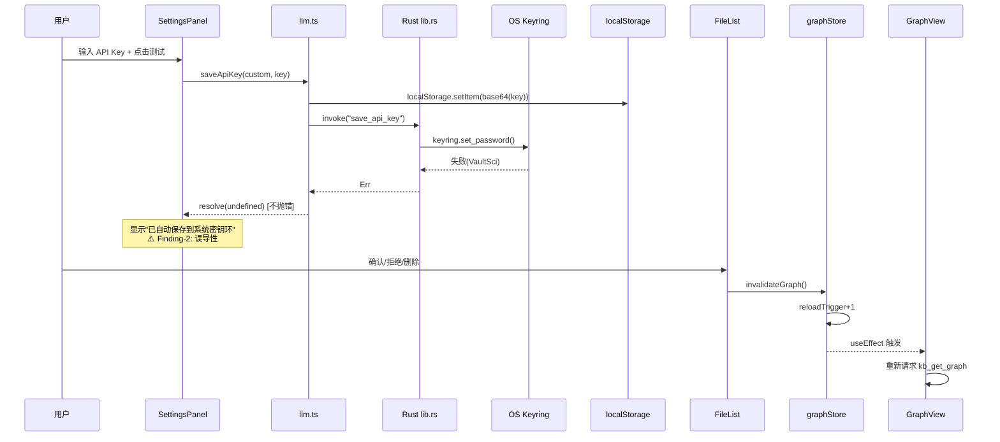

# P5-R3 代码安全护栏审计报告

| 项目 | 内容 |
| --- | --- |
| 任务令牌 | TKN-P5-R3-GUARDRAIL-001 |
| 日期 | 2026-08-01 |
| 阶段 | P5-R3（第三轮 P5 验收修复） |
| 审计角色 | guardrail-enforcer — 代码安全与质量护栏 |
| 技术栈 | Tauri v2 桌面应用 + React 18 前端 + Rust 后端 + Node MCP server |
| 审计范围 | P5-R3 全部未提交变更（12 个源码文件 + 2 个测试文件） |
| 前序报告 | [P5-R3 考古与方案](2026-08-01-p5-r3-archaeology-and-solution.md) |
| 关联 ADR | ADR-013（LLM 集成）、ADR-010（路径穿越防护）、ADR-008（知识库 Schema） |
| 安全策略基线 | 无独立 SECURITY.md；以 ADR-013 V7（keyring 持久化）、.github/workflows/security.yml（Semgrep XSS 扫描）、根 .gitignore（.env 排除）为安全基线 |
| 审计 Skill | TRAE-security-review + TRAE-code-review |

---

## 1. 总体结论

### 通过（附条件）

本次 P5-R3 变更**未发现阻断级（Blocking）安全漏洞**。不存在 SQL 注入、命令注入、硬编码密钥、路径穿越防护削弱或代码执行注入。

存在 **1 项中风险**（API Key 以 base64 明文存入 localStorage，违反 ADR-013 V7 密钥环加密持久化原则的防御纵深回归）和 **3 项低风险/建议**，均不构成阻断，但建议在后续迭代中修复。

**放行条件**：中风险 Finding-1 应在 P5-R4 或下一迭代中修复（方案见 §4.1），当前不阻断 P5-R3 验收流程推进。

---

## 2. 审查范围摘要

| 维度 | 数量 |
| --- | --- |
| 审查文件 | 14 个（源码 12 + 测试 2） |
| 审查函数/接口 | Rust 5 个（validate_inside / delete_page / call_mcp_tool / get_provider_config / call_llm_api）+ TS 6 个（saveApiKey / loadApiKey / deleteApiKey / invalidate / loadSettings / handleDelete） |
| 阻断级问题 | 0 |
| 高风险问题 | 0 |
| 中风险问题 | 1 |
| 低风险/建议 | 3 |
| 硬编码密钥 | 0 |
| 依赖变更 | 0（package.json 仅新增 test 脚本，Cargo.toml 无实质变更） |

---

## 3. 变更数据流总览



---

## 4. 详细发现（按严重度排序）

### 4.1 Finding-1：API Key 以 base64 明文存入 localStorage（中风险）

| 属性 | 值 |
| --- | --- |
| 类别 | `insecure_key_persistence` |
| 严重度 | MEDIUM |
| 置信度 | 0.82 |
| 位置 | [llm.ts:251](frontend/src/lib/llm.ts#L251)、[llm.ts:296-299](frontend/src/lib/llm.ts#L296-L299) |

**证据（Source → Sink）**：

用户在 SettingsPanel 输入 API Key → `saveApiKey()` → `localStorage.setItem("llm-key-${provider}", btoa(encodeURIComponent(apiKey)))` （llm.ts:251）

```typescript
// llm.ts:247-254
try {
  localStorage.setItem(`llm-key-${provider}`, btoa(encodeURIComponent(apiKey)));
} catch {
  /* localStorage 不可用时忽略 */
}
```

**分析**：

1. **base64 是编码而非加密**：`btoa(encodeURIComponent(apiKey))` 可被 `decodeURIComponent(atob(stored))` 一行代码逆向还原。任何能在 Tauri webview 中执行 JavaScript 的代码（XSS 载荷、恶意依赖注入）均可直接读取 localStorage 并解码 API Key。

2. **防御纵深回归**：ADR-013 V7 明确规定「API Key 经 Rust `keyring` crate 加密持久化到操作系统密钥环，永不落明文配置文件」。P5-R2 之前，Key 仅存于 keyring（OS 级加密静态存储）。本次变更引入 localStorage 降级后备，使 Key 以可逆形式额外存于 webview 可达的持久存储中。

3. **利用前提**：当前应用使用 react-markdown（未启用 rehype-raw），渲染用户上传内容时不执行 HTML，XSS 面暂被关闭。但应用处理用户上传的 PDF/Word 解析后的 markdown 内容——若未来引入 `rehype-raw` 或其他 HTML 渲染路径，localStorage 中的 Key 将立即暴露。此外，localStorage 在磁盘上以明文 JSON 存储（Tauri 使用 Chromium WebView，localStorage 落在 `%APPDATA%` 下的 LevelDB/JSON 文件中），物理取证或共享机器场景下可被直接读取。

4. **与 keyring 的差异**：虽然 keyring 也经 Tauri IPC（`invoke("load_api_key")`）可被 webview JS 访问，但 keyring 访问经过 Rust 层，未来可加审计/限流；localStorage 则被任意 JS 直接读取，无中间层。

**修复建议**（非补丁，方向性指导）：

- 方案 A（推荐）：keyring 失败时不降级到 localStorage，而是向用户返回明确错误「密钥环不可用，请检查系统服务」，让用户知晓并选择是否在无 Key 环境下使用。这恢复了 ADR-013 V7 的严格性。
- 方案 B（折中）：若必须保留降级，使用 Tauri 的安全存储（如 `tauri-plugin-store` 加密后端）替代 localStorage，或在 localStorage 中存储时使用 OS 派生密钥（如 DPAPI on Windows）加密。
- 方案 C（最小改动）：保留 localStorage 降级但增加用户可见警告（当前 `saveApiKey` 仅 `console.warn`，SettingsPanel 仍显示「已自动保存到系统密钥环」——误导用户认为 Key 在加密存储中）。

---

### 4.2 Finding-2：saveApiKey 静默降级且 SettingsPanel 误导性反馈（低风险）

| 属性 | 值 |
| --- | --- |
| 类别 | `sensitive_data_exposure`（误导性安全状态反馈） |
| 严重度 | LOW |
| 置信度 | 0.85 |
| 位置 | [llm.ts:255-261](frontend/src/lib/llm.ts#L255-L261)、[SettingsPanel.tsx handleTestConnection](frontend/src/components/SettingsPanel.tsx#L82-L103) |

**证据**：

`saveApiKey` 的 keyring 失败路径仅 `console.warn` 不抛错（llm.ts:258-261）：

```typescript
} catch (err) {
  // keyring 失败不抛错（localStorage 已有备份），仅警告
  console.warn(`[llm] save_api_key keyring failed for ${provider}, using localStorage fallback:`, err);
}
```

SettingsPanel 的 `handleTestConnection` 调用 `saveApiKey` 后的 catch 块已不可达，用户始终看到「已自动保存到系统密钥环」：

```typescript
try {
  await saveApiKey(cloudProvider, apiKey);
  setKeySaved(true);
  setTestMessage(
    result.ok
      ? `${result.message}（已自动保存到系统密钥环）`  // ← 即使 keyring 失败也显示此消息
      : `${result.message}（Key 已保存，可稍后重试连接或检查模型名/网络）`,
  );
} catch (err) {  // ← 不可达：saveApiKey 不再抛错
  ...
}
```

**分析**：用户被误导认为 Key 已存入加密的 OS 密钥环，而实际可能仅在 localStorage（base64 明文）中。这是 Finding-1 的衍生 UX 问题——安全状态反馈不真实。

**修复建议**：`saveApiKey` 返回一个状态枚举（`"keyring" | "localStorage" | "failed"`），SettingsPanel 据此显示真实存储位置。

---

### 4.3 Finding-3：loadApiKey 迁移逻辑可能迁移错误 Key（低风险/建议）

| 属性 | 值 |
| --- | --- |
| 类别 | 逻辑健壮性（非安全漏洞） |
| 严重度 | LOW |
| 置信度 | 0.80 |
| 位置 | [llm.ts:306-337](frontend/src/lib/llm.ts#L306-L337) |

**证据**：

```typescript
if (provider === "custom") {
  const legacyProviders: CloudProvider[] = ["deepseek", "glm", "kimi"];
  for (const legacy of legacyProviders) {
    // 先试 keyring
    ...
    const legacyKey = (await invoke("load_api_key", { provider: legacy })) as string | null;
    if (legacyKey) {
      await saveApiKey("custom", legacyKey);  // 迁移第一个找到的 Key
      ...
      return legacyKey;
    }
    ...
  }
}
```

**分析**：若用户曾在多个旧 provider（如 deepseek 和 glm）下保存了不同的 Key，迁移逻辑会将**第一个找到的**（deepseek）Key 迁移到 "custom"，而用户可能期望使用 glm 的 Key。这不是安全漏洞（Key 不泄露），但可能导致用户使用错误的 API Key 调用错误的端点，产生 401 错误。

**修复建议**：迁移时检查旧 Key 是否与当前 customBaseUrl 匹配（如 baseUrl 含 `deepseek` 则迁移 deepseek 的 Key），或提示用户选择迁移哪个 provider 的 Key。

---

### 4.4 Finding-4：MarkdownPreview pageCache 无界增长（低风险/建议）

| 属性 | 值 |
| --- | --- |
| 类别 | 资源管理（非安全漏洞） |
| 严重度 | LOW |
| 置信度 | 0.80 |
| 位置 | [MarkdownPreview.tsx:46](frontend/src/components/MarkdownPreview.tsx#L46) |

**证据**：

```typescript
const pageCache = new Map<string, PageDetail>();
```

**分析**：模块级 `Map` 在应用生命周期内无清理机制。若用户浏览大量页面（数百个），缓存持续增长，可能导致内存压力。这不构成安全漏洞，但影响长期运行的可用性。本次 diff 未引入此问题（P5-R2 已有），但本次扩展了缓存逻辑（后台刷新 + 内容比较跳过重渲染），增大了缓存保留的倾向。

**修复建议**：使用 LRU 策略限制缓存条目数（如 50 条），或在视图切换时清理。

---

## 5. 安全维度逐项验证

### 5.1 Stage 1：输入与边界审计

#### 5.1.1 validate_inside strip_verbatim — 安全（不削弱路径穿越防护）

| 检查项 | 结论 |
| --- | --- |
| strip_verbatim 是否削弱 starts_with 检查 | **否**。前缀去除应用于 `resolved` 和 `base_resolved` 两侧，语义等价于比较 `D:\kb\wiki\page.md` starts_with `D:\kb`。前缀去除不改变路径组件，仅统一比较基准 |
| 绝对路径注入 | `Path::new(base).join(absolute_path)` 在 Rust 中会用绝对路径替换 base，但 canonicalize 后 starts_with 检查仍会拒绝（绝对路径不在 kb_root 下） |
| `\\?\` 前缀注入 | 攻击者构造 `\\?\..\..\etc\passwd` 作为 path，join 后 canonicalize 解析 `..`，strip_verbatim 去前缀，starts_with 检查 `etc\passwd` 不在 kb_root 下 → 拒绝 |
| UNC 路径 | `\\server\share` 不被 strip_verbatim 去除（仅匹配 `\\?\`），starts_with 正确比较 |

**结论**：[lib.rs:264-272](frontend/src-tauri/src/lib.rs#L264-L272) 的修复正确，不引入路径穿越绕过。

#### 5.1.2 delete_page 自动补 .md — 安全（三层防护）

| 防护层 | 机制 | 位置 |
| --- | --- | --- |
| 第 1 层 | `validate_inside` canonicalize + starts_with(kb_root) | lib.rs:688 |
| 第 2 层 | 扩展名校验 `full_path.extension() == "md"` | lib.rs:691 |
| 第 3 层 | `wiki_root` canonicalize + starts_with(wiki/) | lib.rs:695-701 |

**攻击路径验证**：`page_path = "wiki/coding/../../etc/passwd"` → 补 .md → `validate_inside` canonicalize 解析 `..` → `kb_root/etc/passwd.md` → 第 1 层通过（在 kb_root 下）→ 第 2 层通过（扩展名 md）→ **第 3 层拒绝**（不在 wiki/ 下）。三层防护形成纵深，安全。

#### 5.1.3 delete_raw 路径穿越防护 — 安全

`source_file` 字段来自 frontmatter（可被 LLM/用户通过 `update_staging_content` 间接控制）。验证攻击路径：

`source_file: "raw/../../etc/passwd"` → `raw_full = kb_root/raw/../../etc/passwd` → canonicalize parent → `kb_root/../etc` → join `passwd` → `parent_of_kb_root/etc/passwd` → `starts_with(kb_root/raw)` → **false** → 拒绝删除。安全。

#### 5.1.4 call_mcp_tool 白名单 — 安全（未变更）

工具名白名单 `TOOL_WHITELIST` 未变更，`args_json` 作为单 argv 元素传递（无 shell 插值）。本次仅修改错误透传逻辑，不影响白名单机制。

### 5.2 Stage 2：执行安全审计

#### 5.2.1 注入防护

| 类别 | 状态 | 说明 |
| --- | --- | --- |
| SQL 注入 | N/A | 无数据库交互（文件系统 + JSON） |
| 命令注入 | 安全 | Python parser 和 MCP CLI 均以参数数组形式调用（`.args([...])`），无 shell 插值 |
| 代码注入 | 安全 | 无 `eval()` / `Function()` / 动态加载 |
| 模板注入 | 安全 | React JSX 默认转义；react-markdown 未启用 rehype-raw |
| XSS | 安全 | 无 `dangerouslySetInnerHTML`；无 `.innerHTML` 赋值（Semgrep CI 已配置检测） |

#### 5.2.2 call_mcp_tool 错误透传 — 安全（不泄露敏感信息）

| 检查项 | 结论 |
| --- | --- |
| 错误消息是否含 API Key | **否**。MCP 工具错误来自 `kb_get_page`（"Page not found: <path>"）等，不含密钥 |
| `data` 字段是否泄露 | `data` 返回 MCP 工具的 JSON 输出（含 frontmatter/body），但这是工具的正常返回值，前端需要此数据。且为本地单用户应用，不存在跨用户泄露 |
| 错误消息是否含内部路径 | 是（如 "Page not found: wiki/coding/xxx"），但用户已知这些路径（来自前端导航），非敏感信息 |

**结论**：[lib.rs:934-942](frontend/src-tauri/src/lib.rs#L934-L942) 的错误透传是正确的可诊断性改进，不泄露密钥或敏感信息。

#### 5.2.3 最小权限

| 检查项 | 结论 |
| --- | --- |
| Tauri capabilities | `default.json` 仅授予 `shell:allow-execute`、`dialog:allow-open` 等，无 `privileged: true`，合理 |
| Python parser 调用 | 固定参数数组 `[python_path, parser_path, file_path]`，无 shell |
| MCP CLI 调用 | 固定参数数组 `["--import", "tsx", cli_path, tool_name, args_json]`，tool_name 经白名单 |

### 5.3 Stage 4：配置与密钥安全

| 检查项 | 结论 |
| --- | --- |
| 硬编码密钥/密码/Token | **无**。代码中仅有公开 API URL（api.deepseek.com 等）和模型名（deepseek-v4-pro 等），均非密钥 |
| API Key 传输 | 经 Tauri IPC → Rust reqwest，不经 webview 网络栈，CSP `connect-src` 不允许 LLM API 域名（ADR-013 设计）。API Key 仅在 Authorization header 中使用 |
| API Key 存储 | **中风险**：见 Finding-1。keyring 为主存储（安全），localStorage base64 为降级后备（不安全） |
| console 日志泄露 | **无**。`console.warn`/`console.info` 仅记录 provider 名称和错误消息，不记录 Key 本身 |
| .gitignore | 根 `.gitignore` 排除 `.env`、`.env.local`、`.env.*.local`。frontend/.gitignore 排除 `*.local`。合理 |
| 前端代码含服务端密钥 | **无** |

### 5.4 Stage 5：依赖与供应链

| 检查项 | 结论 |
| --- | --- |
| package.json 变更 | 仅新增 `"test": "vitest run"` 和 `"test:watch": "vitest"` 脚本，无新依赖 |
| Cargo.toml 变更 | 无实质变更（仅行尾 CRLF/LF 差异） |
| 已知漏洞依赖 | 建议主 Agent 执行 `pnpm audit` 和 `cargo audit` 确认无已知 CVE（本次变更未引入新依赖，风险低） |

---

## 6. 代码质量审查（TRAE-code-review skill 集成）

### 6.1 作者意图推断

本次变更的意图是修复 P5-R2 验收中用户报告的 6 个问题：

1. API Key 读取失败（keyring Windows 特定性 + NoEntry/Err 混淆）
2. 删除路径穿越误报（`\\?\` 前缀 + .md 缺失）
3. 移除预设 provider 改为纯自定义
4. MCP 工具错误消息被吞
5. 图谱缓存不刷新
6. 子 Agent 审核降级导致漏问题

这是一组**防御性修复**——添加错误处理、边界修复、降级逻辑和缓存失效机制。意图清晰，代码与考古报告方案一致。

### 6.2 逻辑正确性

| 检查项 | 结论 |
| --- | --- |
| validate_inside 前缀处理 | 正确。双侧去除 `\\?\` 后比较，语义不变 |
| delete_page .md 补全 | 正确。三层防护确保仅删除 wiki/ 下的 .md 文件 |
| call_mcp_tool 错误提取 | 正确。先提取 `mcp_error` 为 owned String 再 move `data`，避免借用冲突 |
| get_provider_config "custom" | 正确。空 baseUrl/model 由 call_llm_api 显式检查并返回友好错误 |
| loadApiKey 迁移逻辑 | 功能正确但有 Finding-3 的多 Key 选择问题 |
| invalidate() + reloadTrigger | 正确。Zustand `set((s) => ({ reloadTrigger: s.reloadTrigger + 1 }))` 触发 GraphView useEffect 重载 |
| llmStore cloudProvider 迁移 | 正确。旧值统一为 "custom"，向后兼容 |

### 6.3 跨模块影响



### 6.4 测试充分性

| 测试覆盖 | 状态 |
| --- | --- |
| saveApiKey keyring 失败降级 | ✅ 已覆盖（llm.test.ts:317-325） |
| saveApiKey 非 Tauri 降级 | ✅ 已覆盖（llm.test.ts:361-369） |
| loadApiKey 返回 null | ✅ 已覆盖 |
| PROVIDERS 4 个条目 | ✅ 已覆盖（llm.test.ts:71-77） |
| customBaseUrl/customModelName 透传 | ✅ 已覆盖（llm.test.ts:221-236, 463-485） |
| **loadApiKey 迁移逻辑** | ❌ 未覆盖。无测试验证 custom 无 Key 时从 deepseek/glm/kimi 迁移 |
| **validate_inside strip_verbatim** | ❌ 未覆盖。无 Rust 单元测试验证 `\\?\` 前缀场景 |
| **delete_page .md 补全** | ❌ 未覆盖。无 Rust 单元测试验证无 .md 后缀时的补全 |
| **call_mcp_tool 错误透传** | ❌ 未覆盖。无测试验证 exit_code=2 时 error 字段提取 |

**建议**：补充上述 4 个未覆盖场景的测试，特别是 loadApiKey 迁移逻辑（涉及多 provider Key 选择，Finding-3 的根因）。

---

## 7. 防护机制验证

| 防护机制 | 配置 | 验证结果 |
| --- | --- | --- |
| Semgrep XSS CI | `.github/workflows/security.yml`：检测 `dangerouslySetInnerHTML`、`innerHTML`、JSX 未转义模板 | ✅ 配置有效，本次变更未触发任何规则 |
| CSP | tauri.conf.json + capabilities/default.json | ✅ `connect-src` 不含 LLM API 域名，API Key 不经 webview 网络栈 |
| Tauri capabilities | `shell:allow-execute` + `dialog:allow-open` | ✅ 最小权限，无 `privileged: true` |
| MCP 工具白名单 | `TOOL_WHITELIST` 11 个工具 | ✅ 未变更，有效 |
| Domain kebab-case 校验 | `is_valid_domain` | ✅ 未变更，有效 |
| Log 注入防护 | `sanitize_log_field` | ✅ 未变更，有效 |
| .gitignore 密钥排除 | `.env`/`.env.local` 排除 | ✅ 有效 |

---

## 8. 豁免声明

| 项目 | 状态 | 说明 |
| --- | --- | --- |
| localStorage base64 降级 | **记录但不阻断** | 开发者已在代码注释中明确标注「base64 编码，非安全存储但胜于丢失」。这是 keyring Windows 故障的降级方案，记录为中风险 Finding-1，建议后续迭代修复。当前不阻断 P5-R3 验收 |
| 旧 provider 保留 | **记录但不阻断** | deepseek/glm/kimi provider 配置保留用于向后兼容已保存的 keyring 条目，不暴露额外攻击面 |

---

## 9. 自动化建议（CI/CD 集成）

### 9.1 密钥存储扫描

在 `.github/workflows/security.yml` 中追加 Semgrep 自定义规则，检测 localStorage 中的密钥存储：

```yaml
# Detect API key storage in localStorage (insecure fallback)
- id: localStorage-secret-storage
  patterns:
    - pattern: localStorage.setItem($KEY, $VAL)
    - pattern-inside: |
        function saveApiKey(...) {
          ...
        }
    - metavariable-pattern:
        metavariable: $VAL
        pattern: btoa(...)
  message: "API key stored in localStorage as base64 — not encryption. Use OS keyring (ADR-013 V7)"
  languages: [typescript, tsx]
  severity: WARNING
  paths:
    include:
      - "frontend/src/**/*.{ts,tsx}"
```

### 9.2 Rust 路径穿越测试

在 CI 中运行 Rust 单元测试覆盖 `\\?\` 前缀场景：

```rust
#[cfg(test)]
mod tests {
    use super::*;

    #[test]
    fn test_validate_inside_strips_verbatim_prefix() {
        // Windows: \\?\ prefix should not cause false positive
        let base = env!("CARGO_MANIFEST_DIR");
        // ... 验证 strip_verbatim 逻辑
    }
}
```

### 9.3 依赖审计

在 CI 中添加定期依赖扫描步骤：

```yaml
- name: Audit npm dependencies
  run: cd frontend && pnpm audit --audit-level=high

- name: Audit Rust dependencies
  run: cd frontend/src-tauri && cargo audit
```

---

## 10. 审计自检清单

| 检查项 | 完成 |
| --- | --- |
| 已读取所有变更文件的完整内容（非仅 diff 片段） | ✅ |
| 已追踪每个外部输入参数的来源到危险 sink | ✅ |
| 已验证路径穿越防护在 strip_verbatim 修改后仍然有效 | ✅ |
| 已验证 delete_page .md 补全不引入新攻击面 | ✅ |
| 已验证 call_mcp_tool 错误透传不泄露密钥 | ✅ |
| 已扫描硬编码密钥/密码/Token | ✅（未发现） |
| 已检查 .gitignore 排除敏感文件 | ✅ |
| 已检查依赖变更 | ✅（无新依赖） |
| 已检查 console 日志不含密钥 | ✅ |
| 已验证状态机守卫未被绕过 | ✅ |
| 每个 finding 都有文件路径 + 行号 + 代码片段 | ✅ |
| 阻断级漏洞发现后立即通知终止 | N/A（无阻断级） |

---

## 11. 结论

**通过（附条件）**

P5-R3 变更修复了 6 个用户验收问题，代码质量良好，安全防护机制完整。未发现阻断级安全漏洞。1 项中风险（API Key localStorage base64 存储）和 3 项低风险/建议均不构成阻断，但 Finding-1 应在后续迭代中优先修复以恢复 ADR-013 V7 的密钥环加密持久化原则。

**审查人**：guardrail-enforcer（代码安全护栏）
**审查日期**：2026-08-01
**任务令牌**：TKN-P5-R3-GUARDRAIL-001
