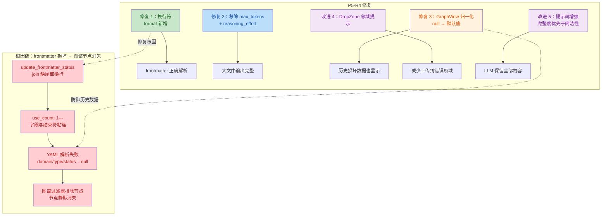

# P5-R4 综合安全与质量审计报告

## 元信息

| 项目 | 内容 |
|---|---|
| 任务令牌 | TKN-P5-R4-GUARDRAIL-001 |
| 执行 Agent | guardrail-enforcer（代码安全护栏） |
| 审查日期 | 2026-08-01 |
| 审查范围 | P5-R4 轮次全部代码变更（4 文件 + 1 wiki 修复） |
| 技术栈 | Rust（Tauri 后端）+ TypeScript/React（前端）+ Markdown 知识库 |
| 审查技能 | TRAE-code-review + TRAE-security-review |
| 考古报告 | [2026-08-01-p5-r4-archaeology-and-solution.md](../../docs/reports/2026-08-01-p5-r4-archaeology-and-solution.md) |

---

## 一、审查范围摘要

### 1.1 审查文件清单

| # | 文件 | P5-R4 变更 | 审查结论 |
|---|---|---|---|
| 1 | [lib.rs](../../frontend/src-tauri/src/lib.rs) | 换行符修复（L235-238）+ 移除 max_tokens/reasoning_effort（L1047-1054）+ HTTP 超时 60s→180s（L1057） | 有条件通过 |
| 2 | [GraphView.tsx](../../frontend/src/components/GraphView.tsx) | 防御性归一化 null→默认值（L224-235） | 通过 |
| 3 | [DropZone.tsx](../../frontend/src/components/DropZone.tsx) | 领域选择 UX 反馈（L222-234） | 通过 |
| 4 | [llm.ts](../../frontend/src/lib/llm.ts) | STAGING_SYSTEM_PROMPT 增强完整度指令（L124-136） | 通过 |
| 5 | [2025国赛.md](../../wiki/reading/2025国赛.md) | frontmatter 换行符修复 | 通过 |

### 1.2 数据收集探针

- `git status`：34 文件修改 + 15 未跟踪文件（含前几轮遗留，已聚焦 P5-R4 标记）
- `git diff`：4 源文件 diff 全量读取（约 1140 行变更）
- P5-R4 标记定位：4 处（lib.rs×2、DropZone.tsx×1、GraphView.tsx×1）
- 上下文读取：lib.rs 关键函数完整实现、llm.ts 全文、MarkdownPreview.tsx 全文、FileList.tsx 关键区域、GraphView.tsx tooltip 区域、html-utils.ts、.gitignore

---

## 二、代码质量审查（TRAE-code-review）

### 2.1 作者意图推断

本次 P5-R4 变更意图可归纳为一句话：

> **修复 LLM 大文件整理静默截断缺陷 + 修复 frontmatter 序列化换行符 bug + 针对历史损坏数据做防御性归一化。**

具体拆解：

- **根因修复**：update_frontmatter_status 的 `join("\n")` 缺尾部换行导致 frontmatter 解析失败（domain/type/status 全 null）→ 知识图谱节点静默消失
- **功能改进**：移除 max_tokens=4096 硬截断 + 移除 reasoning_effort="max"（挤占输出预算），让大文件整理输出完整内容
- **防御加固**：GraphView 归一化确保即使 frontmatter 损坏，节点也始终显示而非静默排除
- **UX 改进**：DropZone 显示目标领域提示，避免用户上传到错误领域

### 2.2 变更流程图



### 2.3 重点审查项逐项验证

#### 审查项 1：update_frontmatter_status 换行符修复是否正确

**结论：修复正确，无残留粘连风险。**

修复前（[lib.rs:234](../../frontend/src-tauri/src/lib.rs#L234)）：

```rust
format!("---{}---{}", new_yaml, &content[yaml_end + 3..])
```

修复后（[lib.rs:238](../../frontend/src-tauri/src/lib.rs#L238)）：

```rust
format!("---{}\n---{}", new_yaml, &content[yaml_end + 3..])
```

验证逻辑链：

1. `new_yaml` = `yaml.lines().map(...).collect::<Vec<_>>().join("\n")`
2. `join("\n")` 在元素之间插入 `\n`，但**不在末尾添加**——所以最后一行（如 `use_count: 1`）后无换行
3. 修复前直接拼 `---` → 产生 `use_count: 1---`（粘连）
4. 修复后添加 `\n` → 产生 `use_count: 1\n---`（正确分隔）
5. `&content[yaml_end + 3..]` 是原文件结束 `---` 之后的 body 部分，保持原样不变
6. 输出格式 `---\n<yaml>\n---\n<body>` 符合 AGENTS.md §3.1.1 格式约定（frontmatter 与 body 间有空行取决于原文件，本次修复不改变 body 部分）

是否有其他字段可能粘连：不会。`join("\n")` 保证所有字段行之间有换行，唯一的粘连点就是最后一行与结束 `---` 之间，已被 `\n` 修复。所有调用方（[L588](../../frontend/src-tauri/src/lib.rs#L588)、[L618](../../frontend/src-tauri/src/lib.rs#L618)、[L661](../../frontend/src-tauri/src/lib.rs#L661)）均受益于此修复。

#### 审查项 2：移除 max_tokens 后是否有静默截断风险

**结论：存在中风险质量缺陷——finish_reason 未检测。**

[lib.rs:1085-1089](../../frontend/src-tauri/src/lib.rs#L1085-L1089) 当前实现：

```rust
let content = json["choices"][0]["message"]["content"]
    .as_str()
    .ok_or("missing content in LLM response")?;
Ok(content.to_string())
```

移除 `max_tokens` 后，模型改用自身默认最大输出长度。当输出仍因模型上下文窗口限制被截断时，API 返回 HTTP 200 + `finish_reason: "length"` + 截断的 content。当前代码**仅检查 content 是否存在，未检查 finish_reason**，会将截断内容作为成功结果返回——用户无感知地获得不完整整理结果。

主 Agent 自检反思第 1 点已识别此问题，但本次未修复。详见发现表 CR-1。

#### 审查项 3：GraphView 归一化的默认值是否合理

**结论：作为防御性措施合理，但存在语义误导风险，需记录限制。**

[GraphView.tsx:226-235](../../frontend/src/components/GraphView.tsx#L226-L235)：

```typescript
const normalizedData: GraphData = {
  ...data,
  nodes: data.nodes.map((n) => ({
    ...n,
    domain: (n.domain ?? "coding") as Domain,
    type: (n.type ?? "source") as PageType,
    status: (n.status ?? "active") as PageStatus,
  })),
};
```

分析：

- **合理性**：防止节点因 null domain 被过滤器静默排除，"始终显示"优于"静默消失"——这是正确的防御策略
- **语义误导**：若用户上传数学建模文件（应为 `academic` 领域）但 frontmatter 损坏导致 domain=null，归一化后显示为 `coding`，可能误导用户
- **安全性**：归一化后的值（"coding"/"source"/"active"）均为安全字符串，传入 escapeHtml 后无 XSS 风险（[GraphView.tsx:434-438](../../frontend/src/components/GraphView.tsx#L434-L438) 已有 escapeHtml 防护）

建议作为低风险改进项 CR-2：可考虑在归一化时为异常节点添加标记（如 `frontmatterDamaged`），在 UI 上以不同样式提示，而非完全伪装为正常节点。

#### 审查项 4：DropZone 领域选择 UX 是否充分

**结论：提示性方案可接受，是合理的折衷。**

[DropZone.tsx:222-234](../../frontend/src/components/DropZone.tsx#L222-L234) 在未选择领域时显示警告，已选择时显示当前领域。这是提示性而非强制性的方案。

评估：

- **优点**：不打断拖拽上传体验，用户可快速批量上传
- **限制**：用户仍可能忽略警告，文件仍默认归入 `coding`
- **合理性**：强制模态框会显著降低拖拽体验，提示性方案在"防错"与"效率"间取得平衡，符合 Karpathy Guidelines 的"不过度设计"原则

#### 审查项 5：HTTP 超时 180s 是否合理

**结论：合理，无安全风险。**

[lib.rs:1057](../../frontend/src-tauri/src/lib.rs#L1057)：60s → 180s。

- 移除 max_tokens 后大文件整理输出更长，60s 可能超时，180s 合理
- 这是本地桌面应用（Tauri），用户自行触发操作，不存在外部攻击者利用超时进行 DoS 的攻击面
- 安全审查 skill §8.1 将 DoS/资源耗尽列为 Hard Exclusion，不在安全审计范围

**但存在文档不一致**：[lib.rs:1008](../../frontend/src-tauri/src/lib.rs#L1008) 注释仍写"超时 60s（思考模式可能较慢）"，实际已改为 180s。详见发现表 CR-3。

### 2.4 代码质量问题表

| # | 问题标题 | 严重度 | 建议 | 代码链接 |
|---|---|---|---|---|
| CR-1 | 移除 max_tokens 后未检测 finish_reason，截断内容静默返回成功 | 中风险 | 在解析 content 前检查 `json["choices"][0]["finish_reason"]`，若为 `"length"` 则向前端返回警告（如 "内容可能被截断，请检查或分段整理"），而非静默返回截断内容 | [lib.rs:1085-1089](../../frontend/src-tauri/src/lib.rs#L1085-L1089) |
| CR-2 | GraphView 归一化默认 domain="coding" 可能误导用户分类 | 低风险 | 可考虑为异常节点添加 `frontmatterDamaged` 标记，UI 以不同样式提示，而非完全伪装为正常 coding 节点；或至少在控制台 console.warn 记录异常节点路径便于排查 | [GraphView.tsx:226-235](../../frontend/src/components/GraphView.tsx#L226-L235) |
| CR-3 | 函数文档注释 "超时 60s" 与实际 180s 不一致 | 低风险 | 更新注释为 "超时 180s（大文件整理输出较长）" | [lib.rs:1008](../../frontend/src-tauri/src/lib.rs#L1008) |

### 2.5 代码质量审查结论

**有条件通过。**

变更逻辑正确，换行符修复验证充分，防御性归一化策略合理。CR-1（finish_reason 未检测）是移除 max_tokens 后的直接遗留缺陷，主 Agent 已自识别，建议在下一轮修复。CR-2、CR-3 为低风险改进项，不阻断。

---

## 三、安全审计（TRAE-security-review）

### 3.1 审计方法

按 guardrail-enforcer 工作流的 6 个阶段执行，聚焦 P5-R4 diff 引入的变更面（diff-introduced surface only）。项目根目录无 SECURITY.md，以 ADR-008（frontmatter schema）、ADR-010（路径遍历防御）、ADR-013（LLM 集成安全）为安全基线。

### 3.2 阶段一：输入与边界审计

#### 1.1 数值与类型边界

- **call_llm_api 参数**：`provider`（白名单校验）、`api_key`（仅用于 Bearer header）、`prompt`/`system_prompt`（字符串透传至 LLM API body）。`base_url`/`model` 为用户自定义覆盖值。无数值边界安全问题——prompt 长度由 LLM API 自身限制。
- **GraphView 归一化**：`n.domain ?? "coding"` 等空值合并，类型断言 `as Domain`/`as PageType`/`as PageStatus`。归一化值均为预定义安全字符串，无越界风险。
- **无溢出/下溢风险**：本次变更不涉及算术运算。

#### 1.2 集合与缓冲边界

- **update_frontmatter_status**：通过 `yaml.lines()` 迭代 + `join("\n")` 重组，不涉及固定缓冲区操作。Rust 是内存安全语言，无缓冲区溢出风险（安全审查 skill §8.2 排除）。
- **GraphView nodes.map()**：使用安全数组迭代，无索引越界风险。

#### 1.3 业务状态机约束

- **update_frontmatter_status 调用方**：全部使用硬编码状态值（`"active"`@L588、`"rejected"`@L618、`"staging"`@L661），不接收外部输入。状态转换路径明确：staging→active（confirm）、staging→rejected（reject）、active→staging（re-stage）。无绕过状态检查的路径。

### 3.3 阶段二：执行安全审计（指令与数据隔离）

#### 2.1 注入防护

**SQL/NoSQL 注入**：本次变更不涉及数据库查询。N/A。

**OS 命令注入**：本次变更不涉及 subprocess/system 调用。N/A。

**代码/表达式注入**：本次变更不涉及 eval/Function/exec。N/A。

**模板引擎注入**：前端使用 ReactMarkdown（[MarkdownPreview.tsx:287](../../frontend/src/components/MarkdownPreview.tsx#L287)），未引入 rehype-raw 插件，默认不渲染原始 HTML。LLM 输出的 markdown 内容经 ReactMarkdown 安全解析后渲染。安全。

**YAML 注入审计（重点审查项 2）**：

[lib.rs:212-238](../../frontend/src-tauri/src/lib.rs#L212-L238) 的 `update_frontmatter_status(content: &str, new_status: &str)` 函数将 `new_status` 直接插入 YAML 字符串 `format!("{}status: {}", indent, new_status)`。

源侧追踪：`new_status` 的全部 3 个调用方均使用硬编码字符串字面量：

- [L588](../../frontend/src-tauri/src/lib.rs#L588)：`update_frontmatter_status(&content, "active")`
- [L618](../../frontend/src-tauri/src/lib.rs#L618)：`update_frontmatter_status(&content, "rejected")`
- [L661](../../frontend/src-tauri/src/lib.rs#L661)：`update_frontmatter_status(&new_content, "staging")`

**结论**：`new_status` 不接收任何外部输入，全部为编译期常量。即使函数本身未对 `new_status` 做 YAML 特殊字符转义，由于输入不可控，不存在 YAML 注入风险。安全。

#### 2.2 XSS 防护审计（重点审查项 1）

LLM 输出的完整数据流追踪：

```text
LLM API 响应 → lib.rs call_llm_api（返回 content: String）
  → llm.ts callLlm（返回 { success, content }）
    → FileList.tsx handleOrganize（setOrganizeResult({ content })）
      → 渲染路径 A：LlmOrganizeModal <pre>{content}</pre>（JSX 文本插值）
      → 渲染路径 B：handleAdopt → updateStagingContent → 写入 wiki 文件
        → MarkdownPreview ReactMarkdown（默认不渲染原始 HTML）
```

- **渲染路径 A**（[FileList.tsx:520-522](../../frontend/src/components/FileList.tsx#L520-L522)）：`<pre>{content}</pre>` 是 React JSX 文本插值，React 自动对 `{content}` 做 HTML 实体转义。即使 LLM 输出含 `<script>alert(1)</script>`，也会被转义为文本显示。安全。
- **渲染路径 B**（[MarkdownPreview.tsx:287-396](../../frontend/src/components/MarkdownPreview.tsx#L287-L396)）：ReactMarkdown 渲染 `page.body`。项目未引入 `rehype-raw` 插件（已确认全项目无 `rehype-raw` import），ReactMarkdown 默认将原始 HTML 作为纯文本处理，不执行。安全。
- **GraphView tooltip**（[GraphView.tsx:432-447](../../frontend/src/components/GraphView.tsx#L432-L447)）：react-force-graph-2d 内部用 innerHTML 渲染 tooltip，但所有用户可控字段（title/domain/type）均经 `escapeHtml` 转义后才拼入 HTML 字符串。归一化后的默认值（"coding"/"source"/"active"）也是安全字符串。安全。

全项目 XSS 逃逸通道扫描：未发现 `dangerouslySetInnerHTML`、`innerHTML` 直接赋值（除 GraphView tooltip 已有 escapeHtml 防护）、`rehype-raw`、`eval`、`new Function`。

**结论：LLM 输出渲染路径 XSS 安全。**

#### 2.3 最小权限检查

- API Key 经 Rust 端 keyring crate 存储（OS 密钥环），前端 webview 不接触网络传输中的 Key。
- 无高权限 OS 操作（无 root/管理员需求）。
- 容器化：N/A（Tauri 桌面应用，非容器部署）。

#### 2.4 输出编码与特殊字符处理

- HTML 上下文：React JSX 自动转义 + ReactMarkdown 安全解析 + escapeHtml（GraphView tooltip）。覆盖完整。
- JSON 序列化：lib.rs 使用 `serde_json::json!` 宏构造请求体（[L1047-1054](../../frontend/src-tauri/src/lib.rs#L1047-L1054)），非字符串拼接。安全。

### 3.4 阶段三：内存安全与运行时保护

Rust 是内存安全语言（安全审查 skill §8.2 排除内存安全问题）。本次变更：

- 无 `unsafe` 代码块
- 无 FFI 边界数据传递
- 无指针运算
- 编译器安全标志由 Cargo.toml 管理（本次未改动 Cargo.toml）

N/A。

### 3.5 阶段四：配置与密钥安全

- **硬编码密钥扫描**：P5-R4 变更的 4 个源文件中未发现硬coded API Key、密码、token、内部 IP/域名。lib.rs 中的 provider 配置（deepseek/glm/kimi）为公开 API 端点 URL，非敏感信息。
- **密钥存储**：API Key 双层存储（keyring 主 + localStorage 降级）。localStorage 使用 `btoa(encodeURIComponent(apiKey))` 编码——这是 P5-R3 引入的降级方案，非 P5-R4 变更。base64 编码非加密，但在 keyring 不可用时保证 Key 不丢失，注释已明确说明风险权衡。
- **.gitignore 检查**（[.gitignore](../../.gitignore)）：包含 `.env`、`.env.local`、`.env.*.local`，排除规则正确。
- **前端代码无服务端密钥**：前端仅存用户自己的 API Key（经 keyring/localStorage），不含服务端密钥。安全。

### 3.6 阶段五：依赖与供应链风险

本次 P5-R4 变更**未修改** `Cargo.toml`、`package.json`、`pnpm-lock.yaml` 中的依赖项（这些文件的改动是前几轮 P5-R2/R3 遗留，非本轮）。无新增/删除/升级依赖。

建议（非阻断）：前几轮引入的依赖（reqwest、keyring、react-markdown、rehype-highlight 等）可运行 `cargo audit` 和 `pnpm audit` 做已知漏洞扫描，但这不属于 P5-R4 审查范围。

### 3.7 安全审计结论

> ✅ 在本次 P5-R4 变更范围内，未发现可利用的安全漏洞。

逐项确认：

| 安全审查重点项 | 结论 | 依据 |
|---|---|---|
| 1. LLM API 响应内容是否经 escapeHtml 后再渲染（XSS） | **安全** | React JSX 自动转义（LlmOrganizeModal `<pre>{content}`）+ ReactMarkdown 默认不渲染 HTML + GraphView tooltip 已有 escapeHtml |
| 2. update_frontmatter_status 是否可被注入恶意 frontmatter（YAML 注入） | **安全** | new_status 全部为硬编码枚举值，不接收外部输入 |
| 3. HTTP 超时增大是否增加 DoS 攻击面 | **不适用** | 本地桌面应用，用户自触发操作，无外部攻击面（§8.1 排除 DoS） |
| 4. 移除 max_tokens 是否导致 LLM 输出过长引发内存问题 | **不适用** | 本地应用，输出长度由模型自身窗口限制，无攻击者可控输入量（§8.1 排除资源耗尽） |

---

## 四、综合结论

### 4.1 综合判定

| 维度 | 结论 |
|---|---|
| 代码质量 | **有条件通过** — 1 个中风险（CR-1 finish_reason 未检测）+ 2 个低风险（CR-2/CR-3） |
| 安全审计 | **通过** — P5-R4 变更范围内无可利用安全漏洞 |

### 4.2 最终结论：**通过（附带改进建议）**

本次 P5-R4 变更**可进入测试阶段**。未发现阻断级安全漏洞或高危安全漏洞。代码质量方面存在 1 个中风险改进项（CR-1），主 Agent 已自识别，建议在下一轮迭代中修复，不阻断当前轮次进入测试。

### 4.3 改进建议清单（非阻断，按优先级排序）

| 优先级 | 编号 | 问题 | 建议 | 影响范围 |
|---|---|---|---|---|
| P1（建议下轮修复） | CR-1 | finish_reason 未检测，移除 max_tokens 后截断内容静默返回成功 | 在 [lib.rs:1085](../../frontend/src-tauri/src/lib.rs#L1085) 解析 content 前，检查 `json["choices"][0]["finish_reason"]`，若为 `"length"` 则返回带警告标识的结果（如 `Ok(format!("⚠️ 内容可能被截断（finish_reason=length）\n\n{}", content))` 或改返回结构体含 `truncated: bool` 字段），让前端显式提示用户 | lib.rs + llm.ts + FileList.tsx |
| P2（可择机修复） | CR-2 | GraphView 归一化默认 domain="coding" 可能误导分类 | 为异常节点添加 `frontmatterDamaged` 标记，UI 以警告样式提示；或在控制台 console.warn 记录异常路径 | GraphView.tsx |
| P3（随手修复） | CR-3 | 函数注释 "超时 60s" 与实际 180s 不一致 | 更新 [lib.rs:1008](../../frontend/src-tauri/src/lib.rs#L1008) 注释为 "超时 180s（大文件整理输出较长）" | lib.rs |

### 4.4 保护机制验证

| 声称的保护机制 | 验证结果 |
|---|---|
| API Key 不暴露到 webview | ✅ 有效 — call_llm_api 经 Rust reqwest 发 HTTP，前端仅传 Key 给 IPC |
| keyring 加密存储 | ✅ 有效 — keyring::Entry::set_password（Windows Credential Manager） |
| provider 白名单校验 | ✅ 有效 — get_provider_config match 穷举，unknown provider 返回 Err |
| 路径遍历防御 | ✅ 有效 — validate_inside + \\?\ 前缀 strip（P5-R3 修复，本次未改动） |
| GraphView tooltip XSS 防护 | ✅ 有效 — escapeHtml 转义所有用户可控字段 |
| .gitignore 排除 .env | ✅ 有效 — `.env` / `.env.local` / `.env.*.local` 均已排除 |

### 4.5 豁免声明

无。本次审计未发现需豁免的安全问题。

---

## 五、CI/CD 自动化建议

建议将以下检查集成到 CI 管道，作为持续安全护栏：

### 5.1 Semgrep 规则（Rust + TypeScript）

```yaml
# .github/semgrep/security.yml
rules:
  # 检测 dangerouslySetInnerHTML 使用（XSS 逃逸通道）
  - id: no-dangerously-set-inner-html
    languages: [typescript]
    patterns:
      - pattern: dangerouslySetInnerHTML
    message: "禁止使用 dangerouslySetInnerHTML，可能导致 XSS"
    severity: ERROR

  # 检测 rehype-raw 引入（ReactMarkdown XSS 逃逸）
  - id: no-rehype-raw
    languages: [typescript]
    patterns:
      - pattern: import ... from "rehype-raw"
    message: "禁止引入 rehype-raw，ReactMarkdown 默认不渲染原始 HTML 是安全基线"
    severity: ERROR

  # 检测 Rust 中字符串拼接构造 HTTP 请求体
  - id: no-string-concat-http-body
    languages: [rust]
    patterns:
      - pattern: format!("...{...}...", $X)
        metavariable-regex:
          metavariable: $X
          regex: ".*api_key.*"
    message: "禁止将 api_key 拼入字符串，应使用 serde_json::json! 宏"
    severity: WARNING
```

### 5.2 GitHub Action 集成

```yaml
# .github/workflows/security-guardrail.yml
name: Security Guardrail
on: [pull_request]
jobs:
  semgrep:
    runs-on: ubuntu-latest
    steps:
      - uses: actions/checkout@v4
      - uses: returntocorp/semgrep-action@v1
        with:
          config: .github/semgrep/security.yml
  cargo-audit:
    runs-on: ubuntu-latest
    steps:
      - uses: actions/checkout@v4
      - run: cargo install cargo-audit
      - run: cargo audit
        working-directory: frontend/src-tauri
  pnpm-audit:
    runs-on: ubuntu-latest
    steps:
      - uses: actions/checkout@v4
      - uses: pnpm/action-setup@v3
      - run: pnpm audit --audit-level=high
        working-directory: frontend
```

---

## 六、审计签注

| 项目 | 内容 |
|---|---|
| 审计执行者 | guardrail-enforcer（TRAE 内置安全护栏 Agent） |
| 审计技能 | TRAE-code-review v1 + TRAE-security-review v1 |
| 审计依据 | OWASP Top 10 / CWE / AGENTS.md §9.3 / ADR-008 / ADR-010 / ADR-013 |
| 审计状态 | 完成 |
| 综合结论 | **通过（附带 3 项非阻断改进建议）** |
| 阻断项数 | 0 |
| 报告归档 | [docs/reports/2026-08-01-p5-r4-guardrail.md](../../docs/reports/2026-08-01-p5-r4-guardrail.md) |
