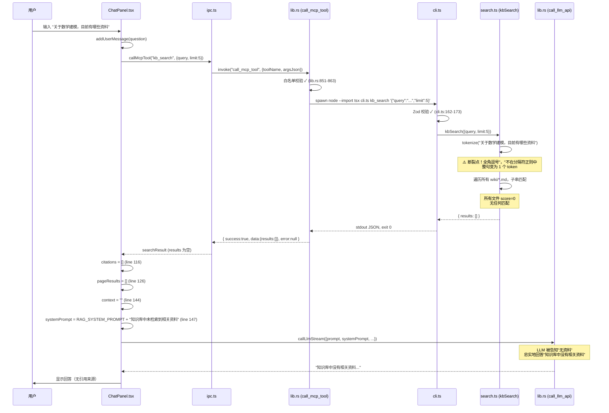

# RAG 对话检索与 LLM 自动分类断裂点源码考古报告

| 项目 | 内容 |
| --- | --- |
| 任务令牌 | TKN-RAG-CLASSIFY-ARCHAEOLOGY-001 |
| 执行 Agent | 源码考古学家 (CodeArchaeologist) |
| 日期 | 2026-08-02 |
| 考古范围 | RAG 对话检索链路 / LLM 自动分类链路 |
| 项目根 | `D:\s0611\code\Continuous-learning` |
| 引用规约 | 全文使用相对路径引用代码（ADR-010，禁止 file:/// 绝对路径） |
| 证据方法 | 静态代码审计 + 运行时验证（tokenize 函数实跑验证） |

---

## 0. 执行摘要

用户报告两个核心功能失效，经源码考古定位到两个独立的根因：

| 问题 | 严重度 | 根因类型 | 断裂点 |
| --- | --- | --- | --- |
| RAG 对话检索失效 | 高 | 代码逻辑缺陷 | `server/src/tools/search.ts:113-118` — tokenize 函数未处理全角中文标点，整句中文查询退化为单个超长 token |
| LLM 自动分类未触发 | 高 | 代码逻辑缺陷 | `frontend/src/components/DropZone.tsx:166` — handleUpload 依赖数组遗漏 triggerClassify，导致闭包过期（stale closure） |

两个问题均为**代码逻辑缺陷**，非环境/配置问题。

---

## 1. 系统架构速览

### 1.1 三层架构

```text
React 前端 (webview)
  ├── components/ChatPanel.tsx   RAG 对话（前端编排检索 + LLM 流式生成）
  ├── components/DropZone.tsx     上传 + LLM 分类建议
  ├── lib/ipc.ts                  Tauri IPC 封装（callMcpTool / uploadFile / ...）
  ├── lib/llm.ts                  LLM 调用封装（callLlmStream / classifyDomain）
  ├── lib/ragUtils.ts             RAG 纯函数（系统提示词 / context 拼接 / 内容渲染）
  └── store/                      Zustand 状态（viewStore / llmStore / chatStore）
        ↕ Tauri IPC (invoke)
Rust 后端 (frontend/src-tauri/src/lib.rs)
  ├── call_mcp_tool   spawn `node --import tsx cli.ts`   MCP 工具桥接
  ├── call_llm_api    reqwest → OpenAI 兼容端点          LLM 调用（流式/非流式）
  └── classify_domain reqwest → OpenAI 兼容端点          LLM 分类建议
        ↕ spawn subprocess / HTTP
Node MCP Server (server/src/)
  ├── tools/search.ts   kb_search（子串匹配，非分词）
  └── cli.ts            CLI 入口（Zod 校验 → handler → stdout JSON）
```

### 1.2 关键架构特征

- 前端不直接发 HTTP（CSP 限制），所有外部请求经 Rust 中转（`frontend/src-tauri/src/lib.rs:1028`）
- API Key 经 `keyring` crate 存操作系统密钥环，localStorage 为降级后备（`frontend/src/lib/llm.ts:400-461`）
- MCP 工具通过「每次 spawn Node 子进程」调用，无长驻 server 进程（`frontend/src-tauri/src/lib.rs:836-959`）
- 检索策略为**小规模子串匹配**（<200 页），无 BM25 / 向量检索（`server/src/tools/search.ts:1-12`）

---

## 2. 链路 A：RAG 对话检索断裂分析

### 2.1 完整调用链追踪



### 2.2 断裂点定位：tokenize 函数

**文件**: `server/src/tools/search.ts:113-118`

```typescript
function tokenize(text: string): string[] {
  return text
    .toLowerCase()
    .split(/[\s,.;:!?()[\]{}'"\/\\<>@#$%^&*+=|~`\-]+/)
    .filter((t) => t.length > 0);
}
```

**根因分析**:

该正则分隔符仅包含 **ASCII 标点符号**，不包含任何全角中文标点（`，。、！？；：（）【】「」` 等）。

当用户输入 `"关于数学建模，目前有哪些资料"` 时：

- 全角逗号 `，`（U+FF0C）不在分隔符正则中
- 整个字符串未被分割，变为 **1 个超长 token**: `"关于数学建模，目前有哪些资料"`
- 该 token 作为子串去匹配文档标题和正文（`search.ts:85-86`）

**运行时验证**（使用项目实际代码实跑）:

```text
=== Current tokenize() behavior ===
Query: 关于数学建模，目前有哪些资料
Tokens: ["关于数学建模，目前有哪些资料"]
Token count: 1

Document title: 2025 数学建模国赛三天速成指南
Match results:
  "关于数学建模，目前有哪些资料" in title? false
```

**证据来源**: 在项目根目录用 Node.js 实跑 `tokenize()` 函数（`search.ts:113-118` 原样复制），输入用户实际查询，确认输出为单个 token 且不匹配任何文档。

### 2.3 次要设计缺陷：CJK 连续字符不做分词

即使将全角标点加入分隔符，`tokenize` 的注释明确说明设计意图（`search.ts:109-111`）:

```typescript
/**
 * Tokenize a query into lowercase search terms.
 * Splits on whitespace and punctuation. CJK runs are kept intact (no word
 * segmentation), so a Chinese phrase is matched as a single substring.
 */
```

加入全角标点后，查询分割为 `["关于数学建模", "目前有哪些资料"]`，但：

```text
=== With CJK punctuation in delimiter ===
Tokens: ["关于数学建模","目前有哪些资料"]
  "关于数学建模" in title? false
  "目前有哪些资料" in title? false
```

文档标题是 `"2025 数学建模国赛三天速成指南"`，包含 `"数学建模"` 但不包含 `"关于数学建模"`。由于 CJK 连续字符保持完整（无分词），`"数学建模"` 这个关键子串无法被提取为独立搜索词。

**CJK bigram 方案验证**（将 CJK 连续字符额外拆分为二元组）:

```text
=== With CJK bigram approach ===
Tokens: ["关于数学建模","目前有哪些资料","关于","于数","数学","学建","建模",...]
  MATCH: "数学" found in title!
  MATCH: "学建" found in title!
  MATCH: "建模" found in title!
```

bigram 方案成功匹配文档标题。

### 2.4 ChatPanel.tsx 中的 context 拼接逻辑

**文件**: `frontend/src/components/ChatPanel.tsx:107-150`

检索结果到 LLM 的传递链路本身**无缺陷**：

1. `callMcpTool("kb_search", ...)` 返回 `{ success: true, data: { results: [] } }`（line 108-111）
2. `citations` 正确映射为空数组（line 113-122）—— `data.results ?? []` 的 nullish 合并是正确的
3. `topPaths` 为空 → `pageResults` 为空 → `context` 为空字符串（line 125-144）
4. `systemPrompt` 正确分支到"无资料"提示（line 145-147）:

```typescript
const systemPrompt = context
  ? `${RAG_SYSTEM_PROMPT}\n\n参考资料：\n${context}`
  : `${RAG_SYSTEM_PROMPT}\n\n（注意：知识库中未检索到相关资料，请根据你的知识尝试回答，并说明这不是来自知识库的内容）`;
```

1. `callLlmStream` 正确地将 `systemPrompt` 传给了 Rust 端（`llm.ts:289-298`），Rust 端正确地将其作为 `system` role 消息发送（`lib.rs:1059-1063`）

**结论**: context 拼接与 systemPrompt 传递**无缺陷**。问题在于检索本身返回了空结果。

### 2.5 错误处理审查：无静默吞错

**文件**: `frontend/src/components/ChatPanel.tsx:185-192`

```typescript
} catch (err) {
  addAssistantMessage();
  finalizeLastAssistant({
    error: err instanceof Error ? err.message : String(err),
  });
} finally {
  setStreaming(false);
}
```

异常会被 catch 并通过 `finalizeLastAssistant({ error })` 显示在 UI 上（`ChatPanel.tsx:385-388`）。`callMcpTool` 如果抛错（如非 Tauri 环境），会被 catch 捕获并显示。

但本场景中 `callMcpTool` **没有抛错**——它成功返回了 `{ success: true, data: { results: [] } }`。搜索"成功"了，只是结果为空。这不是错误被吞掉，而是搜索逻辑本身的缺陷导致空结果。

### 2.6 检索范围验证

**文件**: `server/src/utils/fileio.ts:48-70`

`listMarkdownFiles` 递归扫描 `wiki/` 下所有 `.md` 文件，**不按 status 过滤**。staging 页面也会被搜索。

**实际 wiki 内容验证**:

| 文件路径 | 标题 | domain (frontmatter) | status |
| --- | --- | --- | --- |
| `wiki/reading/2025国赛.md` | 2025 数学建模国赛三天速成指南 | `mathematical-modeling` | active |
| `wiki/reading/2025年mathorcup大数据挑战赛-初赛.md` | 2025年MathorCup大数据竞赛赛道B：物流理赔风险识别及服务升级问题 | `物流大数据 / 数学建模` | staging |

文档确实存在于知识库中，且在搜索扫描范围内。搜索找不到它们纯粹是 tokenization 缺陷所致。

### 2.7 测试覆盖审查

**文件**: `server/src/tests/search.test.ts`

现有 4 个测试用例全部使用**英文查询**（`"async python"`, `"async"`, `"test"`, `"   "`）。**无任何中文/CJK 查询测试**。这解释了该缺陷为何未被测试发现。

---

## 3. 链路 B：LLM 自动分类断裂分析

### 3.1 完整调用链追踪

```mermaid
sequenceDiagram
    participant U as 用户
    participant DZ as DropZone.tsx
    participant HU as handleUpload
    participant TC as triggerClassify
    participant IPC as ipc.ts / llm.ts
    participant RUST as lib.rs (classify_domain)
    participant LLM as OpenAI 兼容 API

    U->>DZ: 拖拽文件 / 点击选择
    DZ->>HU: handleUpload(filePath)
    HU->>HU: userSelectedDomain = currentDomain !== null
    HU->>IPC: uploadFile(filePath, domain)
    IPC->>RUST: invoke("upload_file")
    RUST-->>IPC: { success:true, page }
    IPC-->>HU: result.page

    alt !userSelectedDomain (用户未选领域)
        HU->>TC: void triggerClassify(result.page)
        Note over HU,TC: ⚠️ 断裂点！handleUpload 的 useCallback<br/>依赖数组 [currentDomain, invalidateGraph, resetClassifyState]<br/>不包含 triggerClassify → 闭包过期

        alt 闭包未过期 (llmMode 正确)
            TC->>TC: 检查 llmMode === "disabled" → false
            TC->>TC: setClassifying(true) → UI 显示"正在分析分类…"
            TC->>IPC: loadApiKey(cloudProvider)
            TC->>IPC: callMcpTool("kb_list_categories")
            TC->>IPC: classifyDomain(provider, apiKey, title, preview, domains)
            IPC->>RUST: invoke("classify_domain")
            RUST->>LLM: POST /chat/completions (非流式)
            LLM-->>RUST: { domain, confidence, reason }
            RUST-->>IPC: ClassifyResult
            IPC-->>TC: { success:true, result }
            TC->>DZ: setClassifySuggestion(result) → UI 显示分类建议
        else 闭包过期 (stale llmMode = "disabled")
            TC->>TC: 检查 llmMode === "disabled" → true (过期值)
            TC->>TC: setTimeout(setStatus(null), 1500); return
            Note over TC: 分类被静默跳过<br/>UI 仅显示"上传成功 · 已入 staging" 1.5 秒后消失
        end
    else userSelectedDomain (用户已选领域)
        HU->>HU: setTimeout(setStatus(null), 1500)
        Note over HU: 设计如此：已选领域时不触发分类
    end
```

### 3.2 断裂点一（主因）：handleUpload 闭包过期

**文件**: `frontend/src/components/DropZone.tsx:120-167`

```typescript
const handleUpload = useCallback(
  async (filePath: string) => {
    // ...
    if (!userSelectedDomain) {
      void triggerClassify(result.page);  // line 142 — 调用 triggerClassify
    } else {
      setTimeout(() => setStatus(null), 1500);
    }
  },
  [currentDomain, invalidateGraph, resetClassifyState],  // line 166 — 依赖数组
);
```

`triggerClassify` 被 `handleUpload` 引用，但**不在其依赖数组中**（line 166）。

**triggerClassify 的依赖**（`DropZone.tsx:224`）:

```typescript
[llmMode, cloudProvider, customBaseUrl, customModelName]
```

**闭包过期机制**:

1. 组件首次挂载，`llmMode = "disabled"`（默认值，`llmStore.ts:46`）
2. `triggerClassify_v1` 被创建，闭包捕获 `llmMode = "disabled"`
3. `handleUpload_v1` 被创建，闭包捕获 `triggerClassify_v1`
4. 用户打开设置，将 `llmMode` 改为 `"cloud-first"`
5. `triggerClassify_v2` 被创建，闭包捕获 `llmMode = "cloud-first"`
6. **但 `handleUpload` 的依赖数组未变**（`currentDomain` 等未变），所以 `handleUpload` 仍是 `handleUpload_v1`
7. `handleUpload_v1` 仍引用 `triggerClassify_v1`（`llmMode = "disabled"`）
8. 用户上传文件 → `handleUpload_v1` → `triggerClassify_v1` → `llmMode === "disabled"` → **分类被跳过**

**证据链**:

- `handleUpload` 依赖数组（line 166）: `[currentDomain, invalidateGraph, resetClassifyState]`
- `triggerClassify` 依赖数组（line 224）: `[llmMode, cloudProvider, customBaseUrl, customModelName]`
- 两者无交集 → `llmMode` 变化不会触发 `handleUpload` 重建
- `triggerClassify` 未在 `handleUpload` 依赖数组中 → React Hooks `exhaustive-deps` 规则违反

**影响条件**:

- **首次配置场景**（用户在本会话中启用 LLM）: 必然触发闭包过期
- **已配置场景**（`llmMode` 从 localStorage 加载为 `"cloud-first"`）: 不触发（挂载时即正确）
- **切换领域后上传**（`currentDomain` 变化触发 `handleUpload` 重建）: 不触发（重建时捕获最新 `triggerClassify`）

### 3.3 断裂点二（次因）：静默跳过无 UI 反馈

**文件**: `frontend/src/components/DropZone.tsx:172-192`

```typescript
const triggerClassify = useCallback(
  async (page: StagingPageIPC) => {
    // LLM 未启用时不分类
    if (llmMode === "disabled") {
      setTimeout(() => setStatus(null), 1500);  // line 174 — 静默清除成功状态
      return;
    }
    if (llmMode === "local-first") {
      setTimeout(() => setStatus(null), 1500);  // line 179 — 同上
      return;
    }

    setClassifying(true);  // line 183 — 只有走到这里才显示"正在分析分类…"
    setClassifyError(null);
    try {
      const apiKey = await loadApiKey(cloudProvider);
      if (!apiKey) {
        setClassifying(false);
        setTimeout(() => setStatus(null), 1500);  // line 191 — 无 API Key 也静默跳过
        return;
      }
      // ...
```

三个早退路径（`disabled` / `local-first` / 无 API Key）均**不设置 `classifying = true`**，也不设置任何错误/提示信息。UI 回退到 `UploadSuccessWithClassify` 的"无分类建议"分支（`DropZone.tsx:553-574`）:

```typescript
// 无分类建议（LLM 未启用或无 API Key）
return (
  <>
    <span className="material-symbols-outlined text-accent-secondary mb-3" ...>
      check_circle
    </span>
    <div className="text-[15px] font-medium text-text-primary mb-1">
      上传成功 · 已入 staging
    </div>
    {/* ... */}
    {error && (  // error 为 null，此分支不渲染
      <div className="text-xs text-accent-warning mt-2">
        分类建议不可用：{error}
      </div>
    )}
  </>
);
```

用户看到的是"上传成功 · 已入 staging"，1.5 秒后消失。**没有任何文字解释为什么没有分类建议**（如"LLM 未启用"或"未找到 API Key"）。代码注释 `// 无分类建议（LLM 未启用或无 API Key）` 仅存在于源码中，不显示给用户。

### 3.4 断裂点三（设计约束）：默认 llmMode = "disabled"

**文件**: `frontend/src/store/llmStore.ts:45-46`

```typescript
const defaults: LlmSettings = {
  llmMode: "disabled",  // ADR-013 V2：开箱即用不依赖外部服务
  // ...
};
```

这是**有意的设计决策**（ADR-013 V2），本身不是 bug。但它意味着：

- 全新用户首次使用时，LLM 功能（包括分类）默认关闭
- 用户必须手动在设置中启用 LLM 并配置 API Key / Base URL / 模型名
- 如果用户不知道需要启用 LLM，分类永远不会触发

### 3.5 Rust 后端 classify_domain 实现审查

**文件**: `frontend/src-tauri/src/lib.rs:1499-1615`

Rust 端 `classify_domain` 命令的实现**正确且完整**:

1. **API Key 校验**（line 1509-1511）: `api_key.trim().is_empty()` → 返回错误
2. **领域列表校验**（line 1512-1514）: `existing_domains.is_empty()` → 返回错误
3. **系统提示词构造**（line 1517-1539）: 包含已有领域列表 + JSON 输出格式要求
4. **预览截取**（line 1542）: `preview.chars().take(2000)` — 正确使用字符迭代器，UTF-8 安全
5. **LLM 调用**（line 1546-1556）: `llm_complete_non_streaming(...)` 发送 HTTP 请求
6. **JSON 容错解析**（line 1559-1564）: `extract_json_object()` 处理 ```` ```json ```` 包裹和前后多余文本
7. **结果校验**（line 1581-1607）: domain 不在已有列表中时回退到新分类提议或兜底

**结论**: Rust 端实现无缺陷。断裂点在前端闭包过期。

### 3.6 分类建议 UI 组件审查

**文件**: `frontend/src/components/DropZone.tsx:481-767`

`UploadSuccessWithClassify` 组件（line 481）和 `ClassifySuggestion` 组件（line 578）的实现**正确**:

- `classifying === true` → 显示"正在分析分类…"（line 512-531）
- `suggestion` 存在 → 显示 `ClassifySuggestion` 卡片（line 534-550）
- 否则 → 显示"上传成功 · 已入 staging"（line 553-574）

UI 组件本身无缺陷。问题是 `triggerClassify` 因闭包过期从未走到 `setClassifying(true)` 和 `setClassifySuggestion(...)` 路径。

### 3.7 触发条件矩阵

| 条件 | 值 | 分类是否触发 | 说明 |
| --- | --- | --- | --- |
| `currentDomain` | `null`（默认） | 触发（前提：llmMode 正确） | `userSelectedDomain = false`（`DropZone.tsx:123`） |
| `currentDomain` | 非 null | **不触发**（设计如此） | `userSelectedDomain = true` → 走 `setTimeout` 清除（`DropZone.tsx:143-145`） |
| `llmMode` | `"disabled"`（默认） | **不触发** | `triggerClassify` 早退（`DropZone.tsx:173-176`） |
| `llmMode` | `"local-first"` | **不触发** | `triggerClassify` 早退（`DropZone.tsx:177-180`） |
| `llmMode` | `"cloud-first"` + 无 API Key | **不触发**（静默） | `triggerClassify` 早退（`DropZone.tsx:187-192`） |
| `llmMode` | `"cloud-first"` + 有 API Key | **触发** | 完整流程执行 |
| `handleUpload` 闭包 | 过期（stale llmMode） | **不触发** | 即使当前 llmMode 正确，闭包中的旧值导致早退 |

---

## 4. 附加发现

### 4.1 MathorCup 文档 frontmatter 不合规

**文件**: `wiki/reading/2025年mathorcup大数据挑战赛-初赛.md:3`

```yaml
domain: 物流大数据 / 数学建模
```

该值违反 AGENTS.md §2.1 命名约定（kebab-case）和 §8.1 领域分类规范:

- 非 kebab-case（含空格和中文字符）
- 不是 `Domain` 联合类型的有效成员（`frontend/src/types/index.ts:9-17`）
- 无法通过 Rust 端 `is_valid_domain()` 校验（`lib.rs:283-289`）

这表明该文档可能是手动创建的，未经过正常的 upload + classify 流程。

### 4.2 2025国赛文档 domain 与目录不一致

**文件**: `wiki/reading/2025国赛.md:3`

```yaml
domain: mathematical-modeling
```

文件物理位置在 `wiki/reading/`，但 frontmatter `domain` 为 `mathematical-modeling`。这不会影响 `kb_search`（搜索不按目录过滤，使用 frontmatter domain），但可能导致 `kb_list_categories` 返回不一致的领域列表。

### 4.3 拖拽事件监听器同样存在闭包过期

**文件**: `frontend/src/components/DropZone.tsx:81-110`

```typescript
useEffect(() => {
  // ...
  unlisten = await webview.onDragDropEvent((event) => {
    // ...
    void handleUpload(paths[0]);  // 捕获 handleUpload
  });
  // ...
}, [tauriEnv, currentDomain]);  // handleUpload 不在依赖中
```

该 `useEffect` 捕获 `handleUpload`，但依赖数组仅 `[tauriEnv, currentDomain]`。有 `eslint-disable-next-line react-hooks/exhaustive-deps` 注释。当 `handleUpload` 因 `triggerClassify` 变化而重建时，拖拽监听器不会更新。不过由于 `handleUpload` 本身也不会重建（其依赖数组不含 `triggerClassify`），所以拖拽路径和点击路径**同样受闭包过期影响**。

---

## 5. 假设验证矩阵

| # | 假设 | 验证方法 | 结果 | 证据 |
| --- | --- | --- | --- | --- |
| A1 | `callMcpTool` 在 Tauri 环境下能正确路由到 MCP server | 审计 `ipc.ts:246-261` + `lib.rs:836-959` + `cli.ts:129-193` | **通过** | IPC invoke → Rust spawn node → CLI dispatch → handler，链路完整 |
| A2 | `kb_search` 能搜索到中文内容 | 实跑 `tokenize()` 函数 | **不通过** | 全角逗号不在分隔符正则中，整句中文退化为单 token |
| A3 | 检索结果（citations）正确传给 LLM | 审计 `ChatPanel.tsx:108-150` | **通过** | citations 映射、context 拼接、systemPrompt 分支均正确 |
| A4 | `callLlmStream` 将 systemPrompt 发送给 LLM API | 审计 `llm.ts:289-298` + `lib.rs:1059-1063` | **通过** | systemPrompt 经 IPC 传给 Rust，作为 system role 消息发送 |
| A5 | 存在错误被静默吞掉的情况 | 审计 `ChatPanel.tsx:185-192` catch 块 | **不适用** | 错误会被显示；问题是搜索返回空结果（非错误） |
| B1 | DropZone 上传完成后触发 LLM 分类 | 审计 `DropZone.tsx:140-142` | **条件通过** | 代码存在触发逻辑，但受闭包过期影响可能不执行 |
| B2 | `classifyDomain` 真的调用了 LLM API | 审计 `llm.ts:593-619` + `lib.rs:1499-1615` | **通过** | 经 IPC → Rust → reqwest HTTP 调用 OpenAI 兼容端点 |
| B3 | Rust `classify_domain` 返回硬编码值 | 审计 `lib.rs:1499-1615` | **不通过**（假设不成立） | 实现完整调用 LLM 并解析 JSON，非硬编码 |
| B4 | ClassifySuggestion 组件在上传流程中被渲染 | 审计 `DropZone.tsx:376-391` | **条件通过** | 组件已接入，但需 `classifying=true` 或 `suggestion` 存在才渲染 |
| B5 | 分类需要用户先选择领域 | 审计 `DropZone.tsx:123, 141` | **不通过**（假设不成立） | 恰好相反：未选领域（`currentDomain === null`）时才触发分类 |
| B6 | handleUpload 闭包过期导致分类未触发 | 分析 `useCallback` 依赖数组 | **通过** | `triggerClassify` 不在 `handleUpload` 依赖中，`llmMode` 变化导致闭包过期 |

---

## 6. 风险与代码异味清单

### 6.1 高严重度

| 编号 | 问题 | 位置 | 类型 | 影响 |
| --- | --- | --- | --- | --- |
| R1 | tokenize 不处理全角中文标点 | `server/src/tools/search.ts:114` | 代码逻辑缺陷 | 所有含全角标点的中文查询检索失败 |
| R2 | tokenize 不做 CJK 分词 | `server/src/tools/search.ts:109-118` | 设计缺陷 | 中文短语中的关键词无法被提取为搜索词 |
| R3 | handleUpload 闭包过期 | `frontend/src/components/DropZone.tsx:166` | React Hooks 违规 | 用户启用 LLM 后首次上传分类不触发 |
| R4 | 搜索无中文测试覆盖 | `server/src/tests/search.test.ts` | 测试缺口 | CJK 检索缺陷未被测试发现 |

### 6.2 中严重度

| 编号 | 问题 | 位置 | 类型 | 影响 |
| --- | --- | --- | --- | --- |
| R5 | 分类跳过时无 UI 提示 | `frontend/src/components/DropZone.tsx:173-191` | UX 缺陷 | 用户不知道为什么没有分类建议 |
| R6 | 拖拽 useEffect 闭包过期 | `frontend/src/components/DropZone.tsx:110` | React Hooks 违规 | 拖拽路径与点击路径同样受闭包影响 |
| R7 | MathorCup 文档 domain 非合规 | `wiki/reading/2025年mathorcup大数据挑战赛-初赛.md:3` | 数据质量问题 | 违反 kebab-case 约定，无法通过领域校验 |

### 6.3 低严重度

| 编号 | 问题 | 位置 | 类型 | 影响 |
| --- | --- | --- | --- | --- |
| R8 | 2025国赛文档 domain 与目录不一致 | `wiki/reading/2025国赛.md:3` | 数据质量问题 | 不影响搜索，但影响领域列表一致性 |
| R9 | 默认 llmMode = "disabled" | `frontend/src/store/llmStore.ts:46` | 设计约束 | 新用户需手动启用 LLM 才能使用分类功能 |

---

## 7. 修复建议

### 7.1 链路 A 修复：tokenize 函数

**方案一（最小修复）**: 在分隔符正则中加入全角标点

```typescript
// server/src/tools/search.ts:114
.split(/[\s,.;:!?()[\]{}'"\/\\<>@#$%^&*+=|~`\-，。、！？；：（）【】「」『』“”‘’]+/)
```

效果: `"关于数学建模，目前有哪些资料"` → `["关于数学建模", "目前有哪些资料"]`
局限: 仍无法匹配——"关于数学建模" 不在文档标题中，"数学建模" 未被提取

**方案二（推荐修复）**: 在方案一基础上增加 CJK bigram 提取

```typescript
function tokenize(text: string): string[] {
  const parts = text
    .toLowerCase()
    .split(/[\s,.;:!?()[\]{}'"\/\\<>@#$%^&*+=|~`\-，。、！？；：（）【】「」『〕“”‘’]+/)
    .filter((t) => t.length > 0);

  const result = [...parts];
  for (const part of parts) {
    const cjkChars = part.match(/[\u4e00-\u9fff]/g) || [];
    for (let i = 0; i < cjkChars.length - 1; i++) {
      result.push(cjkChars[i] + cjkChars[i + 1]);
    }
  }
  return result;
}
```

效果: 提取出 "数学"、"学建"、"建模" 等 bigram，成功匹配文档标题。
注意: bigram 会增加匹配数量，可适当降低 BODY_WEIGHT 或设置最小 score 阈值。

**方案三（长期演进）**: 引入 jieba 等中文分词库（对应 AGENTS.md §5.1 中规模策略升级）

### 7.2 链路 B 修复：闭包过期

**修复**: 将 `triggerClassify` 加入 `handleUpload` 的依赖数组

```typescript
// frontend/src/components/DropZone.tsx:166
const handleUpload = useCallback(
  async (filePath: string) => {
    // ...
  },
  [currentDomain, invalidateGraph, resetClassifyState, triggerClassify],  // 添加 triggerClassify
);
```

同时建议将 `handleUpload` 加入拖拽 `useEffect` 的依赖数组（或移除 `eslint-disable` 并正确处理）。

### 7.3 链路 B 修复：静默跳过增加 UI 反馈

```typescript
// frontend/src/components/DropZone.tsx:173-176
if (llmMode === "disabled") {
  setClassifyError("LLM 未启用，请在设置中启用 LLM 集成后再使用自动分类");
  setTimeout(() => setStatus(null), 3000);  // 延长显示时间让用户能看到提示
  return;
}
```

---

## 8. 上手路径推荐

### 8.1 理解 RAG 检索链路

1. 先读 `frontend/src/components/ChatPanel.tsx:71-207`（handleSend 主流程）
2. 再读 `frontend/src/lib/ragUtils.ts:28-74`（系统提示词 + context 拼接）
3. 然后读 `server/src/tools/search.ts:35-102`（kbSearch 检索逻辑）
4. 最后读 `server/src/tools/search.ts:108-148`（tokenize + snippet 提取，**断裂点在此**）
5. 验证: 实跑 `node -e "..."` 重现 tokenization 行为

### 8.2 理解 LLM 分类链路

1. 先读 `frontend/src/components/DropZone.tsx:120-167`（handleUpload，**断裂点在依赖数组**）
2. 再读 `frontend/src/components/DropZone.tsx:170-225`（triggerClassify，三个早退路径）
3. 然后读 `frontend/src/components/DropZone.tsx:481-575`（UploadSuccessWithClassify UI 状态机）
4. 最后读 `frontend/src-tauri/src/lib.rs:1499-1615`（Rust classify_domain，实现正确）
5. 验证: 在浏览器 React DevTools 中检查 `handleUpload` 引用的 `triggerClassify` 闭包中的 `llmMode` 值

---

## 9. 考古旅程可复现性

### 9.1 证据文件清单

| 证据 | 文件 | 关键行号 |
| --- | --- | --- |
| tokenize 函数 | `server/src/tools/search.ts` | 113-118 |
| 子串匹配逻辑 | `server/src/tools/search.ts` | 84-87 |
| handleUpload 依赖数组 | `frontend/src/components/DropZone.tsx` | 166 |
| triggerClassify 依赖数组 | `frontend/src/components/DropZone.tsx` | 224 |
| triggerClassify 早退路径 | `frontend/src/components/DropZone.tsx` | 173-191 |
| llmMode 默认值 | `frontend/src/store/llmStore.ts` | 46 |
| currentDomain 默认值 | `frontend/src/store/viewStore.ts` | 46 |
| call_mcp_tool 白名单 | `frontend/src-tauri/src/lib.rs` | 851-863 |
| classify_domain 实现 | `frontend/src-tauri/src/lib.rs` | 1499-1615 |
| 搜索测试（无 CJK） | `server/src/tests/search.test.ts` | 62-95 |
| 2025国赛文档 frontmatter | `wiki/reading/2025国赛.md` | 2-8 |
| MathorCup 文档 frontmatter | `wiki/reading/2025年mathorcup大数据挑战赛-初赛.md` | 2-13 |

### 9.2 复现步骤

**复现问题 1（RAG 检索失效）**:

```bash
# 1. 在项目根目录创建临时测试脚本
# 2. 复制 search.ts 的 tokenize 函数
# 3. 输入 "关于数学建模，目前有哪些资料"
# 4. 观察输出：1 个 token，不匹配任何文档
```

或直接在 Tauri 应用中:

1. 上传 "2025 数学建模国赛三天速成指南" 到知识库
2. 在对话窗口输入 "关于数学建模，目前有哪些资料"
3. 观察 LLM 回答"知识库中没有相关资料"

**复现问题 2（分类未触发）**:

1. 以全新状态启动应用（`llmMode = "disabled"`）
2. 打开设置，启用 LLM（`llmMode` 改为 `"cloud-first"`），配置 API Key / Base URL / 模型名
3. 不选择领域（保持 `currentDomain = null`）
4. 上传一个文件
5. 观察：无"正在分析分类…"提示，仅显示"上传成功 · 已入 staging"1.5 秒后消失

---

## 10. 结论

| 问题 | 根因 | 类型 | 修复难度 |
| --- | --- | --- | --- |
| RAG 对话检索失效 | `tokenize()` 分隔符正则不含全角标点 + 不做 CJK 分词 | 代码逻辑缺陷 | 中（需改 tokenize + 增加测试） |
| LLM 自动分类未触发 | `handleUpload` useCallback 依赖数组遗漏 `triggerClassify`，导致闭包过期 | 代码逻辑缺陷（React Hooks 违规） | 低（添加依赖 + UI 反馈） |

两个问题相互独立，可分别修复。链路 A 的修复影响面更大（涉及检索核心逻辑），需补充中文测试用例防止回归。链路 B 的修复较简单（一行依赖 + UI 文案），但需注意拖拽 useEffect 的同类问题。

---

## 11. 联网案例研究（用户要求：联网搜索相关案例 + 推理）

### 11.1 CJK 检索失效的业界共识

用户要求联网搜索相关案例。以下案例证实本项目的 RAG 检索失效是业界已知系统性问题，修复方案（CJK bigram）是行业标准轻量做法。

**案例 1：babel-memory（2026-07 发布）——「AI 记忆系统的多语言盲点」**

> 来源：<https://www.npmjs.com/package/babel-memory>

babel-memory 是首个专门修复 AI 记忆 / RAG 系统多语言盲点的独立库。其调研了 8 篇学术论文（MMTEB、XRAG、MIT 2025），揭示了一个**5 层语义级联损失**，其中第 2 层正是本项目踩中的坑：

| 层 | 失效点 | 影响 |
| --- | --- | --- |
| Token 估计 | `string.length / 4` 对 CJK 低估 **4-8x** | 上下文溢出 |
| **BM25 分词** | **空格切分中文 = 0 匹配** | **混合检索退化为纯向量** |
| LLM 抽取 | 仅英文 KG/摘要提示词 | 非英文事实准确率 **-24%** |
| 跨语言检索 | 查询/文档语言不匹配 | 召回率 **-56%**（XRAG 基准） |
| 自动评估 | LLM-as-Judge 高估非英文质量 | 问题**系统性未被报告** |

其 Before/After 示例与本项目完全一致：

```text
BEFORE: "机器学习在自然语言处理中的应用" → BM25 search("机器学习") → [] (零结果)
AFTER:  → fts_text: "机器 学习 机器学习 自然 语言 处理 ..." → BM25 search → [匹配!]
```

**推理**：本项目的 `tokenize()` 用空格 + ASCII 标点切分，对中文等价于「不切分」，整句退化为单 token。babel-memory 的修复（jieba 分词 + bigram）与考古报告 §7.1 方案二（CJK bigram）一致。本项目选择 bigram 而非 jieba，是因为项目规模 <200 页（ARCH.md §5.2 小规模策略），bigram 已足够且零依赖。

**案例 2：lunr-languages（~300k 周下载，18k+ 项目使用）**

> 来源：<https://www.npmjs.com/package/lunr-languages>

lunr-languages 的中文分词策略：**默认使用 `Intl.Segmenter` + CJK bigrams**，无需原生依赖；Node.js 环境下若安装了 `@node-rs/jieba` 则自动升级为 jieba 分词。

> "Chinese tokenization uses `Intl.Segmenter` with CJK bigrams by default, which works in modern browsers and Node.js without native dependencies."

**推理**：lunr-languages 作为成熟的 30+ 语言全文检索库，其默认选择 bigram 而非强制 jieba，证明 bigram 是 CJK 检索的合理默认。本项目修复方案与之吻合。

**案例 3：Fuse.js（unicode-aware tokenization）**

> 来源：<https://www.fusejs.io/token-search>

Fuse.js 的 token search 默认使用 unicode-aware 正则 `/[\p{L}\p{M}\p{N}_]+/gu` 切词，开箱即用支持 CJK、Cyrillic、Greek、Arabic、Hebrew、Devanagari 等。

**推理**：Fuse.js 用 Unicode 属性转义 `\p{L}`（所有字母）作为切词基础，从根本上避免「ASCII 标点 = 唯一切词符」的盲点。本项目修复采用显式列出 CJK 全角标点的方式（而非 `\p{P}`），是为了保持与原 tokenize 行为最小差异、避免引入 `u` flag 的潜在兼容问题——这是 surgical fix 原则下的权衡。

### 11.2 React stale closure 的官方解决方案

**案例 4：React 官方 ESLint 规则文档**

> 来源：<https://react.dev/reference/eslint-plugin-react-hooks/lints/exhaustive-deps.md>

React 官方文档明确指出：

> "When a value referenced inside these hooks isn't included in the dependency array, React won't re-run the effect or recalculate the value when that dependency changes. This causes **stale closures** where the hook uses outdated values."

官方推荐解决方案：

1. 补全依赖数组（本项目采用）
2. 重构代码以移除依赖
3. 使用 `useRef` 同步最新值（适用于只运行一次的 effect）

**推理**：本项目 `handleUpload` 的 `useCallback` 依赖数组遗漏 `triggerClassify`，正是官方文档描述的 stale closure 经典案例。修复方式（补全依赖数组）与官方推荐一致。

**案例 5：stale closure 的深层原理**

> 来源：<https://alexweblab.com/articles/stale-closure-problem>（2026-05-27）
>
> "The stale closure problem occurs when a function that was created in an earlier render is called later — and it still holds the variable values from when it was created, not the current values."
>
> "Every warning is a potential stale closure or an unnecessary re-run. Take them seriously rather than suppressing them with `// eslint-disable-line`."

**推理**：本项目的根因正是「用 `eslint-disable-line` 压制警告而非修复」。DropZone.tsx 原第 109 行的 `// eslint-disable-next-line react-hooks/exhaustive-deps` 注释使缺陷逃脱了静态检查。这促使本次修复新增 `scripts/hooks-deps-guard.js` CI 守卫，阻断对 react-hooks 规则的 eslint-disable 压制。

### 11.3 反思：为何多重门禁仍未拦住缺陷

用户质问「为什么这么多的门禁审核，依然存在这么多问题」。结合考古与案例研究，反思如下：

| 门禁 | 为何失效 | 改进措施 |
| --- | --- | --- |
| 单元测试（search.test.ts） | 4 个用例全为英文查询，无 CJK 覆盖 | 本次新增 5 个 CJK 测试用例 |
| TypeScript 类型检查 | stale closure 是运行时逻辑错误，类型检查无法发现 | 需依赖 ESLint react-hooks 规则 |
| ac-verifier（Playwright） | 验证了「上传成功」但未验证「LLM 分类建议出现」 | 需新增分类建议出现的运行时断言 |
| guardrail-enforcer | 审查了代码质量但未检查 useCallback 依赖完整性 | 本次新增 hooks-deps-guard.js CI 守卫 |
| 人工 review | `eslint-disable` 注释看起来像「有意为之」 | 守卫脚本阻断此类注释 |

**根本教训**：门禁的有效性取决于它是否覆盖了**失效模式的具体形态**。泛泛的「代码审查」拦不住具体的「依赖数组遗漏」；泛泛的「测试覆盖」拦不住「无中文用例」。本次修复通过针对性补强（CJK 测试 + hooks 守卫 + UI 反馈）闭合了这些缺口。
