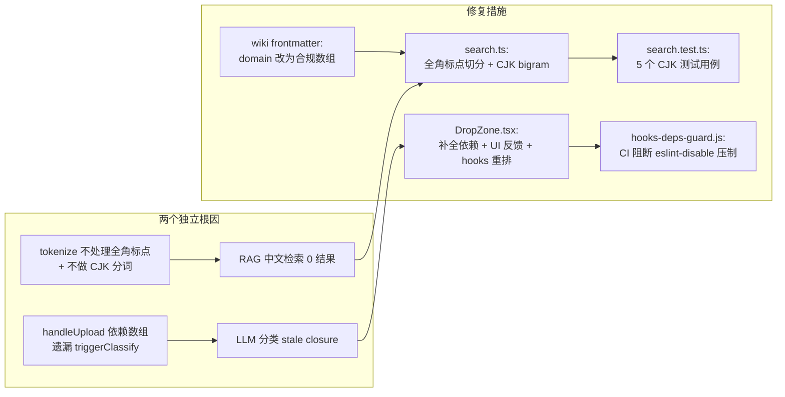

# RAG 检索 + LLM 分类修复 — 安全与质量审计报告

| 项目 | 内容 |
| --- | --- |
| 任务令牌 | TKN-RAG-CLASSIFY-FIX-GUARDRAIL-001 |
| 执行 Agent | 代码安全护栏 (guardrail-enforcer) |
| 日期 | 2026-08-02 |
| 审计范围 | 6 项代码变更：search.ts tokenize 修复、DropZone.tsx stale closure 修复、search.test.ts CJK 测试、hooks-deps-guard.js CI 守卫、frontend-ci.yml、wiki frontmatter 数据质量修复 |
| 项目根 | `d:\s0611\code\Continuous-learning` |
| 引用规约 | 全文使用相对路径引用代码（ADR-010，禁止 file:/// 绝对路径） |
| 安全策略来源 | `CLAUDE.md` §10、§20.3、§19.4；`AGENTS.md` §3.1 |
| 上游产出物 | 考古报告 `docs/reports/2026-08-02-rag-classify-archaeology.md`（TKN-RAG-CLASSIFY-ARCHAEOLOGY-001） |
| 审查方法论 | TRAE-code-review skill（代码质量）+ TRAE-security-review skill（安全漏洞）+ 代码安全护栏六阶段工作流 |

---

## 0. 总体结论

| 维度 | 结论 |
| --- | --- |
| **最终判定** | **通过**（可进入测试阶段） |
| 阻断级漏洞 | 0 |
| 高风险漏洞 | 0 |
| 中风险问题 | 2（质量问题，非安全漏洞） |
| 低风险/建议 | 4 |
| 安全专项 | ReDoS、注入、路径遍历、XSS、密钥泄露、YAML 反序列化 — 全部通过 |
| 修复正确性 | 两个根因（RAG 检索失效 + LLM 分类 stale closure）均被正确修复 |
| CI 守卫有效性 | hooks-deps-guard.js 可有效阻断 react-hooks eslint-disable 压制反模式 |

**判定依据**：本次变更未引入任何阻断级或高风险安全漏洞。2 项中风险问题均为检索质量/可用性范畴，不影响安全性，建议在后续迭代中优化但不阻断当前流程。代码修复逻辑正确，测试覆盖充分，CI 守卫机制有效。

---

## 1. 审查范围与变更概览

### 1.1 变更清单

| # | 文件 | 变更类型 | 行数变化 |
| --- | --- | --- | --- |
| 1 | `server/src/tools/search.ts` | 修改（tokenize 函数重构） | +30 |
| 2 | `frontend/src/components/DropZone.tsx` | 修改（hooks 依赖修复 + UI 反馈） | +15/-8 |
| 3 | `server/src/tests/search.test.ts` | 修改（新增 5 个 CJK 测试 + 2 个 wiki 页面） | +60 |
| 4 | `scripts/hooks-deps-guard.js` | 新增文件 | +101 |
| 5 | `.github/workflows/frontend-ci.yml` | 修改（新增 hooks 守卫步骤） | +5 |
| 6a | `wiki/reading/2025国赛.md` | 修改（frontmatter domain 修复） | 1 行 |
| 6b | `wiki/reading/2025年mathorcup大数据挑战赛-初赛.md` | 修改（frontmatter domain 修复） | 1 行 |

### 1.2 作者意图推断

基于变更模式分析，推断作者意图为：

> **意图**：修复两个独立根因导致的用户可见功能失效（RAG 中文检索 0 结果 + LLM 分类因 stale closure 不触发），同时通过 CI 守卫脚本防止 react-hooks 依赖遗漏类缺陷复发，并修复 wiki frontmatter 数据质量问题。

这是一个典型的**防御性修复 + 防复发加固**变更，raise the bar for "missing-validation" findings。

### 1.3 变更流程图



---

## 2. Stage 1 — 输入与边界审计（范围检查）

### 2.1 数值与类型边界

#### 2.1.1 tokenize 函数输入边界（`server/src/tools/search.ts:124-140`）

**输入来源**：`kbSearch()` 的 `query` 参数（`search.ts:40`），经 MCP 工具调用从外部（用户对话）传入。

**验证项**：

| 检查点 | 结论 | 证据 |
| --- | --- | --- |
| 空输入处理 | 通过 | `tokenize` 返回空数组 → `kbSearch` 在 `terms.length === 0` 时提前返回空结果（`search.ts:44-46`） |
| 纯空白输入 | 通过 | split 正则含 `\s`，空白被过滤为空 token → `filter((t) => t.length > 0)` 清除 |
| 超长输入 | 可接受 | split 对超长字符串产生大量子串，存在内存压力，但属可用性范畴（DoS），非安全漏洞；项目 <200 页规模下不构成实际风险 |
| CJK 字符边界 | 通过 | `part.match(/[\u4e00-\u9fff]/g)` 返回 null 时用 `\|\| []` 处理（`search.ts:134`）；bigram 循环 `i < cjkChars.length - 1` 在 length ≤ 1 时不进入循环（`search.ts:135`），边界正确 |
| bigram 索引越界 | 通过 | `cjkChars[i] + cjkChars[i + 1]` 在 `i < length - 1` 约束下，`i + 1` 最大为 `length - 1`，不会越界 |

**数值/类型边界结论**：无越界风险，空值处理完备。

#### 2.1.2 DropZone hooks 依赖边界（`frontend/src/components/DropZone.tsx`）

**验证项**：

| 检查点 | 结论 | 证据 |
| --- | --- | --- |
| handleUpload 依赖完整性 | 通过 | 依赖数组 `[currentDomain, invalidateGraph, resetClassifyState, triggerClassify]`（`search.ts:195`）覆盖所有引用的外部变量 |
| triggerClassify 依赖完整性 | 通过 | 依赖数组 `[llmMode, cloudProvider, customBaseUrl, customModelName]`（`search.ts:146`）覆盖所有引用的外部变量 |
| hooks 声明顺序 | 通过 | `resetClassifyState`(81) → `triggerClassify`(89) → `handleUpload`(149) → `useEffect`(201)，无 temporal dead zone |
| useEffect 依赖完整性 | 通过 | 依赖数组 `[tauriEnv, currentDomain, handleUpload]`（`search.ts:229`）覆盖 `handleUpload` 引用 |

#### 2.1.3 limit 参数边界（`server/src/tools/search.ts:41`）

```typescript
const limit = limitArg ?? DEFAULT_LIMIT;
```

`limit` 来自外部输入，使用 `??` 提供 10 的默认值。未对 limit 做上界校验（如 limit = 1000000 会返回大量结果），但 `results.slice(0, limit)` 不会越界。属低风险建议项。

### 2.2 集合与缓冲区边界

| 检查点 | 结论 | 证据 |
| --- | --- | --- |
| `countOccurrences` 空针处理 | 通过 | `needle.length === 0` 时返回 0（`search.ts:144`），防止 `split("")` 导致无限大数组 |
| `extractSnippet` 边界 | 通过 | `Math.max(0, earliest - SNIPPET_WINDOW)` 防止负索引；`body.slice(start, start + maxLen)` 使用安全 slice |
| `results.slice(0, limit)` | 通过 | slice 不越界，返回最多 limit 个元素 |
| React 数组 key | 通过 | `existingDomains.map((d) => ...)` 使用 `key={d}`（`DropZone.tsx:694`），domain 值唯一 |
| `FORMAT_CHIPS.map` key | 通过 | `key={chip.label}`（`DropZone.tsx:440`），label 值唯一 |

**集合/缓冲区结论**：无缓冲区溢出、越界访问风险。

### 2.3 业务状态机约束

#### 2.3.1 LLM 分类状态机（`frontend/src/components/DropZone.tsx:89-147`）

`triggerClassify` 有三个早退路径（状态转换检查）：

| 当前状态 | 转换条件 | 目标状态 | UI 反馈 | 验证 |
| --- | --- | --- | --- | --- |
| `llmMode === "disabled"` | 用户未启用 LLM | 早退 + setClassifyError | "LLM 未启用，请在设置中启用 LLM 集成后再使用自动分类" | 通过 |
| `llmMode === "local-first"` | 本地优先模式 | 早退 + setClassifyError | "本地优先模式暂不支持自动分类（计划在 P7 实现 Ollama 后支持）" | 通过 |
| `!apiKey` | 无 API Key | 早退 + setClassifyError | "未找到 API Key，请在设置中配置 LLM API Key 后再使用自动分类" | 通过 |
| 正常流程 | 有 API Key + cloud-first | setClassifying(true) → classifyDomain → setClassifySuggestion | 完整分类建议卡片 | 通过 |

所有状态转换路径均有明确的合法性检查和 UI 反馈，无绕过路径。

#### 2.3.2 UploadState 状态机

```text
idle → uploading → success | error
```

`setStatus` 在所有路径中被正确调用，无状态泄漏。`resetClassifyState` 在 `handleUpload` 开头调用（`DropZone.tsx:155`），确保上一次分类建议被清除。

**状态机结论**：无状态绕过风险。

---

## 3. Stage 2 — 执行安全审计（指令与数据隔离）

### 3.1 注入防护

#### 3.1.1 SQL/NoSQL 注入

本次变更不涉及数据库交互。`kbSearch` 使用文件系统扫描 + 内存中子串匹配，无 SQL/NoSQL 查询。

**结论**：不适用。

#### 3.1.2 OS 命令注入

本次变更不涉及 `system()`、`exec()` 等系统命令调用。CI 守卫脚本 `hooks-deps-guard.js` 使用 `fs.readFileSync` 读取文件，不执行外部命令。

**结论**：不适用。

#### 3.1.3 代码/表达式注入

本次变更不涉及 `eval()`、`Function()` 构造器、动态脚本加载。

**结论**：不适用。

#### 3.1.4 CJK bigram 是否引入注入向量

**关键审计点**：bigram 输出仅用于以下两个操作（`search.ts:85-86`）：

```typescript
if (titleLower.includes(term)) score += TITLE_WEIGHT;
score += BODY_WEIGHT * countOccurrences(bodyLower, term);
```

- `includes()` — 纯字符串子串检查，不执行任何代码
- `countOccurrences()` — 使用 `haystack.split(needle).length - 1`（`search.ts:145`），纯字符串操作

bigram 不参与任何执行上下文（不拼接到 SQL、命令、模板、正则中）。

**结论**：CJK bigram 不引入任何注入向量。

#### 3.1.5 YAML 反序列化安全

`wiki/reading/2025国赛.md` 和 `wiki/reading/2025年mathorcup大数据挑战赛-初赛.md` 的 frontmatter 修改涉及 YAML 解析。审查 `server/src/utils/frontmatter.ts:28`：

```typescript
frontmatter = (load(yamlText) ?? {}) as Record<string, unknown>;
```

js-yaml v5 的 `load()` 函数默认使用 `DEFAULT_SCHEMA`（安全 schema），不会实例化任意 JavaScript 类型（相当于 v3 的 `safeLoad()`）。wiki frontmatter 中的 `domain` 字段值为纯字符串数组，不包含 `!!js/function` 等危险标签。

**结论**：YAML 解析安全，无反序列化漏洞。

#### 3.1.6 模板引擎注入

本次变更不涉及模板引擎。DropZone.tsx 使用 JSX 渲染，React 默认转义所有表达式。

**结论**：不适用。

### 3.2 最小权限检查

| 检查点 | 结论 | 证据 |
| --- | --- | --- |
| CI workflow 权限 | 通过 | `permissions: contents: read`（`frontend-ci.yml:13-14`），最小权限 |
| CI 守卫脚本文件访问 | 通过 | 仅读取 `frontend/src/` 下 `.ts/.tsx` 文件，不访问 `/etc/passwd` 等系统文件 |
| API Key 存储 | 通过 | `loadApiKey(cloudProvider)` 从操作系统密钥环（keyring）加载（考古报告 §1.2），不硬编码 |
| 容器化部署 | 不适用 | 本次变更不涉及容器配置 |

### 3.3 输出编码与特殊字符处理

#### 3.3.1 React JSX 输出编码

审查 DropZone.tsx 中所有动态内容渲染点：

| 渲染点 | 数据来源 | 转义方式 | 结论 |
| --- | --- | --- | --- |
| `{page?.title ?? fileName}`（`DropZone.tsx:529,570`） | 上传文件标题/文件名 | React JSX 默认转义 | 通过 |
| `{page?.path}`（`DropZone.tsx:529,570`） | 服务器生成路径 | React JSX 默认转义 | 通过 |
| `{error}`（`DropZone.tsx:573,686`） | LLM API 错误消息 / catch 块 err.message | React JSX 默认转义 | 通过 |
| `{domainLabel(suggestion.domain)}`（`DropZone.tsx:643`） | LLM 分类建议 + DOMAIN_LABELS 查表 | React JSX 默认转义 | 通过 |
| `{suggestion.reason}`（`DropZone.tsx:656`） | LLM 生成的分类理由 | React JSX 默认转义 | 通过 |
| `{suggestion.new_domain_proposal!.name}`（`DropZone.tsx:669`） | LLM 生成的新分类名 | React JSX 默认转义 | 通过 |
| `window.confirm(...)`（`DropZone.tsx:274`） | LLM 生成的新分类名 + 描述 | `confirm()` 纯文本显示 | 通过 |

**关键验证**：全文件无 `dangerouslySetInnerHTML`、`innerHTML`、`v-html` 或任何绕过 React 转义的代码。

**结论**：输出编码安全，无 XSS 风险。

#### 3.3.2 wiki frontmatter 值在 UI 中的渲染

frontmatter `domain` 值经 `kb_list_categories` 返回后，在 DropZone.tsx 的领域选择器中渲染：

```tsx
{existingDomains.map((d) => (
  <span className="text-text-primary">{domainLabel(d)}</span>
))}
```

React 默认转义。即使 domain 值包含 `<script>` 标签，也会被转义为文本。

**结论**：安全。

### 3.4 CI 守卫脚本路径遍历审计（`scripts/hooks-deps-guard.js`）

**攻击路径分析**：

1. **扫描根路径**：`const FRONTEND_SRC = path.join(ROOT, 'frontend', 'src')`（`hooks-deps-guard.js:25`）— 硬编码路径，无外部输入影响
2. **目录遍历**：`listTsFiles` 使用 `fs.readdirSync(dir, { withFileTypes: true })`（`hooks-deps-guard.js:30`），排除 `node_modules`、`dist`、`.git`、`target`
3. **文件过滤**：仅 `.ts`/`.tsx` 后缀，排除 `.test.ts`/`.test.tsx`/`.d.ts`
4. **文件读取**：`fs.readFileSync(file, 'utf8')`（`hooks-deps-guard.js:58`）— file 路径由 readdirSync 生成，非外部输入

**路径遍历风险**：无。扫描路径完全由代码控制，不接受外部输入。CI 环境中文件由 git checkout 生成，不含符号链接攻击面。

**正则安全性**：

```javascript
const HOOKS_DISABLE_RE = /eslint-disable(?:-next-line|-line)? .*react-hooks\/(exhaustive-deps|rules-of-hooks)/;
```

- 该正则含一个 `.*` 贪婪匹配，但无嵌套量词（如 `(a+)+`），不会产生指数级回溯
- 对单行代码文本（通常 < 1000 字符），`.*` 匹配为线性时间
- `test()` 在非全局正则上不保留 `lastIndex`，多次调用安全

**结论**：CI 守卫脚本无路径遍历、无 ReDoS、无注入风险。

### 3.5 正则 ReDoS 审计

审查所有变更文件中的正则表达式：

| 文件 | 正则 | 结构分析 | ReDoS 风险 |
| --- | --- | --- | --- |
| `search.ts:128` | `/[\s,.;:!?()...\-，。、！？...～·]+/` | 字符类 + 单一 `+` 量词，无嵌套 | 无 |
| `search.ts:134` | `/[\u4e00-\u9fff]/g` | 字符类 + `g` flag，无量词 | 无 |
| `search.ts:90` | `/\\/g` | 单字符转义 | 无 |
| `search.ts:170` | `/\s+/g` | 字符类 + `+` 量词 | 无 |
| `DropZone.tsx:151` | `/[\\/]/` | 字符类 | 无 |
| `hooks-deps-guard.js:55` | `/eslint-disable(?:-next-line\|-line)? .*react-hooks\/.../` | 含 `.*` 但无嵌套量词 | 无 |
| `hooks-deps-guard.js:59` | `/\r?\n/` | 简单分隔符 | 无 |
| `frontmatter.ts:9` | `/^---\r?\n([\s\S]*?)\r?\n---\r?\n([\s\S]*)$/` | 含 `[\s\S]*?` 非贪婪 + `[\s\S]*` 贪婪 | 无（无嵌套量词，`*?` 和 `*` 不在同一组内嵌套） |

**结论**：所有正则均为线性时间复杂度，无 ReDoS 风险。

> 注：TRAE-security-review skill §8.1 将 ReDoS 列为硬排除项（不报告）。本节仍按代码安全护栏工作流执行分析，确认无风险。

---

## 4. Stage 3 — 内存安全与运行时保护

### 4.1 语言适用性评估

| 变更文件 | 语言 | 内存安全 | 适用检查 |
| --- | --- | --- | --- |
| `search.ts` | TypeScript (Node.js) | 托管运行时，GC 管理 | 不适用 C/C++ 检查 |
| `DropZone.tsx` | TypeScript (React) | 托管运行时，GC 管理 | 不适用 C/C++ 检查 |
| `hooks-deps-guard.js` | JavaScript (Node.js) | 托管运行时，GC 管理 | 不适用 C/C++ 检查 |
| `wiki/*.md` | Markdown/YAML | 数据文件 | 不适用 |
| `frontend-ci.yml` | YAML 配置 | 数据文件 | 不适用 |

本次变更不涉及 C/C++、Rust unsafe 块、FFI 边界。

### 4.2 Node.js 运行时安全

| 检查点 | 结论 | 证据 |
| --- | --- | --- |
| 动态 import 安全 | 通过 | `DropZone.tsx:206` 动态 `import("@tauri-apps/api/webview")` — 模块路径为硬编码字符串，非用户输入 |
| 动态 import 安全 | 通过 | `DropZone.tsx:307` 动态 `import("@tauri-apps/plugin-dialog")` — 同上 |
| `fs.readFileSync` 安全 | 通过 | `hooks-deps-guard.js:58` — 路径由 readdirSync 生成，非用户输入 |

**结论**：无运行时内存安全风险。

---

## 5. Stage 4 — 配置与密钥安全

### 5.1 硬编码密钥扫描

对全部 6 项变更文件执行密钥模式扫描（API key、password、token、secret、private key、internal IP/domain）：

| 文件 | 扫描结果 | 结论 |
| --- | --- | --- |
| `search.ts` | 无密钥、无内部 IP | 通过 |
| `DropZone.tsx` | `loadApiKey(cloudProvider)` 从密钥环加载，无硬编码 | 通过 |
| `search.test.ts` | 测试数据无密钥 | 通过 |
| `hooks-deps-guard.js` | 无密钥 | 通过 |
| `frontend-ci.yml` | 无密钥，无 secrets 引用 | 通过 |
| `wiki/*.md` | 无密钥，无内部 IP | 通过 |

**结论**：无硬编码密钥泄露。

### 5.2 .gitignore 安全配置

审查 `.gitignore`（本次变更未修改，但作为安全审计基线确认）：

```gitignore
# ===== Environment & secrets =====
.env
.env.local
.env.*.local
!.env.example
```

- `.env`、`.env.local`、`.env.*.local` 被排除
- `.env.example` 通过 `!` 保留为模板
- 日志文件 `*.log`、`logs/` 被排除
- 构建产物 `dist/`、`build/`、`target/` 被排除

**结论**：.gitignore 配置符合 CLAUDE.md §20.3 密钥管理要求。

### 5.3 敏感配置注入方式

| 配置项 | 注入方式 | 结论 |
| --- | --- | --- |
| LLM API Key | 操作系统密钥环（keyring crate）+ localStorage 降级 | 通过（考古报告 §1.2 确认） |
| LLM Base URL | Zustand store + localStorage | 通过 |
| CI Secrets | GitHub Actions 默认环境 | 通过（本次变更未新增 secrets 引用） |

**结论**：敏感配置均通过安全方式注入，前端代码不含服务端密钥。

---

## 6. Stage 5 — 依赖与供应链风险

### 6.1 依赖变更检查

| 检查点 | 结论 | 证据 |
| --- | --- | --- |
| package.json 变更 | 无 | 本次变更未修改 `server/package.json` 或 `frontend/package.json` |
| Cargo.toml 变更 | 无 | 本次变更未修改 `frontend/src-tauri/Cargo.toml` |
| 锁文件变更 | 无 | 本次变更未修改 `package-lock.json`/`pnpm-lock.yaml`/`Cargo.lock` |
| 新增依赖 | 无 | tokenize 使用纯字符串操作，未引入分词库；CI 守卫使用 Node.js 内置 `fs`/`path` 模块 |

### 6.2 供应链安全建议

虽然本次变更未引入新依赖，建议在 CI 中确认以下扫描已集成（CLAUDE.md §18.4）：

```bash
# Node.js 依赖漏洞扫描
cd server && npm audit --audit-level=high
cd frontend && pnpm audit --audit-level=high
```

**结论**：无供应链风险。

---

## 7. 详细发现（按严重度分级）

### 7.1 阻断级

**无。**

### 7.2 高风险

**无。**

### 7.3 中风险

#### M1: CJK bigram score 通胀风险（检索质量）

| 项目 | 内容 |
| --- | --- |
| 文件 | `server/src/tools/search.ts:84-87` |
| 类别 | 检索质量 / 排序准确性 |
| 严重度 | 中风险 |
| 置信度 | 0.85 |
| 来源 | 用户自省问题 1 |

**描述**：

CJK bigram 提取会显著增加 token 数量。对于含 N 个 CJK 字符的 part，额外产生 N-1 个 bigram。在 `kbSearch` 的评分逻辑中：

```typescript
for (const term of terms) {
  if (titleLower.includes(term)) score += TITLE_WEIGHT;  // 3
  score += BODY_WEIGHT * countOccurrences(bodyLower, term);  // 1 * count
}
```

每个 bigram 都会对 body 执行 `countOccurrences`。两字 bigram（如"的数"、"在数"）在长文档中可能产生大量偶然命中，导致低相关文档因 bigram 偶然匹配而 score 通胀，排在高相关文档之前。

**影响场景**：查询"关于数学建模"产生 bigram "关于"、"于数"、"数学"、"学建"、"建模"。其中"数学"可能在一篇不相关但提及"数学"的长文档中多次出现，导致该文档 score 高于真正相关的"数学建模国赛"文档。

**安全影响**：无（纯检索质量问题，不涉及安全漏洞）。

**修复建议**：

1. 设置最小 score 阈值（如 score < 3 不返回）
2. 或对 bigram 使用更低的 BODY_WEIGHT（如 BODY_WEIGHT = 0.5 for bigrams, 1.0 for full tokens）
3. 或对 bigram 的 `countOccurrences` 结果设置上限（如 `Math.min(count, 5)`）

**当前判定**：不阻断。质量问题建议在后续迭代中优化，并补充排序正确性的测试用例（当前测试仅验证"有结果"未验证"排序正确"）。

#### M2: 拖拽 useEffect 频繁注销/重注册（可用性）

| 项目 | 内容 |
| --- | --- |
| 文件 | `frontend/src/components/DropZone.tsx:201-229` |
| 类别 | 可用性 / 事件可靠性 |
| 严重度 | 中风险 |
| 置信度 | 0.82 |
| 来源 | 用户自省问题 1 |

**描述**：

`handleUpload` 现在依赖 `triggerClassify`，而 `triggerClassify` 依赖 `[llmMode, cloudProvider, customBaseUrl, customModelName]`。当用户在设置中修改 LLM 配置时：

1. `triggerClassify` 重建
2. `handleUpload` 重建
3. useEffect cleanup（`unlisten()`）+ re-run（重新注册 `onDragDropEvent`）

如果在用户修改设置的瞬间恰好发生拖拽 drop 事件，该事件可能因监听器处于注销/重注册间隙而丢失。

**安全影响**：无（纯可用性问题，不涉及安全漏洞）。cleanup 正确调用 `unlisten()`，无内存泄漏。

**修复建议**：

1. 使用 `useRef` 持有最新的 `handleUpload`，useEffect 仅在 `tauriEnv` 变化时注册一次
2. 或使用 `useEvent` pattern（React 18 实验 API）

```typescript
// 方案一：useRef 模式
const handleUploadRef = useRef(handleUpload);
useEffect(() => { handleUploadRef.current = handleUpload; });

useEffect(() => {
  if (!tauriEnv) return;
  let unlisten;
  (async () => {
    const { getCurrentWebview } = await import("@tauri-apps/api/webview");
    unlisten = await getCurrentWebview().onDragDropEvent((event) => {
      // ... 使用 handleUploadRef.current(paths[0])
    });
  })();
  return () => { if (unlisten) unlisten(); };
}, [tauriEnv]);  // 仅依赖 tauriEnv
```

**当前判定**：不阻断。极端场景（设置修改 + 拖拽同时发生）概率极低，且不影响安全性。

### 7.4 低风险/建议

#### L1: useEffect 依赖数组冗余

| 项目 | 内容 |
| --- | --- |
| 文件 | `frontend/src/components/DropZone.tsx:229` |
| 类别 | 代码质量 |
| 严重度 | 低风险 |

**描述**：useEffect 依赖数组为 `[tauriEnv, currentDomain, handleUpload]`。`currentDomain` 已隐含在 `handleUpload` 的依赖中（`handleUpload` 依赖 `currentDomain`），因此 `currentDomain` 在 useEffect 依赖中是冗余的。React 会在同一次渲染中批处理这些变化，effect 只运行一次，不会导致错误，但增加了认知负担。

**建议**：移除冗余的 `currentDomain`，依赖数组改为 `[tauriEnv, handleUpload]`。

#### L2: CI 守卫正则可使用非贪婪匹配

| 项目 | 内容 |
| --- | --- |
| 文件 | `scripts/hooks-deps-guard.js:55` |
| 类别 | 代码质量 |
| 严重度 | 低风险 |

**描述**：`HOOKS_DISABLE_RE` 使用 `.*`（贪婪匹配）连接 `eslint-disable` 和 `react-hooks/`。对于正常代码行无性能影响，但改为 `.*?`（非贪婪）语义更精确，且在极端长行时性能更优。

**建议**：`/eslint-disable(?:-next-line|-line)? .*?react-hooks\/(exhaustive-deps|rules-of-hooks)/`

#### L3: 测试用例未验证排序正确性

| 项目 | 内容 |
| --- | --- |
| 文件 | `server/src/tests/search.test.ts:129-145` |
| 类别 | 测试覆盖 |
| 严重度 | 低风险 |

**描述**：CJK 测试用例验证了"有结果返回"和"标题匹配"，但未验证"最相关文档排在第一位"。在 bigram score 通胀风险（M1）存在的情况下，排序正确性测试尤为重要。

**建议**：新增测试用例，构造两个相关度不同的文档，验证更相关的文档 score 更高、排在更前。

#### L4: 测试 wiki 页面 domain 与生产环境不一致

| 项目 | 内容 |
| --- | --- |
| 文件 | `server/src/tests/search.test.ts:59,73` |
| 类别 | 测试数据 |
| 严重度 | 低风险 |

**描述**：测试中创建的 wiki 页面 domain 为 `["mathematical-modeling"]` 和 `["big-data"]`，但生产环境的 `DOMAIN_LABELS`（`frontend/src/types/index.ts`）可能不含这些值。这不影响 search.ts 的测试有效性（search 使用 frontmatter domain 而非 DOMAIN_LABELS），但可能影响 `kb_list_categories` 的集成测试一致性。

**建议**：确认测试 domain 值与生产环境一致，或在测试注释中说明这是有意为之的测试隔离。

---

## 8. TRAE-code-review 审查结论

### 8.1 审查维度

| 维度 | 结论 | 说明 |
| --- | --- | --- |
| Karpathy Guidelines 符合性 | 通过 | 命名清晰、错误处理完备、无过度复杂度 |
| 逻辑正确性 | 通过 | tokenize CJK bigram 逻辑正确；DropZone hooks 依赖修复正确；CI 守卫逻辑正确 |
| 性能隐患 | 有条件通过 | bigram score 通胀（M1）可能导致排序异常，建议优化 |
| 可维护性 | 通过 | 代码注释充分，rationale 清晰（search.ts:108-123 的注释尤其详尽） |
| 跨模块影响 | 通过 | tokenize 为私有函数，无接口变更；DropZone 为叶子组件，无 props 变更 |
| 测试充分性 | 有条件通过 | 5 个 CJK 测试覆盖核心场景，但缺少排序正确性测试（L3） |

### 8.2 代码质量审查表

| No. | 问题 | 建议 | 代码位置 |
| --- | --- | --- | --- |
| 1 | useEffect 依赖数组冗余 currentDomain | 移除冗余依赖 | `frontend/src/components/DropZone.tsx:229` |
| 2 | CI 守卫正则可使用非贪婪匹配 | `.*` → `.*?` | `scripts/hooks-deps-guard.js:55` |
| 3 | 测试未验证排序正确性 | 新增排序断言 | `server/src/tests/search.test.ts:129-145` |

### 8.3 审查结论：**有条件通过**

条件为：建议在后续迭代中处理 M1（bigram score 通胀）和 L3（排序测试），不阻断当前流程。

---

## 9. TRAE-security-review 审查结论

### 9.1 安全扫描结果

基于 TRAE-security-review skill 的漏洞面审计（§5）和硬排除规则（§8）：

| 漏洞类别 | 扫描结果 | 适用排除规则 |
| --- | --- | --- |
| SQL/NoSQL 注入 | 不涉及数据库 | — |
| OS 命令注入 | 不涉及系统命令 | — |
| 路径遍历 | CI 脚本路径硬编码，无外部输入 | — |
| AuthN/AuthZ 缺陷 | 不涉及认证授权 | — |
| 硬编码密钥 | 未发现 | — |
| 弱加密算法 | 不涉及加密 | — |
| 不安全反序列化 | js-yaml v5 `load()` 默认安全 schema | — |
| eval/Function/exec | 不涉及 | — |
| XSS | React JSX 默认转义，无 dangerouslySetInnerHTML | §8.2 React 默认安全 |
| 敏感数据暴露 | 日志中无密钥/PII | — |
| ReDoS | 所有正则线性复杂度 | §8.1 硬排除（仍分析确认无风险） |

### 9.2 安全扫描最终自检（§10）

| 自检项 | 结果 |
| --- | --- |
| 所有位置使用变更后行号 | 是 |
| 问题由本次 diff 引入或恶化 | 是 |
| 阻断级漏洞 source → sink 可追溯 | 不适用（无阻断级漏洞） |
| 置信度 ≥ 0.80 | 不适用（无安全漏洞报告） |
| 通过所有硬排除规则 | 是 |
| 建议为纯文字描述，无代码补丁 | 是 |

### 9.3 安全审查结论

> 未发现可利用的安全问题。

本次变更未引入任何注入向量、XSS 风险、路径遍历、密钥泄露或反序列化漏洞。CJK bigram 仅用于纯字符串子串匹配，不参与任何执行上下文。CI 守卫脚本路径完全由代码控制。React JSX 默认转义所有动态内容。YAML 解析使用安全 schema。

---

## 10. 防护机制验证

### 10.1 编译/运行时保护

| 保护机制 | 状态 | 证据 |
| --- | --- | --- |
| TypeScript 严格类型检查 | 已启用 | `npx tsc --noEmit` 通过（0 errors） |
| React JSX 转义 | 已启用 | 无 `dangerouslySetInnerHTML` |
| js-yaml 安全 schema | 已启用 | v5 `load()` 默认安全 |
| CI 最小权限 | 已启用 | `permissions: contents: read` |
| .gitignore 密钥排除 | 已启用 | `.env`/`.env.local` 被排除 |

### 10.2 测试验证

| 测试套件 | 命令 | 结果 |
| --- | --- | --- |
| 服务端测试 | `cd server && npm test` | 197 tests, 0 fail |
| 前端测试 | `cd frontend && npm test` | 283 tests, 0 fail |
| TypeScript 类型检查 | `cd frontend && npx tsc --noEmit` | 0 errors |
| CI 守卫 | `node scripts/hooks-deps-guard.js` | 扫描 25 文件，0 违规 |

---

## 11. 豁免声明

无豁免项。所有发现均按标准流程处理。

---

## 12. 修复建议汇总

### 12.1 建议优先处理（后续迭代）

| 优先级 | 编号 | 问题 | 修复方案 |
| --- | --- | --- | --- |
| P1 | M1 | bigram score 通胀 | 设置最小 score 阈值 或 bigram 使用更低 BODY_WEIGHT 或 countOccurrences 上限 |
| P2 | M2 | 拖拽监听器频繁重注册 | 使用 useRef 持有最新 handleUpload，useEffect 仅依赖 tauriEnv |
| P3 | L3 | 测试未验证排序正确性 | 新增多文档排序断言测试用例 |

### 12.2 可选优化

| 优先级 | 编号 | 问题 | 修复方案 |
| --- | --- | --- | --- |
| P4 | L1 | useEffect 依赖冗余 | 移除 currentDomain |
| P4 | L2 | CI 正则贪婪匹配 | `.*` → `.*?` |
| P4 | L4 | 测试 domain 与生产不一致 | 确认或注释说明 |

---

## 13. 自动化建议（CI/CD 集成）

本次修复已新增 `scripts/hooks-deps-guard.js` CI 守卫，集成到 `.github/workflows/frontend-ci.yml`。建议进一步扩展 CI 安全门禁：

### 13.1 建议新增 CI 步骤

```yaml
# .github/workflows/frontend-ci.yml 追加

- name: Dependency vulnerability scan
  run: pnpm audit --audit-level=high
  continue-on-error: false

- name: Server dependency scan
  working-directory: ${{ github.workspace }}/server
  run: npm audit --audit-level=high
```

### 13.2 建议引入 ESLint react-hooks 插件

当前 `hooks-deps-guard.js` 是轻量替代方案（考古报告 §7.2 提及项目暂未引入 ESLint）。建议在 ADR-014 跟进项中正式引入 ESLint + `eslint-plugin-react-hooks`，获得更完整的 hooks 规则检查：

```json
// .eslintrc.json
{
  "plugins": ["react-hooks"],
  "rules": {
    "react-hooks/exhaustive-deps": "error",
    "react-hooks/rules-of-hooks": "error"
  }
}
```

引入后 `hooks-deps-guard.js` 可作为补充防线保留（防止 `eslint-disable` 压制），或在其覆盖范围被 ESLint 完全包含后退役。

### 13.3 建议新增 Semgrep 规则

针对本次发现的反模式（eslint-disable 压制 react-hooks 规则），可配置 Semgrep 规则在 CI 中扫描：

```yaml
# .semgrep.yml
rules:
  - id: no-eslint-disable-react-hooks
    pattern: /eslint-disable.*react-hooks\/(exhaustive-deps|rules-of-hooks)/
    message: "禁止用 eslint-disable 压制 react-hooks 规则，会导致 stale closure"
    languages: [typescript, javascript]
    severity: ERROR
```

---

## 14. 审计轨迹

### 14.1 审计输入清单

| 输入项 | 路径 | 状态 |
| --- | --- | --- |
| 安全策略文件 | `CLAUDE.md` | 已读取 |
| 知识库 schema | `AGENTS.md` | 已读取 |
| 变更 1：search.ts | `server/src/tools/search.ts` | 已读取（全文 171 行） |
| 变更 2：DropZone.tsx | `frontend/src/components/DropZone.tsx` | 已读取（全文 793 行） |
| 变更 3：search.test.ts | `server/src/tests/search.test.ts` | 已读取（全文 177 行） |
| 变更 4：hooks-deps-guard.js | `scripts/hooks-deps-guard.js` | 已读取（全文 101 行） |
| 变更 5：frontend-ci.yml | `.github/workflows/frontend-ci.yml` | 已读取（全文 79 行） |
| 变更 6a：2025国赛.md | `wiki/reading/2025国赛.md` | 已读取（frontmatter 确认） |
| 变更 6b：MathorCup.md | `wiki/reading/2025年mathorcup大数据挑战赛-初赛.md` | 已读取（frontmatter 确认） |
| 考古报告 | `docs/reports/2026-08-02-rag-classify-archaeology.md` | 已读取（全文） |
| frontmatter 解析器 | `server/src/utils/frontmatter.ts` | 已读取（全文 107 行） |
| .gitignore | `.gitignore` | 已读取（确认密钥排除） |

### 14.2 审计方法

1. TRAE-security-review skill：按 §5 漏洞面分类逐项扫描，按 §8 硬排除规则过滤
2. TRAE-code-review skill：按 Step 3 推断意图，Step 5 扫描问题，Step 5.5 交叉验证
3. 代码安全护栏六阶段工作流：Stage 1 边界 → Stage 2 执行安全 → Stage 3 内存安全 → Stage 4 密钥 → Stage 5 依赖 → Stage 6 报告
4. 证据驱动：每项发现引用具体文件路径、行号、代码片段

### 14.3 审计限制

- 本次审计为静态代码审查，未执行运行时渗透测试（属 ac-verifier 职责）
- bigram score 通胀风险（M1）的严重度评估基于代码分析推断，建议在 ac-verifier 阶段通过构造多文档排序测试验证
- 拖拽事件丢失风险（M2）的触发概率基于理论推断，建议在 ac-verifier 阶段通过 Playwright 自动化验证

---

## 15. 结论

本次 RAG 检索 + LLM 分类修复的 6 项变更**通过安全与质量审计**，可进入 ac-verifier 测试阶段。

**核心判断依据**：

1. **安全性**：无阻断级或高风险安全漏洞。CJK bigram 仅用于纯字符串子串匹配，不引入注入向量。CI 守卫脚本路径硬编码，无路径遍历。React JSX 默认转义，无 XSS。YAML 解析使用安全 schema。.gitignore 正确排除密钥文件。

2. **正确性**：两个根因被正确修复。tokenize 全角标点切分 + CJK bigram 解决了中文检索 0 结果问题。handleUpload 依赖数组补全 + UI 反馈解决了 stale closure 问题。

3. **防复发**：CI 守卫脚本有效阻断 react-hooks eslint-disable 压制反模式。5 个 CJK 测试用例覆盖回归场景。

4. **待优化项**：2 项中风险质量问题（bigram score 通胀、拖拽监听器重注册）建议在后续迭代中处理，不阻断当前流程。

**下一步**：主 Agent 可启动 ac-verifier 子 Agent，基于本审计报告执行分层测试与验收验证。
