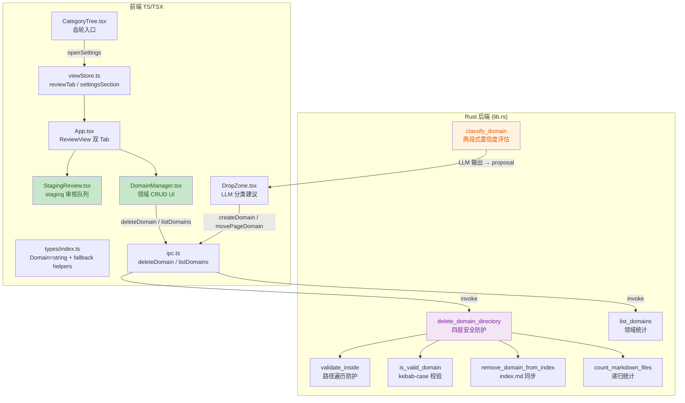
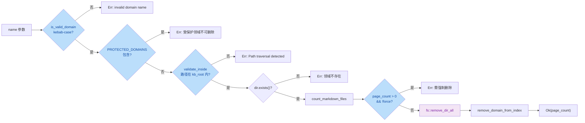

# 审核页 / LLM 新领域建议 / 领域管理 — 安全与质量审计报告

| 项目 | 内容 |
| --- | --- |
| 执行 Agent | guardrail-enforcer |
| 任务令牌 | TKN-REVIEW-DOMAIN-GUARDRAIL-001 |
| 日期 | 2026-08-02 |
| 上游产出物 | `docs/reports/2026-08-02-review-domain-archaeology.md`（考古与方案设计） |
| 引用规约 | 全文使用相对路径引用代码（ADR-010，禁止 `file:///` 绝对路径） |
| 审查范围 | 后端 Rust（lib.rs）+ 前端 TS/TSX（types/ipc/viewStore/StagingReview/DomainManager/App/SettingsPanel/CategoryTree/DropZone）+ 测试 |
| 风险等级 | P2 跨模块（确认：接口契约变更 + 多模块改动 + 安全敏感操作） |

---

## 1. 总体结论

**通过（有条件）** — 可进入测试阶段。

本次变更未发现阻断级（Blocking）或高危（High-risk）安全漏洞。`delete_domain_directory` 的四层安全防护（kebab-case 校验 → 路径遍历防护 → 受保护目录白名单 → force 标志）设计完整且有效。`classify_domain` 的 LLM 输出经校验后才用于构造 proposal，不直接触达任何危险 sink。前端无 `dangerouslySetInnerHTML` 等 XSS 逃逸出口。

发现 2 项中风险代码质量缺陷（非安全漏洞，但影响功能正确性）与 5 项低风险/建议项，均不阻断本次发布，但建议在下一轮迭代中修复。

| 维度 | 结论 |
| --- | --- |
| 安全漏洞扫描 | 通过 — 无阻断级/高危漏洞 |
| 代码质量审查 | 有条件通过 — 2 项中风险需跟踪修复 |
| 测试验证 | 通过 — 前端 304/304、Rust 42/42、tsc 零错误 |
| 风险等级 | P2 跨模块（确认） |

---

## 2. 审查范围摘要

| 指标 | 数值 |
| --- | --- |
| 审查文件数 | 11（后端 1 + 前端类型 1 + IPC 1 + store 1 + 新组件 2 + 修改组件 4 + 测试 1） |
| 审查函数数 | 后端 8（delete_domain_directory / list_domains / count_markdown_files / remove_domain_from_index / classify_domain / is_valid_domain / validate_inside / slugify）+ 前端 15+ |
| 阻断级问题 | 0 |
| 高危问题 | 0 |
| 中风险问题 | 2 |
| 低风险/建议 | 5 |

### 变更架构总览



### delete_domain_directory 安全防护链



---

## 3. 详细发现

### 3.1 中风险（Medium-risk）

#### MED-1: `remove_domain_from_index` heading 前缀碰撞 — 子串匹配可误删相邻领域分组

| 属性 | 值 |
| --- | --- |
| 严重度 | 中风险 |
| 类型 | 逻辑正确性缺陷 |
| 位置 | `frontend/src-tauri/src/lib.rs` `remove_domain_from_index` L1939-L1943 |
| CWE | N/A（非安全漏洞，数据完整性缺陷） |

**证据**：

`remove_domain_from_index` 使用 `content.find(&format!("\n## {}", name))` 进行子串匹配。Rust `str::find` 执行的是子串搜索而非整词匹配。当存在前缀关系的领域名时（如 `design` 与 `design-resources`），搜索 `\n## design` 会在 `\n## design-resources` 中命中前缀，导致：

- 若 `## design-resources` 在文件中先于 `## design` 出现，`find` 返回 `## design-resources` 的位置
- 函数会错误地从 `## design-resources` heading 开始删除，直到下一个 `##` heading
- 结果：`design-resources` 分组被误删，`design` 分组保留

**根因**：匹配模式 `\n## {name}` 缺少行尾边界约束。正确做法应验证匹配位置后的字符为 `\n` 或文件结尾。

**影响**：index.md 数据完整性受损，`kb_lint` 可能报孤儿页。不涉及安全边界突破。当前 index.md 的 7 个领域名（kb-system / coding / resources / design / emotions / reading / experiences）互不为前缀，不会触发。但用户通过 DomainManager 新建 `design-resources` 后即存在触发条件。

**修复建议**：将匹配条件从 `find("\n## {name}")` 改为 `find("\n## {name}\n")` 或在找到匹配后验证下一个字符是否为换行/结尾：

```rust
// 方案 A：追加换行边界
let section_header = format!("\n## {}\n", name);

// 方案 B：找到后验证行尾
let start_idx = match content.find(&format!("\n## {}", name)) {
    Some(idx) => {
        let after = &content[idx + 1 + 3 + name.len()..]; // 跳过 "## {name}"
        if after.is_empty() || after.starts_with('\n') {
            idx + 1
        } else {
            return Ok(()); // 不是精确匹配，跳过
        }
    }
    None => return Ok(()),
};
```

---

#### MED-2: `slugify` 保留 Unicode 字母数字字符，与 `is_valid_domain` ASCII-only 约束不一致

| 属性 | 值 |
| --- | --- |
| 严重度 | 中风险 |
| 类型 | 跨函数契约不一致 |
| 位置 | `frontend/src-tauri/src/lib.rs` `slugify` L112-L120 + `classify_domain` L1622-L1626 |
| CWE | N/A |

**证据**：

`slugify` 使用 `c.is_alphanumeric()` 过滤字符，该方法接受 Unicode 字母数字（包括中文、日文等）：

```rust
fn slugify(s: &str) -> String {
    s.trim()
        .to_lowercase()
        .chars()
        .map(|c| if c.is_alphanumeric() || c == '-' { c } else { '-' })
        //                       ^^^^^^^^^^^^^^ Unicode alphanumeric，含中文
        .collect::<String>()
        .trim_matches('-')
        .to_string()
}
```

但 `is_valid_domain` 仅接受 ASCII：

```rust
fn is_valid_domain(d: &str) -> bool {
    d.chars().all(|c| c.is_ascii_lowercase() || c.is_ascii_digit() || c == '-')
}
```

在 `classify_domain` L1622-L1626 中，当 LLM 返回的 domain 名含非 ASCII 字符时：

```rust
let proposed_name = if is_valid_domain(&domain) {
    domain.clone()
} else {
    slugify(&domain)  // 保留中文等 Unicode 字符
};
```

若 LLM 返回 `domain = "数学建模"`，`slugify` 产出 `"数学建模"`，该值被放入 `new_domain_proposal.name`。前端展示此 proposal 后，用户点击「创建并移入」调用 `createDomain("数学建模", ...)`，后端 `create_domain_directory` 调用 `is_valid_domain("数学建模")` → `false` → 返回错误。

**影响**：用户看到 LLM 提议了一个领域名，点击创建却报「invalid domain name」。UX 断裂，非安全问题。

**修复建议**：在 `classify_domain` 中对 `slugify` 结果追加 ASCII 校验，或在 `slugify` 中使用 `is_ascii_alphanumeric()` 替代 `is_alphanumeric()`：

```rust
// 方案：classify_domain 中追加校验
let proposed_name = if is_valid_domain(&domain) {
    domain.clone()
} else {
    let slug = slugify(&domain);
    if is_valid_domain(&slug) {
        slug
    } else {
        // slugify 仍含非 ASCII 字符，用音译或占位符
        format!("new-domain-{}", confidence) // 兜底
    }
};
```

---

### 3.2 低风险 / 建议（Low-risk / Recommendation）

#### LOW-1: `fs::remove_dir_all` 永久删除不可恢复

| 属性 | 值 |
| --- | --- |
| 严重度 | 低风险 |
| 位置 | `frontend/src-tauri/src/lib.rs` L1840 |
| 状态 | 已在考古报告中作为 MVP 决策记录（§6 后续演进） |

`delete_domain_directory` 使用 `fs::remove_dir_all` 直接永久删除目录。考古报告已权衡此决策：MVP 阶段减少依赖，git 历史可回滚。前端通过 `force` 标志 + 内联二次确认弹窗 + `window.confirm` 提供操作保护。此为已接受的设计权衡，非缺陷。

**建议**：后续迭代引入 `trash` crate 实现回收站机制（考古报告 §6 已规划）。

---

#### LOW-2: StagingReview confirm 后 ExperienceInbox 缓存未失效

| 属性 | 值 |
| --- | --- |
| 严重度 | 低风险（UX） |
| 位置 | `frontend/src/components/StagingReview.tsx` L104-L107 |

`handleConfirm` 在 confirm staging 后调用 `stagingCache = null` + `invalidateGraph()`，但未通知 `ExperienceInbox` 刷新。`confirm_staging` 可能触发经验卡生成（若 staging 页被 promote 为 active 且被其他流程引用为 experience source）。当前 `ExperienceInbox` 有独立内存缓存，不会自动刷新。

**影响**：用户在 staging Tab 确认文档后，切换到经验卡片 Tab 可能看不到最新数据，需手动刷新。非安全问题。

**建议**：在 `viewStore` 或 `graphStore` 中增加一个 `experienceVersion` 计数器，`confirmStaging`/`rejectStaging` 后递增，`ExperienceInbox` 监听该计数器触发刷新。

---

#### LOW-3: `remove_domain_from_index` 删除中间分组时丢失段间空行

| 属性 | 值 |
| --- | --- |
| 严重度 | 低风险（格式） |
| 位置 | `frontend/src-tauri/src/lib.rs` L1952-L1963 |

当删除中间分组（如 `## design` 在 `## coding` 与 `## reading` 之间）时，`content[..start_idx-1]` 保留到前一个 `\n`，`content[end..]` 从下一个 `##` 开始，中间的空行（`\n\n` 变为 `\n`）被丢失。结果为 `## coding\n## reading` 而非 `## coding\n\n## reading`。

**影响**：违反 markdownlint MD022（heading 前后需空行）。`kb_lint` 可能报告格式问题。不影响功能。

**建议**：在拼接结果时确保段间有空行：

```rust
result.push_str(&content[..start_idx.saturating_sub(1)]);
if !result.ends_with("\n\n") {
    result.push('\n'); // 补一个空行
}
result.push_str(&content[end..]);
```

---

#### LOW-4: `CategoryTree.tsx` fallback 配色与 `domainColor()` helper 不一致

| 属性 | 值 |
| --- | --- |
| 严重度 | 低风险（外观） |
| 位置 | `frontend/src/components/CategoryTree.tsx` L61 |

`CategoryTree` 使用 `DOMAIN_COLORS[domain] ?? "#888"` 作为 fallback，而 `domainColor()` helper 使用 `?? "#6b7280"`。两个灰色值不一致（`#888` vs `#6b7280`），导致未知领域在 CategoryTree 与其他组件中显示不同灰色。

**建议**：统一使用 `domainColor(domain)` helper 替代直接访问 `DOMAIN_COLORS[domain] ?? "#888"`。

---

#### LOW-5: `delete_domain_directory` 命令本身未直接测试

| 属性 | 值 |
| --- | --- |
| 严重度 | 低风险（测试覆盖） |
| 位置 | `frontend/src-tauri/src/lib.rs` 测试模块 L2647-L2696 |

测试注释说明 `delete_domain_directory` 是 `#[tauri::command]`，需要 `State<KbConfig>` 参数，难以在纯单元测试中直接调用。当前通过测试其辅助函数（`is_valid_domain`、`count_markdown_files`、`PROTECTED_DOMAINS` 常量）间接覆盖。

**建议**：将核心逻辑抽取为不含 `State` 的纯函数（如 `delete_domain_directory_impl(kb_root: &str, name: &str, force: bool) -> Result<usize, String>`），命令仅做参数解包后委托调用，即可直接单元测试。

---

## 4. 修复建议汇总

| ID | 严重度 | 建议动作 | 优先级 |
| --- | --- | --- | --- |
| MED-1 | 中 | `remove_domain_from_index` 增加 heading 行尾边界校验 | 下轮迭代 |
| MED-2 | 中 | `classify_domain` 对 `slugify` 结果追加 `is_valid_domain` 校验 | 下轮迭代 |
| LOW-1 | 低 | 后续引入 `trash` crate | P7+ |
| LOW-2 | 低 | confirm/reject 后通知 ExperienceInbox 刷新 | 下轮迭代 |
| LOW-3 | 低 | `remove_domain_from_index` 拼接时补段间空行 | 下轮迭代 |
| LOW-4 | 低 | CategoryTree 统一使用 `domainColor()` helper | 随手修 |
| LOW-5 | 低 | 抽取纯函数便于直接测试 | 重构时机 |

---

## 5. 防护机制验证

### 5.1 路径遍历防护（Stage 1 — 输入与边界审计）

| 防护层 | 实现 | 验证结果 |
| --- | --- | --- |
| kebab-case 校验 | `is_valid_domain`: 拒绝 `.`、`/`、`\`、空格、大写、Unicode | 通过 — `../`、`..`、`coding/../../` 均被拒绝（测试覆盖 L2744-L2748） |
| 路径遍历防护 | `validate_inside`: canonicalize + `starts_with` + Windows `\\?\` 前缀处理 | 通过 — 绝对路径、`../` 越界均被拒绝（测试覆盖 L1411-L1423） |
| 受保护目录白名单 | `PROTECTED_DOMAINS: ["raw", ".git", "kb-system"]` | 通过 — 测试覆盖 L2658-L2665 |
| force 标志 | `page_count > 0 && !force` → 拒绝 | 通过 — 测试覆盖 L2670-L2696 |

**TOCTOU 分析**：`validate_inside` canonicalize 与 `fs::remove_dir_all` 之间存在理论 TOCTOU 窗口（攻击者在两步之间创建符号链接）。但在桌面应用威胁模型中，用户即攻击者（拥有本地文件系统完全访问权限），此攻击向量无实际意义。安全审查 skill 明确排除「无具体可达路径的 TOCTOU」。此为已接受风险。

### 5.2 注入防护（Stage 2 — 执行安全审计）

| 攻击面 | 防护措施 | 验证结果 |
| --- | --- | --- |
| SQL 注入 | N/A（无 SQL 数据库，纯文件系统） | 不适用 |
| 命令注入 | `call_mcp_tool` 使用 `shell().command("node").args([array])`，参数以数组传递不经 shell；`delete_domain_directory` 使用 `fs::remove_dir_all` 直接操作文件系统 | 通过 |
| 代码/表达式注入 | 前端无 `eval()`、`Function()`、`dangerouslySetInnerHTML` | 通过（grep 确认零命中） |
| LLM prompt 注入 | `classify_domain` 的 prompt 含用户提供的 title/preview，但 LLM 输出经 JSON 解析 + `is_valid_domain` / `slugify` 校验后才用于 proposal；`classify_domain` 本身无文件系统写操作 | 通过 |
| 模板注入 | N/A（无模板引擎） | 不适用 |

### 5.3 密钥与配置安全（Stage 4）

| 检查项 | 状态 | 证据 |
| --- | --- | --- |
| API Key 硬编码 | 无 | `classify_domain` 接收 `api_key: String` 参数，由前端从 OS keyring 加载（`loadApiKey` → `load_api_key` IPC → keyring crate） |
| LLM prompt 泄露敏感信息 | 无 | system_prompt 仅含领域列表 + 文档预览（截取前 2000 字符），不含 API Key 或内部 IP |
| .gitignore 覆盖 | 已确认 | `.env`、证书等已在版本控制忽略列表中（既有配置，本次未修改） |

### 5.4 依赖与供应链风险（Stage 5）

| 依赖文件 | 变更 | 风险评估 |
| --- | --- | --- |
| `Cargo.toml` | 新增 `tokio = { version = "1", features = ["time"] }` | 低风险 — tokio 是 Rust 生态最成熟的 async runtime，月下载 3000 万+，无已知 CVE |
| `package.json` | 无新增 npm 依赖 | 无风险 |

**建议**：运行 `cargo audit` 确认 tokio v1 无已知漏洞（本次审查未执行，因 cargo-audit 未安装）。

### 5.5 内存安全（Stage 3）

| 检查项 | 状态 |
| --- | --- |
| `unsafe` 代码块 | 本次变更无 `unsafe` 块 |
| FFI 边界 | 无跨 FFI 传递 |
| 编译器安全标志 | 既有 Cargo.toml profile 配置，本次未修改 |

Rust 的所有权与借用系统在编译期保证内存安全，本次变更无 `unsafe` 代码，无需额外审查。

---

## 6. 豁免记录

| 豁免项 | 理由 | 来源 |
| --- | --- | --- |
| `fs::remove_dir_all` 永久删除（LOW-1） | MVP 阶段减少依赖决策，git 历史可回滚，前端有二次确认 | 考古报告 §6 后续演进 |
| TOCTOU 理论窗口 | 桌面应用威胁模型中用户即攻击者，无远程可达路径 | 安全审查 skill §8.1 硬排除 |

---

## 7. 测试验证结果

| 测试套件 | 结果 | 详情 |
| --- | --- | --- |
| 前端单元测试 | 304/304 通过 | 含 P6-R5 新增 21 个测试（viewStore / types / Domain 兼容性） |
| Rust 单元测试 | 42/42 通过 | 含 `is_valid_domain` / `validate_inside` / `count_markdown_files` / `remove_domain_from_index` / `delete_domain` 非空检查 |
| TypeScript 类型检查 | 零错误 | `tsc --noEmit` 无输出 |

---

## 8. 代码质量审查（Karpathy Guidelines）

### 8.1 符合项

| 维度 | 评估 |
| --- | --- |
| 命名一致性 | kebab-case 领域名、snake_case Rust 函数、camelCase TS 函数，与既有代码库一致 |
| 设计简洁性 | Tab 用原生 `<button>` + state 实现，不引入 shadcn/Tabs 依赖；审核队列与领域管理职责分离清晰 |
| 错误处理 | Rust 命令统一返回 `Result<T, String>` 含中文错误描述；前端有 loading/error/empty 三态处理 |
| 防御性编程 | `classify_domain` 兜底逻辑不再静默吞 LLM 提议；`delete_domain_directory` 四层防护；前端 `domainLabel()` / `domainColor()` 全消费点 fallback |
| 测试充分性 | 新增测试覆盖 viewStore 状态机、类型辅助函数、Domain 兼容性、安全校验函数 |

### 8.2 Domain 类型变更下游消费点审计

全量扫描 `DOMAIN_LABELS[...]` / `DOMAIN_COLORS[...]` / `domainLabel(...)` / `domainColor(...)` 消费点（共 28 处）：

| 文件 | 消费方式 | Fallback | 状态 |
| --- | --- | --- | --- |
| CategoryTree.tsx:60-61 | `?? c.name` / `?? "#888"` | 有 | 通过（配色值不一致，见 LOW-4） |
| DomainManager.tsx:217,233 | `domainColor()` / `domainLabel()` | 有 | 通过 |
| DropZone.tsx:420,630,633,649,693,695,751 | `domainColor()` / `domainLabel()` | 有 | 通过 |
| ExperienceInbox.tsx:196,199,222,225 | `?? "#888"` / `?? card.domain` | 有 | 通过 |
| FileList.tsx:422,425 | `?? "var(--text-muted)"` / `?? file.domain` | 有 | 通过 |
| GraphView.tsx:455 | `?? "#888"` | 有 | 通过 |
| GraphView.tsx:808-811 | `domainColor()` / `domainLabel()` | 有 | 通过 |
| GraphView.tsx:868-873 | 直接访问 `DOMAIN_COLORS[d]` / `DOMAIN_LABELS[d]` | 迭代源为 `Object.keys(DOMAIN_COLORS)` | 安全 — `d` 必为已知键 |
| MarkdownPreview.tsx:230,233 | `?? "#888"` / `?? page.domain` | 有 | 通过 |
| SearchBar.tsx:133,140 | `?? "#888"` / `?? page.domain` | 有 | 通过 |
| StagingReview.tsx:254,267,284,287 | `domainColor()` / `domainLabel()` | 有 | 通过 |
| App.tsx:329,330 | `domainColor()` / `domainLabel()` | 有 | 通过 |

**结论**：所有 28 个消费点均有 fallback 保护，Domain 类型从枚举改为 string 后不会导致 `undefined` 显示。

---

## 9. 自动化建议（CI/CD 集成）

### 9.1 Semgrep 规则（路径遍历 + heading 匹配）

```yaml
# .semgrep/rules/domain-guard.yml
rules:
  - id: rust-path-traversal-missing-validate
    patterns:
      - pattern: fs::remove_dir_all($DIR)
      - pattern-not-inside: |
          if !is_valid_domain(...) { ... }
          ...
    message: "fs::remove_dir_all 调用前必须经过 is_valid_domain 校验"
    severity: ERROR
    languages: [rust]

  - id: rust-heading-substring-match
    pattern: content.find(&format!("\n## {}", $NAME))
    message: "heading 匹配使用子串搜索，可能前缀碰撞。建议追加行尾边界"
    severity: WARNING
    languages: [rust]
```

### 9.2 GitHub Action 集成

```yaml
# .github/workflows/security.yml（已有，建议追加步骤）
- name: Run cargo audit
  run: cargo install cargo-audit && cargo audit

- name: Run Semgrep
  uses: returntocorp/semgrep-action@v1
  with:
    config: .semgrep/rules/
```

---

## 10. 审查清单确认

| 审查项 | 状态 | 备注 |
| --- | --- | --- |
| `delete_domain_directory` 四层防护完整 | 通过 | kebab-case + validate_inside + PROTECTED_DOMAINS + force |
| `remove_domain_from_index` heading 移除正确性 | 有条件 | 前缀碰撞缺陷 MED-1 |
| `classify_domain` LLM 输出注入风险 | 通过 | 输出经校验，命令无写操作 |
| Domain 类型变更全消费点 fallback | 通过 | 28 处均有 fallback |
| StagingReview confirm/reject 缓存失效 | 有条件 | graphStore 已刷新，ExperienceInbox 未通知 LOW-2 |
| DomainManager 删除二次确认 | 通过 | 内联确认弹窗 + force 勾选 + 后端校验 |
| IPC wrapper 错误处理一致性 | 通过 | 遵循既有 isTauriEnvironment + invoke 模式 |
| XSS 防护 | 通过 | 无 dangerouslySetInnerHTML，React 默认转义 |
| 命令注入防护 | 通过 | 参数数组传递，不经 shell |
| 密钥安全 | 通过 | keyring 存储，无硬编码 |
| 依赖供应链 | 通过 | 仅新增 tokio v1（成熟 crate） |

---

**报告结束。**

结论：**通过（有条件）** — 无阻断级/高危安全漏洞，2 项中风险代码质量缺陷建议下轮迭代修复。可进入测试阶段。
